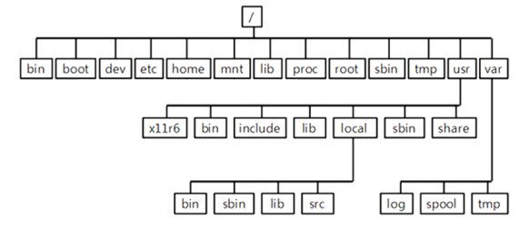
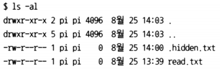
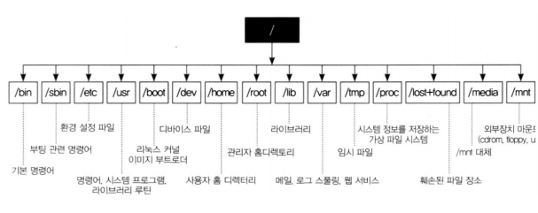
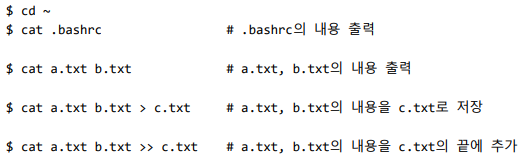
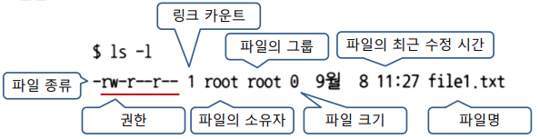
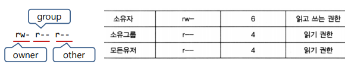

# 라즈베리 파이를 위한 리눅스 기초 배우기

<br>

<br>

## 리눅스 파일 시스템

### 리눅스 디렉토리 구조



>   bin : OS  
>
>   boot : 부팅파이션  
>
>   root : super user  
>
>   etc : 설정파일  
>
>   usr : 설치 S/W  
>
>   usr/bin : 명령어  

-   /etc
    -   시스템 환경 설정 파일이 있는 디렉토리
    -   네트워크 관련 설정파일, 사용자 정보 및 암호정보, 파일 시스템 정보, 보안파일, 시스템 초기화 파일등 중요 설정 파일들의 위치한 디렉토리
    -   /etc/cron.d : crontab 명령의 설정파일이 있음
    -   /etc/cron.daily : 매일 작동하게 하는 crontab 스크립트 파일이 존재
    -   /etc/httpd : 아파치 웹 서버의 설정 및 로그파일이 있음 
    -   /etc/mail : 센드메일과 관련된 파일이 있음
    -   /etc/ppp : ppp 설정에 관련된 파일들이 있음
    -   /etc/profile.d : 쉘 로그인 하여 프로파일의 실행되는 스크립트에 대한 정의 가 있음
    -   /etc/rc.d : 시스템 초기화와 관련된 스크립트가 존재
    -   **/etc/samba** : 삼바에 관련된 파일들이 있음
    -   /etc/security : 터미널 보안에 관련된 설정이 있음
    -   /etc/skel : 새로운 사용자를 추가할 때 자동적으로 생성되는 디렉토리와 파일 이 있음
    -   /etc/ssh : secure shell 설정 파일이 있음
    -   /etc/sysconfig : 시스템과 네트워크 설정을 담고 있음

<br>

<br>

## 리눅스 명령어

### 쉘(shell)

-   사용자와 운영체제를 연결해주는 프로그램
    -   사용자가 입력한 명령을 실행
-   Windows의 cmd.exe, powershell.exe에 해당
-   리눅스에서는 터미널을 통해 제공
    -   Ctrl + Shift + T

>   리눅스의 기본 shell : bash

<br>

### date 명령어

-   현재 날짜 확인 및 설정

    $ `date`   
    $ `sudo date -s "2020-08-01 09:00:00"`

<br>

### hostname 명령어

-   호스트의 이름 확인 및 변경

<br>

### ls 명령어

-   list 
-   지정한 디렉토리/파일의 정보를 보여줌 
-   ls <디렉토리>| <파일명> … 
-   옵션 
    -   -a : 히든 파일을 포함해 모두 출력 
    -   -l : 긴 포맷으로 출력 
    -   -al : -a, -l 을 같이 지정



<br>

### passwd 명령어

-   사용자 비밀번호 변경

    $ `passwd` # 자신의 비밀번호 변경  
    $ `sudo passwd <사용자 id>` # 사용자 id의 비밀번호 변경  

<br>

### 파일 및 디렉토리



<br>

### Home 디렉토리 : /home/<사용자 id>

-   사용자 소유의 최상위 디렉토리
    -   사용자가 로그인 했을 때 위치하는 디렉토리
    -   이 디렉토리에 대해서 모든 권한을 가짐
-   $HOME 환경 변수 자동 설정  
    $ `cd $HOME`   
    $ `cd ~`   
    $ `cd`  

<br>

### pwd 명령어

-   print working directory  
    -   wd : 현재 작업을 수행하고 있는 디렉토리
    -   cd 명령으로 변경됨
        $ `pwd`  
        /home/pi  

<br>

### mkdir 명령어

-   make directory  

    $ `mkdir test`

<br>

### rmdir 명령어

-   remove directory  
    $ rmdir test

<br>

### touch 명령어

-   파일의 최근 접근 시간을 현재 시간으로 수정
-   파일이 존재하지 않으면 새로 생성
    $ `cd ~`   
    $ `mkdir webapps`   
    $ `cd webapps`   
    $ `mkdir ch02`   
    $ `cd ch02`   
    $ `touch read.txt`  

<br>

### cat 명령어

-   지정한 파일들을 연결하여 하나의 내용으로 출력
-   파일의 내용 확인용으로 사용



>   concatenate의 약자
>
>   \> : 리디렉션
>
>   **표준장치**
>
>   -   0 : 표준입력(키보드)
>   -   1 : 표준출력(모니터)
>   -   2 : 표준에러출력(모니터)

<br>

### head 명령어

-   지정한 파일의 앞 부분 출력
-   -n
    -   n 줄만 출력(생략 시 디폴트 5줄)
        $ `head -5 .bahsrc`

<br>

### tail 명령어

-   지정한 파일의 뒷 부분 출력
-   -n
    -   n 줄만 출력(생략 시 디폴트 5줄)
        $ `tail -5 .bahsrc`

<br>

### cp 명령어(copy)

-   파일을 복사 해주는 명령어
-   `cp <복사할 대상> <복사할 위치>`
    -    여러 개의 대상 지정 가능
-   `cp <복사할 대상> <복사할위치/파일명>`
    -   새로운 파일명으로 파일을 복사

<br>

### mv 명령어(move)

-   파일을 이동하는 명령
-   `mv <파일명> <이동할 위치>`
    -   여러 개의 파일 지정 가능
-   `mv <파일명> <새로운 파일명>`

<br>

### rm 명령어(remove)

-   `rm <파일명> …`
-   `rm -r <디렉토리> … `

<br>

### which 명령어

-   실행 명령어의 위치를 찾아 줌
    `which python3`

<br>

### whereis 명령

-   실행파일, 소스파일 등의 위치를 찾아 줌

<br>

### 권한

  

-   파일 종류
    -   \- : 일반 파일 
    -   d : 디렉토리 
    -   l : 심벌릭 링크 
    -   b : 블록형 디바이스 파일 
    -   c : 문자형 디바이스 파일

-   소유자, 그룹, 다른 사람에 대해서 지정
-   각 권한은 읽기(r), 쓰기(w), 실행(x) 권한으로 구성
    -   해당 권한이 없는 경우 (-)
    -   8진수로 표현 가능
    -   디렉토리의 실행 권한은 탐색 권한을 의미
        -   cd 명령으로 디렉토리 이동 허용 여부



<br>

### chmod 명령어(change mode)

-   파일의 권한 설정을 변경
-   지정 파일의 소유자, root 만 가능
-   `chmod <수정번호> <파일>`

```
$ chmod 755 read.txt 		# rwxr-xr-x
$ chmod 751 read.txt 		# rwxr-xr--
$ chmod +w read.txt 		# 쓰기 권한 추가
$ chmod -w read.txt 		# 쓰기 권한 제거
$ chmod u+x a.out 			# 소유자만 실행 권한 추가(u, g, o)
$ sudo chmod 755 read.txt 	# rwxr-xr-x
```

<br>

### chown 명령어(change owner)

-   파일의 소유권을 다른 사용자로 이전

-   root만 사용 가능

-   `chown <소유자>:<소유그룹> <파일명 or 디렉토리명>`

    $ `sudo chown root:pi file1.txt`

<br>

### IO 리다이렉션(Redirection)

-   모든 프로세스는 표준 입력장치, 출력장치, 에러 출력장치를 가짐
    -   표준 입력장치: 키보드
    -   표준 출력장치, 에러 출력장치: 모니터
-   IO 리다이렉션
    -   표준 입/출력 장치를 다른 장치로 변경
    -   < : 입력장치 리다이렉션
    -   \>, >> : 출력장치 리다이렉션
        -   $ `ls -l > file_list.txt`
    -   2>, 2>> : 에러 출력 장치 리다이렉션

<br>

### 파일 아카이블/압축, 압축 해제

-   파일 아카이브

    $ `mkdir aaa`

    $ `tar -cvf aaa.tar aaa` # aaa 디렉토리를 aaa.tar로 아카이브

-   파일 아카이브 해제

    $ `tar -xvf aaa.tar`

-   파일 압축

    $ `mkdir ccc`
    $ `tar -zcvf ccc.tar.gz ccc`

-   파일 압축 해제

    $ `tar -zxvf ccc.tar.gz`

<br>