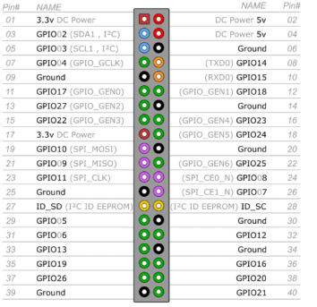
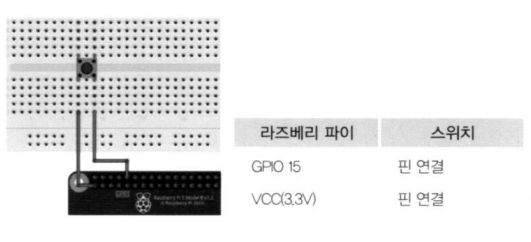
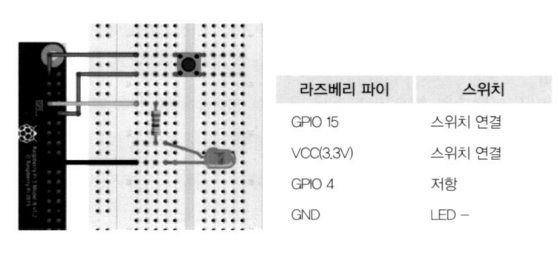
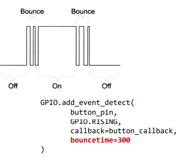
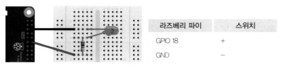
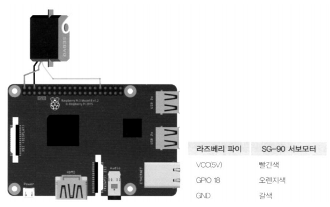
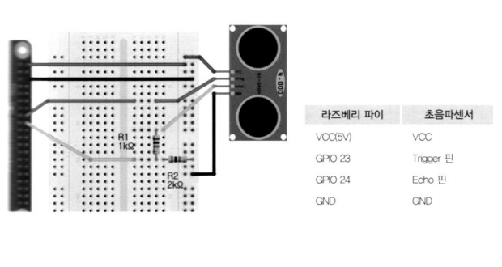

# 라즈베리 파이 GPIO 및 센서 활용하기

<br>

## GPIO 제어 및 테스트

-   GPIO 핀 배치



<br>

### GPIO

-   General Purpose Input Output 
-   범용 입출력 포트

<br>

### GPIO 제어 모듈

-   RPi.GPIO 모듈이 기본 설치되어 있음
-   절차
    -   모듈 임포트 
        -   핀 번호 지정 방식 설정 
            -   BCM * : GPIO 핀 번호 사용 
            -   BOARD : 보드 핀 번호 사용
        -   핀 I/O 모드 설정
        -   핀 제어 
        -   마칠때 cleanup()
            -   모든 GPIO 핀을 초기화

<br>

## LED 실습

>   ~/workspace/01_GPIO-TEST

### ex01_LED_Blink.py

```python
import RPi.GPIO as GPIO
import time

# 사용할 GPIO핀의 번호를 선정합니다.(BCM 모드)
led_pin = 18 #GPIO18

# GPIO핀의 번호 모드 설정
GPIO.setmode(GPIO.BCM)

# LED 핀의 IN/OUT 설정
GPIO.setup(led_pin, GPIO.OUT)

# 10번 반복문
for i in range(10):
    GPIO.output(led_pin,1) # LED ON
    time.sleep(1) # 1초동안 대기상태
    GPIO.output(led_pin,0) # LED OFF
    time.sleep(1) # 1초동안 대기상태
    
GPIO.cleanup() # GPIO 설정 초기화
```

>   \> `ssh pi@192.168.0.10`
>
>   $ `cd workspace/`
>
>   $ `python ex01_LED_Blink.py`

<br>

<br>

## 푸시 버튼 스위치 실습(Polling 방식)



### ex02_Btn_Polling.py

```python
import RPi.GPIO as GPIO
import time

# 사용할 GPIO 핀의 번호를 선정합니다.
button_pin = 16

# GPIO핀의 번호 모드 설정
GPIO.setmode(GPIO.BCM)

# 버튼 핀의 입력설정 , PULL DOWN 설정
GPIO.setup(button_pin, GPIO.IN, pull_up_down=GPIO.PUD_DOWN)

while 1: #무한반복
    # 만약 버튼핀에 High(1) 신호가 들어오면, "Button pushed!" 을 출력합니다.
    if GPIO.input(button_pin) == GPIO.HIGH:
        print("Button pushed!")
    time.sleep(0.1) # 0.1초 딜레이
```


### ex03_LED+Btn.py

```python
#!/usr/bin/python
import RPi.GPIO as GPIO
import time

# 사용할 GPIO 핀의 번호를 선정합니다.
button_pin = 16
led_pin = 18

# GPIO핀의 번호 모드 설정
GPIO.setmode(GPIO.BCM)

# 버튼 핀의 입력설정 , PULL DOWN 설정
GPIO.setup(button_pin, GPIO.IN, pull_up_down=GPIO.PUD_DOWN)
GPIO.setup(led_pin, GPIO.OUT)

try:
    while 1: #무한반복
        GPIO.output(led_pin,GPIO.input(button_pin)) # LED ON
        time.sleep(0.1) # 0.1초 딜레이
except KeyboardInterrupt:
    GPIO.cleanup()
```

>   맨 앞줄 **#!/usr/bin/python** 넣어주고 CRLF -> **LF** 후 저장
>   : ./(파일명) 으로 실행 가능 
>
>   > 실행 권한(x)이 있어서 가능

<br>

>   **파일명으로 실행**
>   $ `echo $PATH ` > 현재 디렉토리가 없다.
>
>   $ `PATH=.:$PATH` > 현재 디렉토리를 먼저 찾음 > $ `(파일명)` 으로 실행 가능
>
>   >   단, 이번 Shell에서만 적용된다.

<br>

>   **실행 관련 변경 내용 저장**
>
>   탐색기 192.168.0.10 > .bashrc 코드로 열기
>
>   맨 밑에 `export PATH=.:$PATH` 추가
>
>   ~ $ `echo $PATH`
>
>   확인

### GPIO 핀의 상태 변경 감지

-   GPIO.add_event_detect(채널, GPIO.RISING, callback=my_callback)
    -   GPIO 핀의 상태가 0 또는 1로 변경될 때 호출할 함수(my_callback)를 등록

<br>

<br>

## 푸시 버튼 스위치 실습(Event 알림 방식)



### ex04_Btn_Event.py

```python
#!/usr/bin/python
import RPi.GPIO as GPIO
import time

# button_callback 함수를 정의합니다.
def button_callback(channel):
    print("Button pushed!")

# 사용할 GPIO핀의 번호를 선정합니다.
button_pin = 16

# GPIO핀의 번호 모드 설정
GPIO.setmode(GPIO.BCM)

# 버튼 핀의 IN/OUT 설정 , PULL DOWN 설정
GPIO.setup(button_pin, GPIO.IN, pull_up_down=GPIO.PUD_DOWN)

# Event 방식으로 핀의 Rising 신호를 감지하면 button_callback 함수를 실행합니다.
GPIO.add_event_detect(button_pin,GPIO.RISING,callback=button_callback)

try:
    while 1: #무한반복
        time.sleep(0.1) # 0.1초 딜레이
except KeyboardInterrupt:
    GPIO.cleanup()
```

<br>

### 디바운싱



<br>

### ex05_Btn_LED.py

```python
#!/usr/bin/python
import RPi.GPIO as GPIO
import time

# 사용할 GPIO핀의 번호를 선정합니다.
button_pin = 16
led_pin = 18

# GPIO핀의 번호 모드 설정
GPIO.setmode(GPIO.BCM)

# 버튼 핀의 INPUT설정 , PULL DOWN 설정
GPIO.setup(button_pin, GPIO.IN, pull_up_down=GPIO.PUD_DOWN)

# LED 핀의 OUT설정
GPIO.setup(led_pin, GPIO.OUT)

# boolean 변수 설정
light_on = False

# button_callback 함수를 정의합니다.
def button_callback(channel):
    global light_on # Global 변수선언
    if light_on == False: # LED 불이 꺼져있을때
        GPIO.output(led_pin,1) # LED ON
        print("LED ON!")
    else: # LED 불이 져있을때
        GPIO.output(led_pin,0) # LED OFF
        print("LED OFF!")
    light_on = not light_on # False <=> True

# Event 알림 방식으로 GPIO 핀의 Rising 신호를 감지하면 button_callback 함수를 실행
# 300ms 바운스타임을 설정하여 잘못된 신호를 방지합니다.
GPIO.add_event_detect(button_pin,GPIO.RISING, callback=button_callback, bouncetime=300)

try:
    while 1: #무한반복
        time.sleep(0.1) # 0.1초 딜레이
except KeyboardInterrupt:
    GPIO.cleanup()
```

<br>

<br>

# 모듈화

### python_lib/myapp.py

```python
import sys

class MenuItem:
    def __init__(self, title, action):
        self.title = title
        self.action = action

    def __str__(self):
        return f"<MenuItem {self.title}>"

    def __repr__(self):
        return f"<MenuItem {self.title}>"

    def run(self):
        self.action()
        
class Menu:
    def __init__(self):
        self.menus= []

    def add_menu(self, menu_item):
        self.menus.append(menu_item)

    def print(self):
        print("[메뉴] ", end="")
        for i, menu in enumerate(self.menus):
            print(f"{i}:{menu.title}  ", end="")
        print()

    def run(self, select):
        if select >= len(self.menus):
            print("잘못된 메뉴 선택입니다.")
            return
        self.menus[select].run()        


class Application:
    def __init__(self):
        self.book = [1, 2, 3]
        self.menu = Menu()
        self.create_menu(self.menu)

    def create_menu(self, menu):	
        pass

    def exit(self):
        sys.exit(0)

    def run(self):
            while True:
                self.menu.print()
                sel = int(input("선택] "))
                try:
                    self.menu.run(sel)
                except KeyboardInterrupt:
                    pass
                print()

```

>   **pi/python_lib/myapp.py** 저장
>
>   .bashrc 파일 끝 `export PYTHONPATH=/home/pi/python_lib` 추가
>
>   등록 $ `source ~/.bashrc`
>
>   확인 $ `echo $PYTHONPATH`
>
>     
>
>   vscode에 **pi/python_lib/** workspace 추가

<br>

### python_lib/piapp.py

```python
from myapp import *
import RPi.GPIO as GPIO

class PiApplication(Application):
    def __init__(self):
        GPIO.setmode(GPIO.BCM)
        super().__init__()

    def exit(self):
        GPIO.cleanup()
        sys.exit(0)
```

<br>

### 01_GPIO-TEST/gpioapp.py

```python
from piapp import *
import RPi.GPIO as GPIO

from ledex import LedEx
from btnex import BtnEx
from btneventex import BtnEventEx

class GpioApp(PiApplication):
    def __init__(self):
        super().__init__()

    def create_menu(self, menu):	
        menu.add_menu(MenuItem("종료", self.exit))
        menu.add_menu(MenuItem("LED", LedEx()))
        menu.add_menu(MenuItem("Button", BtnEx()))
        menu.add_menu(MenuItem("Button Event", BtnEventEx()))

if __name__ == "__main__":
    app = GpioApp()
    app.run()
```

<br>

### 01_GPIO-TEST/ledex.py

```python
import RPi.GPIO as GPIO
import time

# callable class
class LedEx:
    def __init__(self):
        self.led_pin = 18
        GPIO.setup(self.led_pin, GPIO.OUT)

    def __call__(self):
        # 10번 반복문
        for i in range(10):
            GPIO.output(self.led_pin,1) # LED ON
            time.sleep(1) # 1초동안 대기상태
            GPIO.output(self.led_pin,0) # LED OFF
            time.sleep(1) # 1초동안 대기상태

# if __name__ == "__main__":
#     ex = LedEx()  # LedEx 인스턴스 생성자 호출
#     ex()  # LedEx 클래스의 __call__() 메서드 호출
```

**~/workspace/01_GPIO-TEST $ `python ledex.py`**

LexEx call

---

<br>

### 01_GPIO-TEST/btnex.py

```python
import RPi.GPIO as GPIO
import time

# callable class
class BtnEx:
    def __init__(self):
        self.button_pin = 16
        self.led_pin = 18

        GPIO.setup(self.button_pin, GPIO.IN, pull_up_down=GPIO.PUD_DOWN)
        GPIO.setup(self.led_pin, GPIO.OUT)

    def __call__(self):
        while 1: #무한반복
            GPIO.output(self.led_pin,GPIO.input(self.button_pin)) # LED ON
            time.sleep(0.1) # 0.1초 딜레이


if __name__ == "__main__":
    ex = BtnEx()
    ex()
```

<br>

### 01_GPIO-TEST/btneventex.py

```python
import RPi.GPIO as GPIO
import time

# callable class
class BtnEventEx:
    def __init__(self):
        self.button_pin = 16
        self.led_pin = 18

        GPIO.setup(self.button_pin, GPIO.IN, pull_up_down=GPIO.PUD_DOWN)
        GPIO.setup(self.led_pin, GPIO.OUT)

        self.light_on = False

    # button_callback 함수를 정의합니다.
    def button_callback(self, channel):
        if self.light_on == False: # LED 불이 꺼져있을때
            GPIO.output(self.led_pin,1) # LED ON
            print("LED ON!")
        else: # LED 불이 져있을때
            GPIO.output(self.led_pin,0) # LED OFF
            print("LED OFF!")
        self.light_on = not self.light_on # False <=> True
    

    def __call__(self):
        self.light_on = False
        GPIO.add_event_detect(self.button_pin,GPIO.RISING, callback=self.button_callback, bouncetime=300)

        try:
            while 1: #무한반복
                time.sleep(0.1) # 0.1초 딜레이
        except KeyboardInterrupt:
            GPIO.remove_event_detect(self.button_pin)


if __name__ == "__main__":
    ex = BtnEventEx()
    ex()
```

>   ~/workspace/01_GPIO-TEST $ `python gpioapp.py`
>
>   [메뉴] 0:종료  1:LED  2:Button  3:Button Event
>   선택] `3`
>
>   **LED 버튼 이벤트 작동**

<br>

<br>

## PWM으로 LED 실습



<br>

### PWM 프로그래밍

-   절차

    -   PWM 인스턴스 생성 `p = GPIO.PWM(channel, frequency) `

        >   GPIO : 모듈, PWM : 클래스

    -   시작 듀티비 설정 `p.start(dc)` # dc : 0 ~100 

    -   사용할 주파수 변경 `p.ChangeFrequency(freq) `

    -   듀티비 설정 `p.ChangeDutyCycle(dc)` # dc : 0 ~100 

    -   PWM 인스턴스 정지`p.stop()`

<br>

**01_GPIO-TEST/gpioapp.py**

```python
from piapp import *
import RPi.GPIO as GPIO

from ledex import LedEx
from btnex import BtnEx
from btneventex import BtnEventEx
from pwmex import PwmEx

class GpioApp(PiApplication):
    def __init__(self):
        super().__init__()

    def create_menu(self, menu):	
        menu.add_menu(MenuItem("종료", self.exit))
        menu.add_menu(MenuItem("LED", LedEx()))
        menu.add_menu(MenuItem("Button", BtnEx()))
        menu.add_menu(MenuItem("Button Event", BtnEventEx()))
        menu.add_menu(MenuItem("PWM LED", PwmEx()))

if __name__ == "__main__":
    app = GpioApp()
    app.run()
```

<br>

**01_GPIO-TEST/pwmex.py**

```python
import RPi.GPIO as GPIO
import time

class PwmEx:
    def __init__(self):
        self.led_pin = 18

        GPIO.setup(self.led_pin, GPIO.OUT)
        self.p = GPIO.PWM(self.led_pin, 50)
        self.p.start(0)

    def __call__(self):
        try:
            while 1:
                # fade in
                for dc in range(0, 101, 5): # dc의 값은 0에서 100까지 5만큼 증가
                    self.p.ChangeDutyCycle(dc) # dc의 값으로 듀티비 변경
                    time.sleep(0.1) # 0.1초 딜레이
                
                # fade out
                for dc in range(100, -1, -5): # dc의 값은 100에서 0까지 5만큼 감소
                    self.p.ChangeDutyCycle(dc) # dc의 값으로 듀티비 변경
                    time.sleep(0.1) # 0.1초 딜레이
        
        except KeyboardInterrupt: # 키보드 Ctrl+C 눌렀을 때 예외발생
            self.p.stop() # PWM을 종료
```

[메뉴] 0:종료  1:LED  2:Button  3:Button Event  4:PWM LED  
선택] `4`

**LED fade in out 작동**

---

<br>

### PWM으로 서보모터 실습




<br>

**01_GPIO-TEST/gpioapp.py**

```python
from piapp import *
import RPi.GPIO as GPIO

from ledex import LedEx
from btnex import BtnEx
from btneventex import BtnEventEx
from pwmex import PwmEx
from pwmservoex import PwmServoEx

class GpioApp(PiApplication):
    def __init__(self):
        super().__init__()

    def create_menu(self, menu):	
        menu.add_menu(MenuItem("종료", self.exit))
        menu.add_menu(MenuItem("LED", LedEx()))
        menu.add_menu(MenuItem("Button", BtnEx()))
        menu.add_menu(MenuItem("Button Event", BtnEventEx()))
        menu.add_menu(MenuItem("PWM LED", PwmEx()))
        menu.add_menu(MenuItem("Servo", PwmServoEx()))

if __name__ == "__main__":
    app = GpioApp()
    app.run()
```

<br>

**01_GPIO-TEST/pwmservoex.py**

```python
import RPi.GPIO as GPIO
import time

class PwmServoEx:
    def __init__(self):
        self.led_pin = 25

        GPIO.setup(self.led_pin, GPIO.OUT)
        self.servo = GPIO.PWM(self.led_pin, 50)
        self.servo.start(0)

    def __call__(self):
        try:
            while 1:
                # 듀티비를 변경하여 서보모터를 원하는 만큼 움직임
                self.servo.ChangeDutyCycle(7.5) # 90도
                time.sleep(1)
                self.servo.ChangeDutyCycle(12.5) # 180도
                time.sleep(1)
                self.servo.ChangeDutyCycle(2.5) # 0도
                time.sleep(1)
        
        except KeyboardInterrupt: # 키보드 Ctrl+C 눌렀을 때 예외발생
            self.servo.stop() # PWM을 종료
```

[메뉴] 0:종료  1:LED  2:Button  3:Button Event  4:PWM LED  5:Servo  
선택] `5`

**서보모터 작동**

>   핀 번호를 각 다른 것으로 해야 오류가 나지 않는다.

---

<br>

<br>

### 초음파센서(HC-SR04) 실습



<br>

**01_GPIO-TEST/gpioapp.py**

```python
from piapp import *
import RPi.GPIO as GPIO

from ledex import LedEx
from btnex import BtnEx
from btneventex import BtnEventEx
from pwmex import PwmEx
from pwmservoex import PwmServoEx
from ultraex import UltraEx

class GpioApp(PiApplication):
    def __init__(self):
        super().__init__()

    def create_menu(self, menu):	
        menu.add_menu(MenuItem("종료", self.exit))
        menu.add_menu(MenuItem("LED", LedEx()))
        menu.add_menu(MenuItem("Button", BtnEx()))
        menu.add_menu(MenuItem("Button Event", BtnEventEx()))
        menu.add_menu(MenuItem("PWM LED", PwmEx()))
        menu.add_menu(MenuItem("Servo", PwmServoEx()))
        menu.add_menu(MenuItem("Distance", UltraEx()))

if __name__ == "__main__":
    app = GpioApp()
    app.run()
```

<br>

**01_GPIO-TEST/ultraex.py**

```python
import RPi.GPIO as GPIO
import time

class UltraEx:
    def __init__(self):
        self.TRIG = 23
        self.ECHO = 24

        GPIO.setup(self.TRIG, GPIO.OUT)
        GPIO.setup(self.ECHO, GPIO.IN)
        

    def __call__(self):
        GPIO.output(self.TRIG, 0)
        print("Waiting for sensor to settle")
        time.sleep(2)

        while True:
            GPIO.output(self.TRIG, True) # Triger 핀에 펄스신호를 만들기 위해 1 출력
            time.sleep(0.00001) # 10µs 딜레이
            GPIO.output(self.TRIG, False)

            while GPIO.input(self.ECHO)==0:
                start = time.time() # Echo 핀 상승 시간

            while GPIO.input(self.ECHO)==1:
                stop = time.time() # Echo 핀 하강 시간

            check_time = stop - start
            distance = check_time * 34300 / 2
            print("Distance : %.1f cm" % distance)
            time.sleep(0.4) # 0.4초 간격으로 센서 측정
```

[메뉴] 0:종료  1:LED  2:Button  3:Button Event  4:PWM LED  5:Servo  6:Distance
선택] `6`

**초음파 센서 작동**

---

<br>