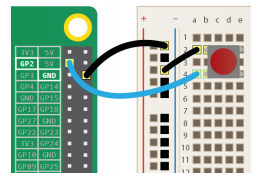
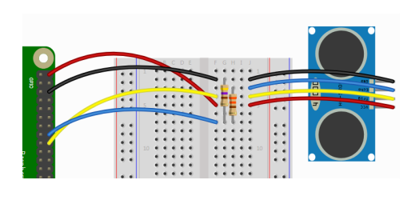

# GPIO-ZERO

### 설치

-   pi@raspberrypi:~$ sudo apt update 
-   pi@raspberrypi:~$ sudo apt install python3-gpiozero

<br>

### 문서

-   https://gpiozero.readthedocs.io/en/stable/

<br>

### Importing GPIO Zero

-   import gpiozero   
    button = gpiozero.Button(2)
-   from gpiozero import Button   
    button = Button(2)

<br>

### 입력 장치 클래스 계층도


<br>

### 출력 장치 클래스 상속도


<br>

### 핀번호

-    Broadcom (BCM) pin numbering


<br>

### LED


**02_GPIO-ZERO_TEST/ex01_led.py**

```python
from gpiozero import LED
from time import sleep

red = LED(18)

while True:
    red.on()
    sleep(1)
    red.off()
    sleep(1)
```

<br>

**02_GPIO-ZERO_TEST/ex01_led2.py**

```python
from gpiozero import LED
from signal import pause

red = LED(18)

red.blink()

pause()
print("end...")
```

>   blink는 독자적으로 실행 중 ∴ print가 출력되지 않음 → 쓰레드 매커니즘

<br>

### PWM

-   PWMLED 객체
    -   value 속성 : 0 ~ 1 사이의 값 지정
    -   pulse() : 지속적으로 fade in/out 반복

<br>

#### LED with variable brightness

**02_GPIO-ZERO_TEST/ex02_pwm_led.py**

```python
from gpiozero import PWMLED
from time import sleep
led = PWMLED(18)
while True:
    led.value = 0  # off
    sleep(1)
    led.value = 0.5  # half brightness
    sleep(1)
    led.value = 1  # full brightness
    sleep(1)
```

>   getter, setter 이용

<br>

**02_GPIO-ZERO_TEST/ex02_pwm_led2.py**

pulse()로 fade in/out

```python
from gpiozero import PWMLED
from signal import pause

led = PWMLED(18)

led.pulse()
pause()
```

<br>

### Button

-   속성
    -   is_pressed : 버튼이 눌러진 경우 True 
    -   when_pressed : 버튼을 눌렀을 때 호출할 콜백 함수 
    -   when_released : 버튼을 뗄 때 호출할 콜백 함수
-   메서드
    -   wait_for_press() : 버튼이 눌러질 때 까지 대기(동기 메서드)


<br>

**02_GPIO-ZERO_TEST/ex03_button.py**

```python
from gpiozero import Button
button = Button(2)

while True:
    if button.is_pressed:
        print("Button is pressed")
    else:
        print("Button is not pressed")
```

<br>

**02_GPIO-ZERO_TEST/ex02_button2.py**

```python
from gpiozero import Button

button = Button(18)

button.wait_for_press()
print("Button was pressed")
```

<br>

**02_GPIO-ZERO_TEST/ex02_button3.py**

```python
from gpiozero import Button
from signal import pause

def say_hello():
    print("Hello!")
def say_goodbye():
    print("Goodbye!")

button = Button(18)

button.when_pressed = say_hello
button.when_released = say_goodbye

pause()
```

누를 때 Hello!, 땔 때 Goodbye!

<br>

#### Button controlled LED



>   setting > code-runner: Run In Terminal > check
>
>   setting > Workspace(이번 프로젝트) > code-runner: Executor Map By File Extension > Edit in settings.json
>
>   `".py": "python $fileName",` 추가
>
>   아직 안됨!


**02_GPIO-ZERO_TEST/ex04_button+led.py**

```python
from gpiozero import LED, Button
from signal import pause

led = LED(23)
button = Button(18)

button.when_pressed = led.on
button.when_released = led.off

pause()
```

<br>

**02_GPIO-ZERO_TEST/ex04_button+led2.py**

```python
from gpiozero import LED, Button
from signal import pause

led = LED(23)
button = Button(18)

led.source = button.values

pause()
```

>   led의 상태를 button의 상태와 동일하게, 위와 같다.

<br>

### LEDBoard

-   여러 개의 LED 를 묶어서 관리

**02_GPIO-ZERO_TEST/ex05_ledboard.py**

```python
from gpiozero import LEDBoard
from time import sleep
from signal import pause

leds = LEDBoard(18, 23, 24)

# 모두 같이 동작
leds.on()
sleep(1)
leds.off()
sleep(1)

# 개별적인 값을 튜플로 지정
leds.value = (1, 0, 1)
sleep(1)
leds.blink()
pause()
```

<br>

**02_GPIO-ZERO_TEST/ex05_ledboard2.py**

pwm=True 이용 밝기 조절

```python
from gpiozero import LEDBoard
from signal import pause

leds = LEDBoard(18, 23, 24, pwm=True)

leds.value = (0.2, 0.4, 0.6)

pause()
```

<br>

### LEDBarGraph

**02_GPIO-ZERO_TEST/ex06_ledbargraph.py**

```python
from gpiozero import LEDBarGraph
from time import sleep

graph = LEDBarGraph(18, 23, 24, pwm=True)

graph.value = 1/10 # (0.5, 0, 0)
sleep(1)
graph.value = 3/10 # (1, 0.5, 0)
sleep(1)
# 음수 뒤에서 해석
graph.value = -3/10 # (0, 0, 0)
sleep(1)
graph.value = 9/10 # (1, 1, 1)
sleep(1)
graph.value = 95/100 # (1, 1, 1)
sleep(1)
```

>   소리크기, 음높이 제어도 가능하다.

<br>

### Distance sensor



**02_GPIO-ZERO_TEST/ex07_ultra.py**

```python
from gpiozero import DistanceSensor
from time import sleep

sensor = DistanceSensor(23, 24) # echo, trig

while True:
    print('Distance to nearest object is', sensor.distance, 'm')
    sleep(1)
```

**02_GPIO-ZERO_TEST/ex07_ultra2.py**

초음파를 입력으로 led 작동

```python
from gpiozero import DistanceSensor, LED
from signal import pause

sensor = DistanceSensor(23, 24, max_distance=1, threshold_distance=0.2)
led = LED(18)

sensor.when_in_range = led.on
sensor.when_out_of_range = led.off

pause()
```

<br>

### 서보 모터 제어 : Servo 클래스

-   `Servo(pin, *, initial_value=0, min_pulse_width=1/1000, max_pulse_width=2/1000, frame_width=20/1000, pin_factory=None)`
    -   min() : 최소 각도로 이동 
    -   mid() : 중간 각도로 이동 
    -   max() : 최대 각도로 이동 
    -   value : 이동 값
        -   -1 : 최소 각도
        -   0 : 중간 각도
        -   1 : 최대 각도

<br>

**02_GPIO-ZERO_TEST/ex08_servo.py**

```python
from gpiozero import Servo
from time import sleep

myGPIO=18

servo = Servo(myGPIO)

while True:
    servo.mid()
    print("mid")
    sleep(0.5)
    servo.min()
    print("min")
    sleep(1)
    servo.mid()
    print("mid")
    sleep(0.5)
    servo.max()
    print("max")
    sleep(1)
```

<br>