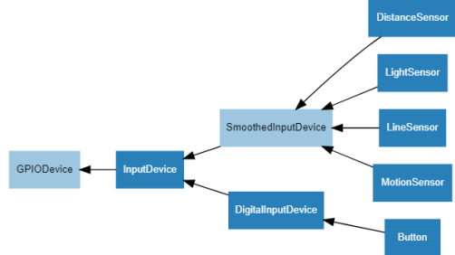
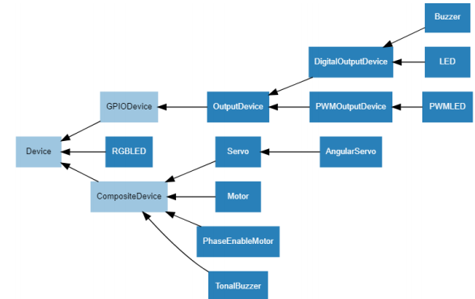
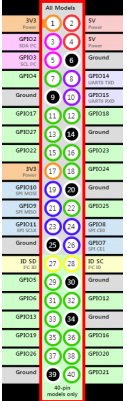
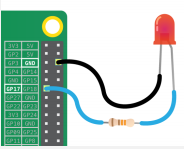

# GPIO-ZERO

### 설치

-   pi@raspberrypi:~$ sudo apt update 
-   pi@raspberrypi:~$ sudo apt install python3-gpiozero

<br>

### 문서

-   https://gpiozero.readthedocs.io/en/stable/

<br>

### Importing GPIO Zero

-   import gpiozero   
    button = gpiozero.Button(2)
-   from gpiozero import Button   
    button = Button(2)

<br>

### 입력 장치 클래스 계층도



<br>

### 출력 장치 클래스 상속도




<br>

### 핀번호

-    Broadcom (BCM) pin numbering



<br>

### LED



**ex01_led.py**

```python
from gpiozero import LED
from time import sleep

red = LED(18)

while True:
    red.on()
    sleep(1)
    red.off()
    sleep(1)
```

<br>

**ex01_led2.py**

```python
from gpiozero import LED
from signal import pause

red = LED(18)

red.blink()

pause()
print("end...")
```

>   blink는 독자적으로 실행 중 ∴ print가 출력되지 않음 → 쓰레드 매커니즘

<br>

<br>

<br>

<br>

<br>

<br>