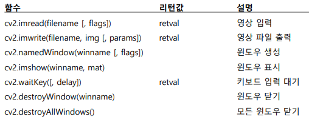
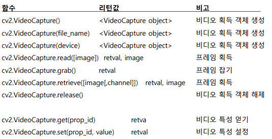
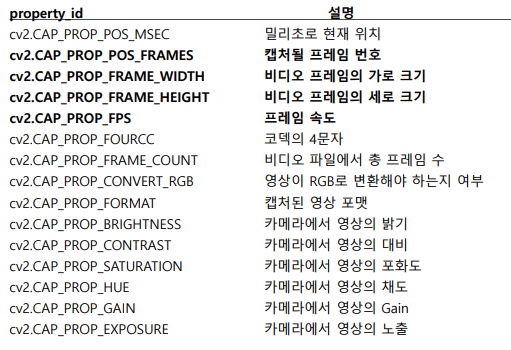

**라즈베리파이용 OpenCV 설치 절차**

$ `sudo apt-get install -y libjpeg-dev libtiff5-dev libjasper-dev libpng12-dev`

$ `sudo apt-get install -y libavcodec-dev libavformat-dev libswscale-dev libv4l-dev`

$ `sudo apt-get install -y libxvidcore-dev libx264-dev`

$ `sudo apt-get install -y qt4-dev-tools libatlas-base-dev`

$ `sudo pip3 install opencv-python`

---

**cmd**

가상환경 만들기 : `conda create -n iot python=3.7`

가상환경 활성화 : `conda activate iot`

Numpy, Matplotlib 설치: `pip install numpy matplotlib pillow`

OpenCV 설치 : ` pip install opencv-python`

---

**03_OPENCV-EX** 폴더에서 작업

code로 열기 > F1 > Python : Select Interpreter > C:\Users\coolu\anaconda3\envs\iot\python.exe

---

<br>

<br>

# 영상 및 비디오 입출력

<br>

## 영상 입출력 디스플레이

### 영상 입출력 메서드



<br>

### cv2.imread(filename [, flags])

-   영상파일(BMP, JPEG, PNG, TIFF 등)을 읽어 numpy 배열로 반환
-   읽기 실패하면 None을 반환
    -   filename
        -   영상파일(BMP, JPEG, PNG, TIFF 등)의 파일명
    -   flags
        -   cv2.IMREAD_COLOR(디폴트)
        -   cv2.IMREAD_GRAYSCALE
        -   cv2.IMREAD_UNCHANGED

<br>

**파일 영상 읽기 및 화면표시**

cv_ex01.py

```python
import cv2

image_file = './data/lena.jpg'
img = cv2.imread(image_file) # cv2.IMREAD_COLOR
img2 = cv2.imread(image_file, cv2.IMREAD_GRAYSCALE)

print(img.shape, img2.shape)

cv2.imshow('Lena color', img)
cv2.imshow('Lena grayscale', img2)

cv2.waitKey(0) # 위에 imshow 뜨게 하기 위해, 0 무제한 대기
cv2.destroyAllWindows()
```

(512, 512, 3) (512, 512)


---

<br>

### cv2.imwrite(filename, img [, params])

-   numpy.ndarray의 배열 img를 filename의 영상 파일로 저장
-   파일의 확장자에 의해 영상 포맷 결정
-   params는 압축 관련 인수로 생략 가능
    -   cv2.IMWRITE_PNG_COMPRESSION [0,9] 기본값 3
    -   cv2.IMWRITE_JPEG_QUALITY [0, 100] 기본값 95

<br>

**영상 파일 저장**

cv_ex02.py

```python
import cv2

image_file = './data/lena.jpg'
img = cv2.imread(image_file)

cv2.imwrite('./data/Lena.bmp', img)
cv2.imwrite('./data/Lena.png', img)
cv2.imwrite('./data/Lena2.png', img, [cv2.IMWRITE_PNG_COMPRESSION, 9])
cv2.imwrite('./data/Lena2.jpg', img, [cv2.IMWRITE_JPEG_QUALITY, 90])

cv2.waitKey(0)
cv2.destroyAllWindows()
```

Lena.bmp, Lena.png, Lena2.png, Lena2.jpg 파일 생성됨

---

<br>

<br>

## 영상 입출력 디스플레이 - Matplotlib로 출력하기

**채널 순서**

cv_ex03.py

```python
import cv2
import matplotlib.pyplot as plt

imageFile = './data/lena.jpg'
img_bgr = cv2.imread(imageFile)

plt.axis('off')
plt.imshow(img_bgr)
plt.show()

plt.axis('off')
img_rgb = cv2.cvtColor(img_bgr, cv2.COLOR_BGR2RGB)
plt.imshow(img_rgb)
plt.show()
```


>   OpenCV는 BGR 순이라 색이 이상하게 보인다.


>   cvtColor 이용하여 RGB로 변경

>   동기함수이므로 창을 닫아야 다음 창이 열림

<br>

<br>

## 비디오 프레임 캡처와 화면 표시

### 비디오 관련 메서드



###  property_id 주요 상수



<br>

**비디오 캡처와 화면**

cv_ex04.py

```python
import cv2

cap = cv2.VideoCapture(1) # 1번 카메라
# cap.set(cv2.CAP_PROP_FRAME_WIDTH, 320)
# cap.set(cv2.CAP_PROP_FRAME_HEIGHT, 240)

frame_size = (int(cap.get(cv2.CAP_PROP_FRAME_WIDTH)),
                int(cap.get(cv2.CAP_PROP_FRAME_HEIGHT)))
print('frame_size = ', frame_size)

while True:
    retval, frame = cap.read() # 프레임 캡처
    if not retval: break

    cv2.imshow('frame', frame)
    key = cv2.waitKey(25)  # 25ms 대기, 초당 40 frame : FPS
    if key == 27: break # ESC키를 누른 경우 루프 탈출

if cap.isOpened():
    cap.release()

cv2.destroyAllWindows()
```

frame_size =  (640, 480)

>   카메라 번호를 찾아준다. 나는 0은 노트북, 1이 usb 캠
>
>   default : 640 x 240

---

<br>

**안드로이드**

-   Droid cam을 통한 비디오 처리
    -   http://192.168.0.2:4747/video
    -   http://192.168.0.2:4747/video?640x480
        -   비디오 크기 지정

<br>

**iPhone**

-   iCam - Mobile IP Cam

<br>

**비디오 입력과 화면표시 - 안드로이드 스마트폰**

cv_ex05.py

```python
import cv2
# cap = cv2.VideoCapture('http://192.168.0.2:4747/video')  # droid cam
cap = cv2.VideoCapture('./data/vtest.avi')  # 비디오 파일 재생

frame_size = (int(cap.get(cv2.CAP_PROP_FRAME_WIDTH)),
              int(cap.get(cv2.CAP_PROP_FRAME_HEIGHT)))

print('frame_size = ', frame_size)

while True:
    retval, frame = cap.read()  # 프레임 캡처
    if not retval: break

    cv2.imshow('frame', frame)
    key = cv2.waitKey(40)  # 초당 25 frame
    if key == 27: break

if cap.isOpened():
    cap.release()

cv2.destroyAllWindows()
```

>   카메라 번호 대신 url로 접근

<br>

### 비디오 파일 녹화


-   fourcc
    -   ***'PIM1'** MPEG-1
    -   ***'MJPEG'** Motion-JPEG
    -   ***'DIVX'** DIVX 4.0 이후 버전
    -   ***'XDIV'** XVID, MPEG-4
    -   ***'MPEG'** MPEG
    -   ***'X264'** H.264/AVC

<br>

**비디오 녹화**

cv_ex06.py

```python
import cv2

cap = cv2.VideoCapture(0)  # 0번 카메라

frame_size = (int(cap.get(cv2.CAP_PROP_FRAME_WIDTH)),
              int(cap.get(cv2.CAP_PROP_FRAME_HEIGHT)))
print('frame_size = ', frame_size)

# fourcc = cv2.VideoWriter_fourcc(*'DIVX')
fourcc = cv2.VideoWriter_fourcc(*'XVID')

out1 = cv2.VideoWriter('./data/record0.mp4', fourcc, 20.0, frame_size)
out2 = cv2.VideoWriter('./data/record1.mp4', fourcc, 20.0, frame_size,
                       isColor=False)

while True:
    retval, frame = cap.read()  # 프레임 캡처
    if not retval: break

    out1.write(frame)

    gray = cv2.cvtColor(frame, cv2.COLOR_BGR2GRAY)
    out2.write(gray)

    cv2.imshow('frame', frame)
    cv2.imshow('gray', gray)

    key = cv2.waitKey(25)
    if key == 27: break  # ESC

cap.release()
out1.release()
out2.release()

cv2.destroyAllWindows()
```

칼라 비디오 : ./data/record0.mp4  생성

흑백 비디오 : ./data/record1.mp4  생성

<br>

>   오디오는 기록 되지 않는다.