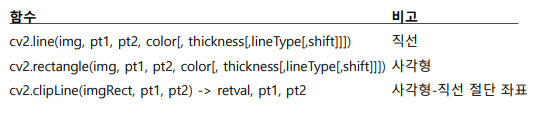
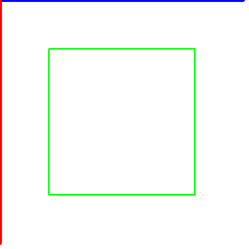
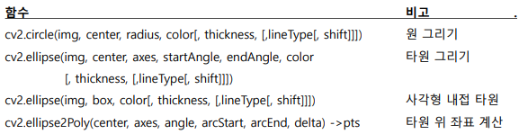
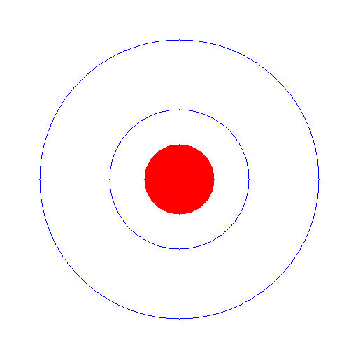
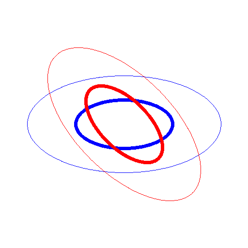

# 간단한 그래픽 처리

<br>

## 직선 및 사각형 그리기

### 주요 메서드



<br>

### cv2.line(img, pt1, pt2, color[, thickness[,lineType[,shift]]])

-   img에 좌표 pt1에서 pt2까지 연결하는 직선을 그림
-   color는 색상, thickness는 두께
-   lineType : cv2.LINE_8(디폴트), cv2.LINE_4, cv2.LINE_AA 등
-   shift : pt1과 pt2의 각 좌표에 대한 비트 이동을 설정

<br>

**직선 및 사각형 그리기**

cv_ex07.py

```python
import cv2
import numpy as np

# White 배경 색상
img = np.zeros(shape=(512, 512, 3), dtype=np.uint8) + 255
# img = np.ones((512, 512, 3), dtype=up.uint8) * 255
# img = np.full((512, 512, 3), (255,255,255), dtype=up.uint8)  # 흰색
pt1 = 100, 100
pt2 = 400, 400
cv2.rectangle(img, pt1, pt2, (0, 255, 0), 2)

cv2.line(img, (0, 0), (500, 0), (255, 0, 0), 5)
cv2.line(img, (0, 0), (0, 500), (0, 0, 255), 5)

cv2.imshow('img', img)
cv2.waitKey()
cv2.destroyAllWindows()
```



<br>

### cv2.clipLine(imgRect, pt1, pt2) -> retval, pt1, pt2

-   imgRect 사각형과 pt1, pt2를 이은 직선의 교차점을 찾아준다.
    -   imgRect : (left, top, width, height)
-   교차하면 retval은 True, 교차점 좌표는 pt1, pt2
-   교차하지 않으면 False 리턴

<br>

<br>

## 원 및 타원 그리기



<br>

### cv2.circle(img, center, radius, color[, thickness, [,lineType[, shift]]])

-   영상 img에 중심점 center, 반지름 radius의 원을 색상 color, 두께 thickness로 그림
-   thickness = cv2.CV_FILLED(-1)이면 color 색상으로 채운 원을 그림

<br>

**원 그리기**

cv_ex08.py

```python
import cv2
import numpy as np

img = np.zeros(shape=(512, 512, 3), dtype=np.uint8) + 255
cx = img.shape[0] // 2
cy = img.shape[1] // 2

for r in range(200, 0, -100):
    cv2.circle(img, (cx, cy), r, color=(255, 0, 0))

cv2.circle(img, (cx, cy), radius=50, color=(0, 0, 255), thickness=-1)

cv2.imshow('img', img)
cv2.waitKey()
cv2.destroyAllWindows()
```



<br>

### cv2.ellipse(img, center, axes, startAngle, endAngle, color [, thickness, [,lineType[, shift]]])

-   영상 img에 중심점 center, 주축의 크기의 절반 axes, 수평축과의 회전 각도 angle
-   호의 시작과 끝의 각도는 startAngle, endAngle인 타원을 그림
-   startAngle=0, endAngle=360이면 닫힌 타원
-   thickness=cv2.CV_FILLED(-1)이면 color 색상으로 채운 타원

<br>

### cv2.ellipse(img, box, color[, thickness, [,lineType[, shift]]])

-   영상 img에 회전된 사각형 box=(center, size, angle)에 내접하는 타원 을 그림
-   center는 중심점, size는 크기, angle은 수평축과의 각도

<br>

**타원 그리기**

cv_ex09.py

```python
import cv2
import numpy as np

img = np.zeros(shape=(512, 512, 3), dtype=np.uint8) + 255
ptCenter = img.shape[0] // 2, img.shape[1] // 2
size = 200, 100

cv2.ellipse(img, ptCenter, size, 0, 0, 360, (255, 0, 0))
cv2.ellipse(img, ptCenter, size, 45, 0, 460, (0, 0, 255))

box = (ptCenter, size, 0) # 중심점, 크기, 각도
cv2.ellipse(img, box, (255, 0, 0), 5)

box = (ptCenter, size, 45)
cv2.ellipse(img, box, (0, 0, 255), 5)

cv2.imshow('img', img)
cv2.waitKey()
cv2.destroyAllWindows()
```



<br>

<br>

## 문자열 출력

### putText(img, text, org, font, fontScale, color)

-   img: 이미지 
-   text: 출력할 문자열 
-   org: 출력할 좌표(문자열의 좌측 하단 코너 기준) 
-   font: CvFont 구조체 
-   fontScale: 폰트 크기 비율 
-   color: 텍스트 컬러

<br>

-   주의
    -    한글 출력 불가

<br>