# OpenCV 기본연산

<br>

## 영상 속성과 화소 접근

**영상 속성**

cv_ex10.py

```python
import cv2
import numpy as np

img = cv2.imread('./data/lena.jpg')
# img = cv2.imread('./data/lena.jpg', cv2.IMREAD_GRAYSCALE)

print('img.ndim=', img.ndim)
print('img.shape=', img.shape)
print('img.dtype=', img.dtype)

# np.bool, np.uint16, np.unit32, np.float32, np.float64, np.complex64
img = img.astype(np.uint32)
print('img.dtype=', img.dtype)
img = np.uint8(img)
print('img.dtype=', img.dtype)
```

img.ndim= 3  
img.shape= (512, 512, 3)  
img.dtype= uint8  
img.dtype= uint32  
img.dtype= uint8  

---

<br>

**영상 속성 - 모양 변경**

cv_ex11.py

```python
import cv2
import numpy as np

img = cv2.imread('./data/lena.jpg', cv2.IMREAD_GRAYSCALE)
print('img.shape=', img.shape)

# img = img.reshape(img.shape[0] * img.shape[1])
img = img.flatten()
print('img.shape=', img.shape)

img = img.reshape(-1, 512, 512)
print('img.shape=', img.shape)

cv2.imshow('img', img[0])  # 그레이스케일 영상을 화면에 표시
cv2.waitKey()
cv2.destroyAllWindows()
```

img.shape= (512, 512)  
img.shape= (262144,)  
img.shape= (1, 512, 512)  

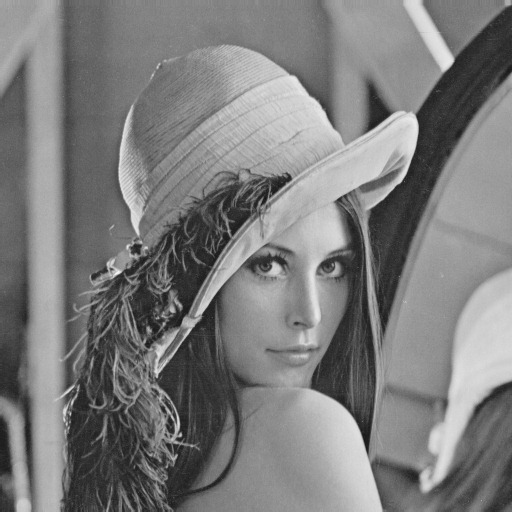

<br>

**화소 접근 : 그레이스케일 영상**

cv_ex12.py

```python
import cv2
# import numpy as np

img = cv2.imread('./data/lena.jpg', cv2.IMREAD_GRAYSCALE)
img[120, 200] = 0 # 화소값(밝기, 그레이스케일) 변경
print(img[100:110, 200:210]) # ROI 접근

# for y in range(100, 400):
#   x in range(200, 300):
#       img[y, x] = 0

img[100:400, 200:300] = 0 # ROI 접근

cv2.imshow('img', img)
cv2.waitKey()
cv2.destroyAllWindows()
```

[[146 143 145 132 147 144 142 139 132 138]
 [138 138 143 151 137 144 139 139 138 138]
 [132 139 153 140 133 136 143 138 137 128]
 [137 146 138 125 132 145 139 142 130 128]
 [149 139 130 137 140 145 136 133 132 141]
 [141 139 134 149 149 137 132 127 140 140]
 [142 148 139 142 144 138 146 135 131 130]
 [151 146 136 131 142 144 149 135 126 132]
 [147 131 135 138 147 139 128 125 134 138]
 [135 132 149 142 134 128 122 135 138 129]]

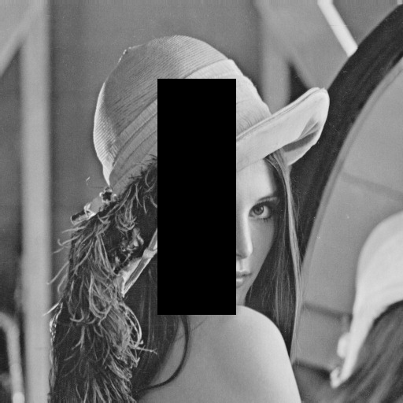

---

<br>

**화소접근 - 컬러 영상(BGR)**

cv_ex13.py

```python
import cv2
# import numpy as np

img = cv2.imread('./data/lena.jpg')
img[120, 200] = [255, 0, 0] # 컬러(BGR) 변경
print(img[100:110, 200:210]) # ROI 접근

# for y in range(100, 400):
#   x in range(200, 300):
#       img[y, x] = [255, 0, 0] # 파란색으로 변경

img[100:400, 200:300] = [255, 0, 0] # ROI 접근

cv2.imshow('img', img)
cv2.waitKey()
cv2.destroyAllWindows()
```

[[[118 119 209]  

:  

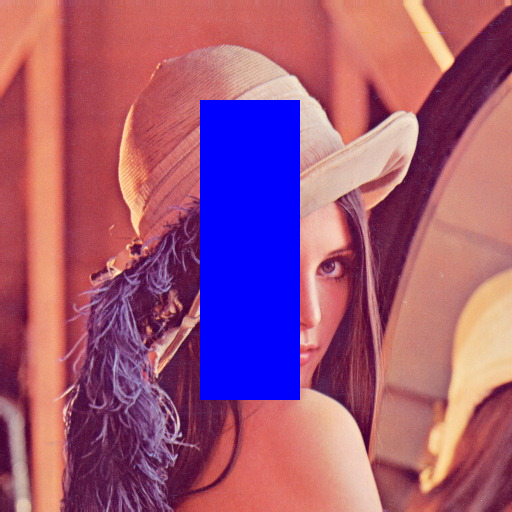

---

<br>

**화소접근 - 컬러 영상(채널 접근)**

cv_ex14.py

```python
import cv2
# import numpy as np

img = cv2.imread('./data/lena.jpg')

# for y in range(100, 400):
#   x in range(200, 300):
#       img[y, x, 0] = 255 # B-채널을 255로 변경

img[100:400, 200:300, 0] = 255 # B-채컬을 255로 변경
img[100:400, 200:300, 1] = 255 # G-채컬을 255로 변경
img[100:400, 200:300, 2] = 255 # R-채컬을 255로 변경

cv2.imshow('img', img)
cv2.waitKey()
cv2.destroyAllWindows()
```

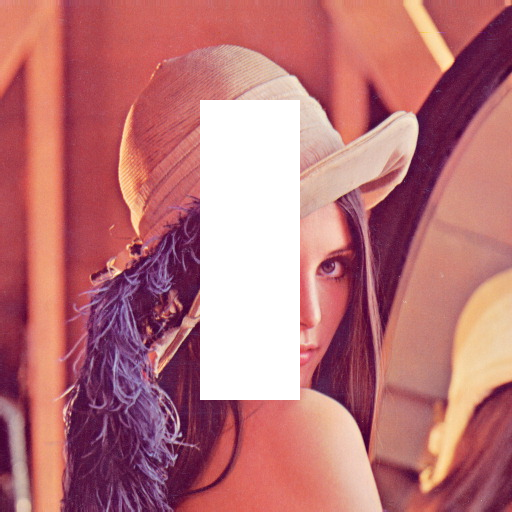

<br>

<br>

## 관심 영역과 ROI(Region Of Interest)

### selectROI(windowName, img[, showCrosshair[, fromCenter]]) -> retval

-   windowName 윈도우(디폴트 ROI selector)에 img 영상을 표시하고, 
    사용자가 마우스 클릭과 드래그로 ROI를 선택할 수 있게한다. 
-   showCrosshair = True이면 선택 영역에 격자가 표시 
-   fromCenter=True이면 마우스 클릭 위치 중심을 기준으로 박스로 선택 
-   Space 또는 Enter를 사용하여 선택 종료, c를 사용하여 선택 취소 
-   반환값 retval에 선택 영역의 튜플(x, y, widht, height)를 반환

<br>

### selectROIs(windowName, img[, showCrosshair[, fromCenter]]) -> boundingBoxes

-   windowName 윈도우를 생성해 img 영상을 표시하고, 마우스 클릭과 드래그 로 다중 ROI를 선택
-   선택 확정 space, Enter, 모든 선택 완료 종료 Esc
-   선택한 영역의 리스트 반환

<br>

**ROI에 의한 블록 평균 영상**

cv_ex15.py

```python
import cv2
import numpy as np

src = cv2.imread('./data/lena.jpg', cv2.IMREAD_GRAYSCALE)
dst = np.zeros(src.shape, dtype=src.dtype)

N = 64  # 8, 32, 64
height, width = src.shape
# height, width, _ = src.shape # 컬러 영상

h = height // N
w = width // N

for i in range(N):
    for j in range(N):
        y = i * h
        x = j * w
        roi = src[y:y+h, x:x+w]
        dst[y:y+h, x:x+w] = cv2.mean(roi)[0]  # 그레이스케일 영상
        # dst[y:y+h, x:x+w] = cv2.mean(roi)[0:3] # 컬러 영상

cv2.imshow('dst', dst)
cv2.waitKey()
cv2.destroyAllWindows()
```

N=4  

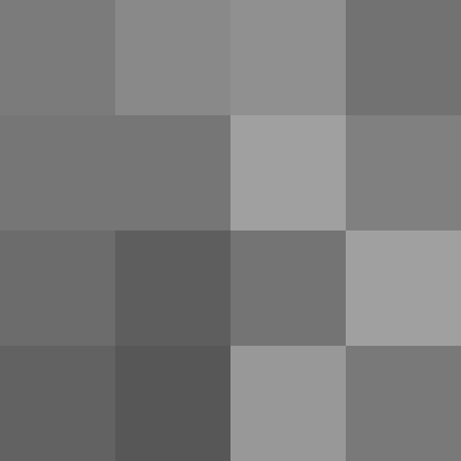

N=64  

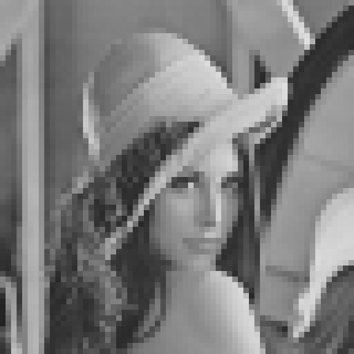

>   모자이크 처리

>   복사 X 참조 O

<br>

**영상 복사**

cv_ex16.py

```python
import cv2
src = cv2.imread('./data/lena.jpg', cv2.IMREAD_GRAYSCALE)

# dst = src # 참조
dst = src.copy()# 복사
dst[100:400, 200:300] = 0

cv2.imshow('src', src)
cv2.imshow('dst', dst)
cv2.waitKey()
cv2.destroyAllWindows()
```

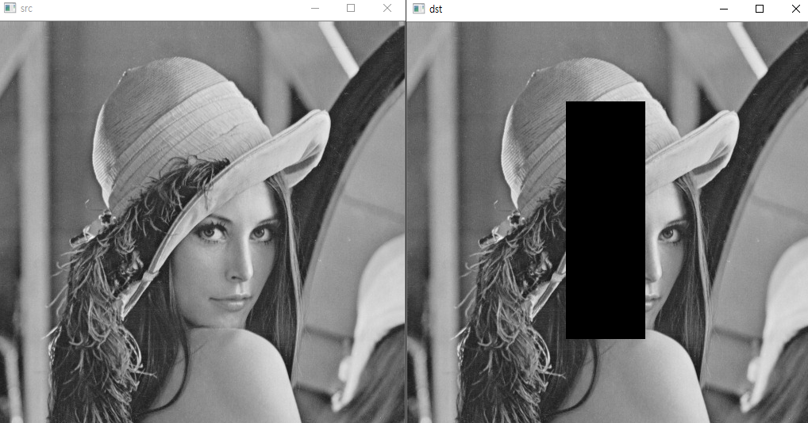

<br>

<br>

# 컬러 공간 변환

### cv2.cvtColor(src, code[, dst[, dstCn]]) -> dst

-   GRAY, HSV, YCrCb 등의 다양한 컬러 공간 포맷으로 변환
-   입력 영상 src를 code에 따라 출력 영상 dst에 반환
-   dstCn: 출력 영상의 채널 수, 자료형에 따라 다름

  <br>

-   컬러 변환 코드
    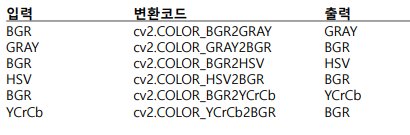

<br>

**컬러 변환**

cv_ex17.py

```python
import cv2
src = cv2.imread('./data/lena.jpg')

gray = cv2.cvtColor(src, cv2.COLOR_BGR2GRAY)
yCrCv = cv2.cvtColor(src, cv2.COLOR_BGR2YCrCb)
hsv = cv2.cvtColor(src, cv2.COLOR_BGR2HSV)

cv2.imshow('gray', gray)
cv2.imshow('yCrCv', yCrCv)
cv2.imshow('hsv', hsv)

cv2.waitKey(0)
cv2.destroyAllWindows()
```

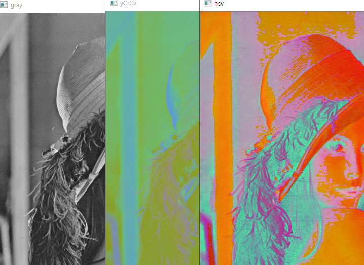

<br>

<br>

## 영상의 크기 변환과 회전

### cv2.resize(src, dsize[, dst[, fx[, fy[, interpolation]]]]) -> dst

-   영상의 크기를 변환하여 확대/축소 한다.
-   dsize는 출력 영상 크기
-   fx, fy는 가로와 세로의 스케일
-   interpolation(보간법)
    -   cv2.INTER_NEAREST
    -   cv2.INTER_LINEAR(디폴트)
    -   cv2.INTER_AREA
    -   cv2.INTER_CUBIC
    -   cv2.INTER_LANCZOS4 등

<br>

**영상 크기 변환**

cv_ex18.py

```python
import cv2
import numpy as np

src = cv2.imread('./data/lena.jpg', cv2.IMREAD_GRAYSCALE)
dst = cv2.resize(src, dsize=(320, 240))
dst2 = cv2.resize(src, dsize=(0,0), fx=1.5, fy=1.2)

cv2.imshow('dst', dst)
cv2.imshow('dst2', dst2)
cv2.waitKey()
cv2.destroyWindows()
```

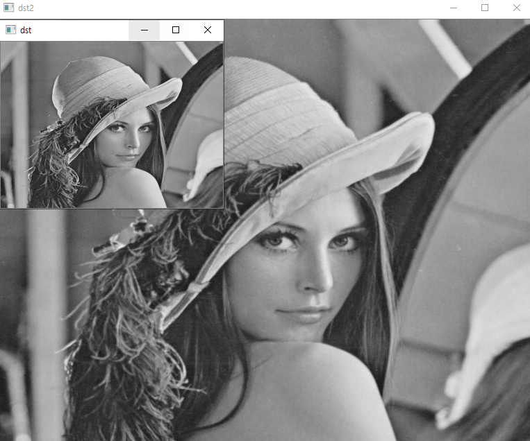

<br>

### cv2.rotate(src, rotateCode[, dst]) -> dst

-   입력 영상 src를 크기 rotateCode에 따라 90의 배수로 회전시켜 dst에 반환
-   rotateCode
    -   cv2.ROTATE_90_CLOCKWISE 
    -   cv2.ROTATE_180 
    -   cv2.ROTATE_90_COUNTERCLOCKWISE 등

<br>

**영상 회전**

cv_ex19.py

```python
import cv2
import numpy as np

src = cv2.imread('./data/lena.jpg', cv2.IMREAD_GRAYSCALE)
dst1 = cv2.rotate(src, cv2.ROTATE_90_CLOCKWISE)
dst2 = cv2.rotate(src, cv2.ROTATE_90_COUNTERCLOCKWISE)

cv2.imshow('dst1', dst1)
cv2.imshow('dst2', dst2)

cv2.waitKey()
cv2.destroyWindows()
```

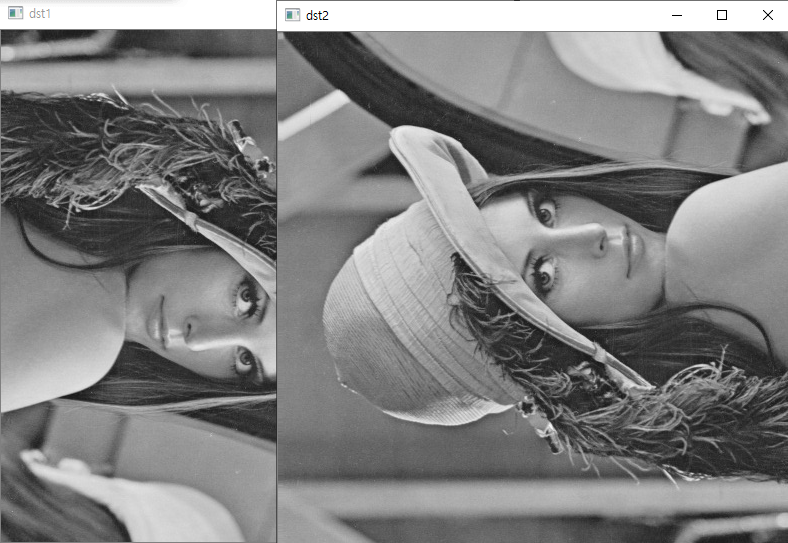

<br>

### cv2.getRotationMatrix2D(center, angle, sclae) -> M

-   center 좌표를 중심으로 scale 확대/축소하고, angle 각도 만큼 회전한 어파인 변환행렬 M을 반환
-   angle>0이면 반시계 방향 회전
-   M[:2] += (tx, ty)를 추가하면 이동

<br>

###  cv2.warpAffine(src, M, dsize[, dst[, flags[, borderMode[, borderValue]]]]) -> dst

-   src 영상에 2x3 어파인 변환행렬 M을 적용하여 dst에 반환 
-   dsize는 출력 영상 dst의 크기 
-   flags: 보간법과 cv2.WRAP_INVERSE_MAP의 조합 
    -   cv2.WRAP_INVERSE_MAP : M이 dst->src의 역변환 
-   borderMode : 경계값 처리 방싱(cv2.BORDER_CONSTANT)
-   borderVaule 경계값 상수

<br>

