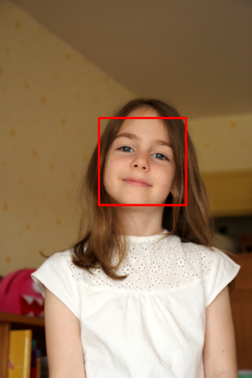
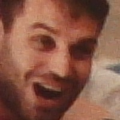

라즈베리파이 vscode 설치

>   $ sudo su  
>
>   \# wget https://packagecloud.io/headmelted/codebuilds/gpgkey -O - | sudo apt-key add -  
>
>   \# . <( wget -O - https://code.headmelted.com/installers/apt.sh )  
>
>   \# exit  
>
>   >   Code - OSS 확장팩 : python

<br>

<br>

# OpenCV 얼굴 영역 추출

<br>

### Haar Cascade

-   머신 러닝기반의 오브젝트 검출 알고리즘 
-   비디오 또는 이미지에서 오브젝트 검출 
-   직사각형 영역으로 구성 
-   찾으려는 오브젝트(여기에선 얼굴)가 포함된 이미지와 오브젝트가 없는 이미지를 사용하여 Haar Cascade Classifier(하르 특징 분류기)를 학습 
-   분류기를 사용하여 오브젝트 검출

<br>

### 사전 훈련된 분류기

-   opencv 라이브러리 설치 디렉토리 아래 data 패키지
    -   C:\Users\coolu\anaconda3\envs\iot\Lib\site-packages\cv2\data

>   작업 폴더에 복사

  

<br>

### haarcascade_frontalface_default.xml

-   얼굴 영역 검출 분류기
    -   face_classifier = cv2.CascadeClassifier( 'haarcascade_frontalface_default.xml')
        -   xml 파일을 작업 디렉토리에 복사 후 작업
-   목표 영역 검출하기
    -   cascade.detectMultiScale(image, scaleFactor=1.1, minNeighbors=1, minSize=(150,150))
        -   검출된 영역 리스트(x, y, w, h) 리턴

<br>

<br>

### 얼굴 영역 검출 및 영역 표시하기

cv_face_ex01.py   

```python
import cv2
import sys

cascade_file = "haarcascade_frontalface_alt.xml"
cascade = cv2.CascadeClassifier(cascade_file)

image_file = "./data/face1.jpg"  # ./data/face2.jpg
image = cv2.imread(image_file)
image_gs = cv2.cvtColor(image, cv2.COLOR_BGR2GRAY)

face_list = cascade.detectMultiScale(image_gs, scaleFactor=1.1,
                                     minNeighbors=1, minSize=(150, 150))
if len(face_list) > 0:
    print(face_list)
    color = (0, 0, 255)
    for face in face_list:
        x, y, w, h = face
        cv2.rectangle(image, (x, y), (x+w, y+h), color, thickness=8)
    cv2.imwrite("facedetect-output.PNG", image)
else:
    print("no face")
```

[[402 479 354 354]]

**원본**

  

**실행후**

  

---

<br>

<br>

### 검출된 얼굴 영역 모자이크 처리하기

cv_face_ex02.py

>   30배 축소하여 모자이크 처리

```python
import cv2
import sys

cascade_file = "haarcascade_frontalface_alt.xml"
cascade = cv2.CascadeClassifier(cascade_file)

image_file = "./data/face2.jpg"  # ./data/face2.jpg
output_file = "face1-mosaic.jpg"  # face2-mosaic.jpg

image = cv2.imread(image_file)
image_gs = cv2.cvtColor(image, cv2.COLOR_BGR2GRAY)

cascade = cv2.CascadeClassifier(cascade_file)
face_list = cascade.detectMultiScale(image_gs, scaleFactor=1.1,
                                     minNeighbors=1, minSize=(100, 100))
if len(face_list) == 0:
    print("no face")
    quit()

# 확인한 부분에 모자이크 처리하기
mosaic_rate = 30

print(face_list)
color = (0, 0, 255)

for (x, y, w, h) in face_list:
    face_img = image[y:y+h, x:x+w]  # 얼굴 부분 자르기
    # 자른 이미지를 지정한 배율로 확대/축소하기
    face_img = cv2.resize(face_img, (w//mosaic_rate, h//mosaic_rate))
    # 확대/축소한 그림을 원래 크기로 돌리기
    face_img = cv2.resize(face_img, (w, h), interpolation=cv2.INTER_AREA)
    image[y:y+h, x:x+w] = face_img  # 원래 이미지에 붙이기

# 렌더링 결과를 파일에 출력
cv2.imwrite(output_file, image)
```

[[599 481 205 205]
 [293 142 239 239]]

**원본**

  

**실행 후**

  

---

<br>

<br>

### 동영상에서 얼굴 영역 추출

cv_face_ex03.py

```python
import cv2
import numpy as np

face_classifier = cv2.CascadeClassifier('haarcascade_frontalface_default.xml')

cap = cv2.VideoCapture(0)

# cap.get(cv2.CAP_PROP_POS_FRAMES)
# cap.get(cv2.CAP_PROP_FRAME_COUNT)
# cap.set(cv2.CAP_PROP_FRAME_WIDTH, 640) (3)
# cap.set(cv2.CAP_PROP_FRAME_HEIGHT, 480) (4)

if cap.isOpened():
    print('width: {}, height : {}'.format(cap.get(3), cap.get(4)))
else:
    print("No Camera")

while True:
    ret, frame = cap.read()
    if ret:
        gray = cv2.cvtColor(frame, cv2.COLOR_BGR2GRAY)

        # 얼굴 검출
        faces = face_classifier.detectMultiScale(gray, 1.3, 5)
        for (x, y, w, h) in faces:
            cropped_face = frame[y:y+h, x:x+w].copy()
            cropped_face = cv2.resize(cropped_face, dsize=(300, 300),
                                    interpolation=cv2.INTER_AREA)
            cv2.rectangle(frame, (x, y), (x+w, y+h), (0, 0, 255), 3)

            cv2.imshow('face', cropped_face)
            
        cv2.imshow('video', frame)

        
        if cv2.waitKey(1) == 27: break  # ESC 키
    else:
        print('error')

cap.release()
cv2.destroyAllWindows()
```

width: 640.0, height : 480.0  

  

<br>

<br>

### 동영상 fullbody 추출

cv_face_ex04.py

```python
import cv2
import numpy as np

face_classifier = cv2.CascadeClassifier('haarcascade_fullbody.xml')

cap = cv2.VideoCapture('./data/vtest.avi')


while True:
    ret, frame = cap.read()
    if ret:
        gray = cv2.cvtColor(frame, cv2.COLOR_BGR2GRAY)

        faces = face_classifier.detectMultiScale(gray, 1.3, 5)
        for (x, y, w, h) in faces:
            cropped_face = frame[y:y+h, x:x+w].copy()
            cropped_face = cv2.resize(cropped_face, dsize=(300, 300),
                                    interpolation=cv2.INTER_AREA)
            cv2.rectangle(frame, (x, y), (x+w, y+h), (0, 0, 255), 3)
            
        cv2.imshow('video', frame)
        
        if cv2.waitKey(1) == 27: break  # ESC 키
    else: break

cap.release()
cv2.destroyAllWindows()

```

    

<br>

<br>

## 카메라 class 만들기

**cam.py**

```python
import cv2

class USBCam:
    def __init__(self, show=False, framerate=25, width=640, height=480):
        self.size = (width, height)
        self.show = show
        self.framerate = framerate

    def __iter__(self):
        self.cap = cv2.VideoCapture(0) # 0번 카메라
        self.cap.set(cv2.CAP_PROP_FRAME_WIDTH, self.size[0])
        self.cap.set(cv2.CAP_PROP_FRAME_HEIGHT, self.size[1])
        
        while True:
            retval, frame = self.cap.read() # 프레임 캡처
            yield frame

    def run(self, callback):
        self.cap = cv2.VideoCapture(0) # 0번 카메라
        self.cap.set(cv2.CAP_PROP_FRAME_WIDTH, self.size[0])
        self.cap.set(cv2.CAP_PROP_FRAME_HEIGHT, self.size[1])
        
        while True:
            retval, frame = self.cap.read() # 프레임 캡처
            if not retval: break
            if not callback(frame): break
            
            if self.show:
                cv2.imshow('frame', frame)
                key = cv2.waitKey(self.framerate)
                if key == 27: break

        if self.cap.isOpened():
            self.cap.release()
```

<br>

**USBCam Class 활용**

cv_face_ex05.py

```python
import cv2

from cam import USBCam

c = USBCam() # USBCam(show=True)

def capture(frame):
    # frame 처리
    cv2.imshow('frame', frame)
    key = cv2.waitKey(25)
    if key == 27: return False
    return True
    
c.run(capture)
```

<br>

**USBCam Class 활용 - 얼굴 영역 분리 출력 및 저장**

cv_face_ex06.py

```python
import numpy as np
from cam import USBCam
import cv2

FACE_WIDTH = 200
face_cascade = cv2.CascadeClassifier('haarcascade_frontalface_default.xml')
ix = 0
def save_image(img):
    global ix
    cv2.imwrite(f'p:/workspace/04_OPENCV-FACE/face_{ix:04d}.jpg', img, [cv2.IMWRITE_JPEG_QUALITY, 90])
    ix += 1

face_image = np.array((FACE_WIDTH, FACE_WIDTH,3), dtype=int)

def detect_face(frame):
    global face_image
    gray = cv2.cvtColor(frame, cv2.COLOR_BGR2GRAY)
    
    # 이미지에서 얼굴을 검출합니다.
    faces = face_cascade.detectMultiScale(gray, 1.3, 5)
    
    # 얼굴이 검출되었다면 얼굴 위치에 대한 좌표 정보를 리턴받습니다.
    for (x,y,w,h) in faces:
        # 원본 이미지에 얼굴의 위치를 표시
        # cv2.rectangle(frame,(x,y),(x+w,y+h),(255,0,0),2)
        minLength = min(w, h)
        if minLength < 150: break
        width = max(w, h)

        # 얼굴 부분 검출
        # face_image = frame[y:y+h, x:x+w].copy()
        x = x + w//2 - width//2
        y = y + h//2 - width//2
        face_image = frame[y:y+width, x:x+width].copy()
        cv2.rectangle(frame,(x,y),(x+width,y+width),(255,0,0),2)

        face_image = cv2.resize(face_image, dsize=(FACE_WIDTH, FACE_WIDTH), interpolation=cv2.INTER_AREA)

        save_image(face_image) # 얼굴영역 저장
    
    frame[0:FACE_WIDTH, 0:FACE_WIDTH] = face_image[:] # 좌측 상단에 출력
    
    return True


c = USBCam(show = True)
print('cam start')
c.run(detect_face)
```

  

>   얼굴이 인식되면 지정해준 폴더에 face_0000.jpg 부터 저장됨

<br>