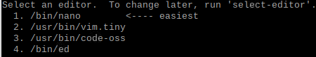

# picamera

<br>

### 동작 확인

-   $ `raspistill -v -o test.jpg`
    -   미리보기 화면을 5초간 보여준 후 촬영
    -   촬영한 이미지를 test.jpg 파일로 저장함

<br>

### 타이머 변경

-   $ `raspistill -t 1000 -o cam.jpg`
    -   -t : 밀리초 단위로 촬영 타이머 설정

<br>

### 크기 변경

-   $ `raspistill -w 300 -h 300 -o cam.jpg`
    -   -w : 이미지 폭 지정
    -   -h : 이미지 높이 지정

<br>

### 밝기 조정

-   $ `raspistill -br 0 -o br-0.jpg`
-   $ `raspistill -br 50 -o br-50.jpg`
-   $ `raspistill -br 100 -o br-100.jpg`
    -   -br : 밝기를 %로 지정

<br>

### 화면 뒤집기

-   $ `raspistill -hf cam.jpg`
    -   -hf : 수평 방향으로 뒤집기
    -   -vf : 수직 방향으로 뒤집기

<br>

###  쉘 스크립트로 촬영하기

-   파일명 : camera.sh

```sh
#!/bin/bash
DATE=$(date +"%Y-%m-%d_%H%M")
raspistill -o /home/pi/picamera/$DATE.jpg
```

-   $ `chmod +x camera.sh`
-   $ `./camera.sh`

<br>

### 연속 촬영(타임 랩스)

-   $ `raspistill -o image_%04d.jpg -tl 3000 -t 30000`
    -   -t : 촬영 시간
    -   -tl : 촬영 간격
    -   30초 동안 3초 간격으로 사진 촬영

<br>

### cron에 촬영 스케줄 등록하기

-   cron으로 스케줄 생성
    -   $ `crontab -e`
        -   에디터 선택 묶음에 nano 또는 leafpad 선택 `3`



### cron 테이블 양식

```
# m h dom mon dow command

# * * * * * 명령문
# ┬ ┬ ┬ ┬ ┬
# │ │ │ │ │
# │ │ │ │ │
# │ │ │ │ └───── 요일 (0 - 7) : 0 에서 6은 일요일에서 토요일을 뜻한다
# │ │ │ └────────── 월 (1 - 12)
# │ │ └─────────────── 일 (1 - 31)
# │ └──────────────────── 시 (0 - 23)
# └───────────────────────── 분 (0 - 59)
```

-   \* * * * * /home/pi/work/camera.sh 2>&1
    -   매분 마다 camera.sh 실행

>   0: 표준 입력 장치  
>
>   1: 표준출력장치  
>
>   2: 표준에러출력장치  
>
>   아직 안됨!

<br>

<br>

### 비디오 촬영

-   $ `raspivid -o video.h264`
    -   기본 촬영 시간 : 5초
-   $ `raspivid -t 10000 -o video.h264`
    -   -t : 촬영시간 옵션, 단위 밀리초

<br>

###  비디오 재생

-   $ `omxplayer video.h264` or `vlc video.h264`

<br>

