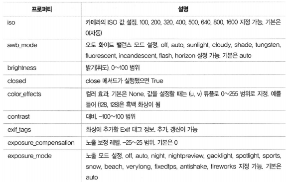
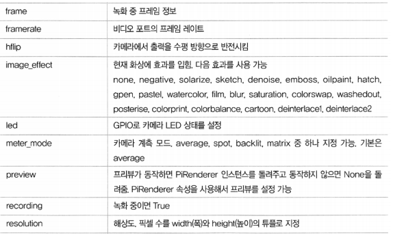
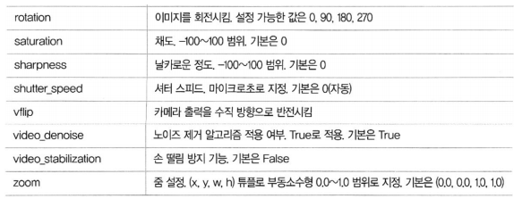
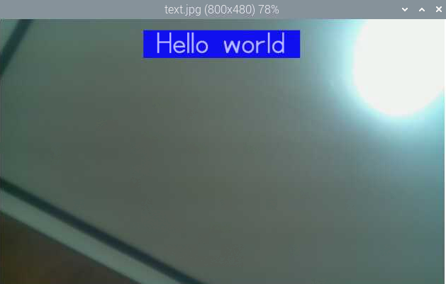

# python-picamera

### python-picamera

-    라즈베리 파이 카메라를 파이썬으로 제어하는 라이브러리

-   최신 라즈베리 파이에는 이미 설치되어 있음

-   sudo apt-get install python-picamera

    >   기본적으로 자동 설치 되어있다.

```python
from picamera import PiCamera

camera = PiCamera()  # PiCamera 객체 생성
```

<br>

### picamera 주요 프로퍼티

  

  

  

<br>

### 미리보기 화면

-   start_preview()
    -   미리 보기 화면을 생성
-   stop_preview()
    -   미리 보기 화면을 닫음

<br>

>   P:\workspace\05_python-picamera

**미리보기**

pycamera_basic_ex01.py

```python
from picamera import PiCamera
from time import sleep

camera = PiCamera()

# 180도 회전하기
camera.rotation = 180

# camera.start_preview() # 미리보기 화면 시작
camera.start_preview(alpha=200) # 투명도 설정, 값의 범위 : 0~255

sleep(10)
camera.stop_preview() # 미리보기 화면 정지
```

<br>

### 해상도 설정

-   resolution 속성에 해상도 설정값을 튜플로 지정
    -   `camera.resolution = (1024, 768)` # 1024x768 해상도

<br>

### 이미지 촬영하기

-   `capture(파일명)`
    -   촬영한 이미지를 저장할 파일 경로를 매개변수로 지정

<br>

**해상도 설정, 이미지 촬영**

pycamera_basic_ex02.py

```python
# picamera 라이브러리 임포트
import picamera

# time 라이브러리 임포트
import time

# PiCamera 객체 인스턴스 생성
with picamera.PiCamera() as camera:

    # 해상도를 선택하도록 함
    res = int(input('Resolution(1:320x240, 2:640x480, 3:1024x768)?'))
    
    # 선택한 값에 따라 해상도 설정
    if res == 3:
        camera.resolution = (1024, 768)
    elif res == 2:
        camera.resolution = (640, 480)
    else:
        camera.resolution = (320, 240)

    # 파일명 입력 받기
    filename = input('File Name?')

    # 프리뷰 화면 표시
    camera.start_preview()

    # 1초 대기
    time.sleep(1)

    # 프리뷰 종료
    camera.stop_preview()
    
    # 촬영하고 저장
    camera.capture(filename + '.jpg')
```

<br>

**5초 간격으로 5장 사진 촬영하기**

pycamera_basic_ex03.py

```python
camera.start_preview()

for i in range(5):
    time.sleep(5)
    camera.capture(format('/home/pi/workspace/05_python-picamera/image{}.jpg', i))

camera.stop_preview()
```

<br>

### 텍스트 설정

-   annotate_text : 표시할 문자열
-   annotate_text_size : 텍스트 크기 (6~160), 기본 32
-   annotate_foreground : 글자 색
-   annotate_background : 글자 배경색

<br>

pycamera_basic_ex04.py

```python
from picamera import PiCamera, Color
from time import sleep

camera = PiCamera()

camera.start_preview()
camera.annotate_text_size = 50
camera.annotate_background = Color('blue')
camera.annotate_foreground = Color('yellow')
camera.annotate_text = " Hello world "
sleep(5)
camera.capture('/home/pi/Desktop/text.jpg')
camera.stop_preview()
```



<br>

### 밝기 설정

-   brightness : 0~100 지정, 기본값 50

<br>

### 대비 설정

-   contrast : 0~100 지정

<br>

### 이미지 효과(IMAGE_EFFECTS)

-   image_effect : 디폴트는 none
    -   none, negative, solarize, sketch, denoise, emboss, oilpaint, hatch, gpen, pastel, watercolor, film, blur, saturation, colorswap, washedout, posterise, colorpoint, colorbalance, cartoon, deinterlace1, deinterlace2

```python
from picamera import PiCamera
from time import sleep

camera = PiCamera()

camera.start_preview()
for effect in camera.IMAGE_EFFECTS:
    camera.image_effect = effect
    camera.annotate_text = "Effect: %s" % effect
    sleep(5)
camera.stop_preview()
```

<br>

### 자동 화이트밸런스(AWB_MODES)

-   awb_mode 속성, 기본값은 (auto)
-   AWB_MODES 값 목록
    -   off, auto, sunlight, cloudy, shade, tungsten, fluorescent, incandescent, flash, horizon

```python
from picamera import PiCamera
from time import sleep

camera = PiCamera()

camera.start_preview()
camera.awb_mode = 'sunlight'
sleep(5)
camera.capture('/home/pi/sunlight.jpg')
camera.stop_preview()

# AWB_MODES 값 목록
# off, auto, sunlight, cloudy, shade, tungsten, fluorescent, incandescent, flash, horizon
```

<br>

### 노출(EXPOSURE_MODES)

-   exposure_mode 속성, 기본값은 auto
-   EXPOSURE_MODES 값 목록
    -   off, auto, night, nightpreview, backlight, spotlight, sports, snow, beach, verylong, fixedfps, antishake, fireworks

```python
from picamera import PiCamera
from time import sleep

camera = PiCamera()

camera.start_preview()
camera.exposure_mode = 'beach'
sleep(5)
camera.capture('/home/pi/beach.jpg')
camera.stop_preview()

# EXPOSURE_MODES 값 목록
# off, auto, night, nightpreview, backlight, spotlight, sports, snow, beach, verylong, fixedfps, antishake, fireworks
```

<br>

<br>

### 동영상 촬영

-   start_recording(파일명)
    -   동영상 저장 시작
-    stop_recording()
    -    동영상 저장 마침

<br>

pycamera_basic_ex05.py

```python
import picamera
import time

with picamera.PiCamera() as camera:
    res = int(input('Resolution(1:320x240, 2:640x480, 3:1024x768)?'))
    # 선택한 값에 따라 해상도 설정
    if res == 3:
        camera.resolution = (1024, 768)
    elif res == 2:
        camera.resolution = (640, 480)
    else:
        camera.resolution = (320, 240)

    # 파일명 입력
    filename = input('File Name?')

    camera.framerate = 15
    # 프리뷰 화면 표시
    camera.start_preview()

    # 촬영하고 파일 저장
    camera.start_recording(output = filename + '.h264')
    
    # 5초 대기
    camera.wait_recording(5)
    
    # 촬영 종료
    camera.stop_recording()
    
    # 프리뷰 화면 종료
    camera.stop_preview()
```


<br>

