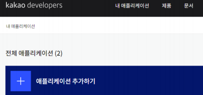
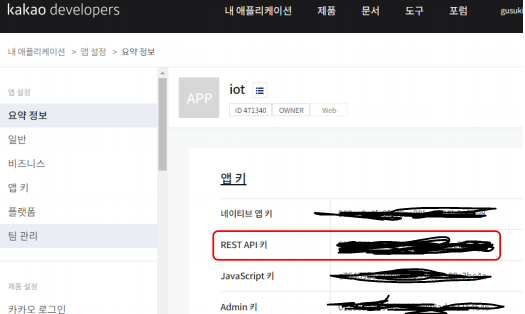
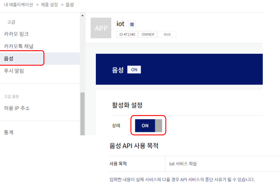

# 카카오 음성합성, 음성인식

### 카카오 음성 API

-   https://speech-api.kakao.com/
-   개발자 가이드
    -   https://developers.kakao.com/docs/latest/ko/voice/rest-api


-   음성 인식(뉴톤)
    -   Speech-to-Text(STT): 음성을 텍스트로 변환
-   음성 합성(뉴톤톡)
    -   Text-to-Speech(TTS): 텍스트를 음성으로 변환


-   무료 가격 정책
    -   음성 인식 5,400초(90분)
    -   음성 합성 20,000자

<br>

### 카카오 개발자 등록

-   https://developers.kakao.com/

<br>

### 애플리케이션 추가

-   내 애플리케이션 > 애플리케이션 추가하기

  

### REST API 키 얻기

    

### 음성 API 활성화

  

<br>

<br>

## 음성 합성

### 음성 합성 요청 xml

-   \<speak\> 루트

    -   \<voice>

        -   음성 합성할 텍스트 지정

        -   name 속성: 보이스 선택(성별, 음색)

            MAN_READ_CALM  

            WOMAN_READ_CALM  

            MAN_DIALOG_BRIGHT  

            WOMAN_DIALOG_BRIGHT  

        -   텍스트는 반드시 UTF-8 인코딩이어야 함

-   예제

```xml
<speak>
    <voice name="WOMAN_READ_CALM"> 지금은 여성 차분한 낭독체입니다.</voice>
    <voice name="MAN_READ_CALM"> 지금은 남성 차분한 낭독체입니다.</voice>
    <voice name="WOMAN_DIALOG_BRIGHT"> 안녕하세요. 여성 밝은 대화체예요.</voice>
    <voice name="MAN_DIALOG_BRIGHT">안녕하세요. 남성 밝은 대화체예요.</voice>
</speak>
```

<br>

>   새 디렉토리 > 가상환경 설정 > 활성화 > pip install requests

<br>

### kakao_synthesize.py

>   \> `pip install pydub`
>
>   \> `conda install -c anaconda pyaudio`
>
>   https://www.gyan.dev/ffmpeg/builds/ > release full 다운로드
>
>   환경변수 경로 설정

```python
import requests
import io
from pydub import AudioSegment
from pydub.playback import play

URL = "https://kakaoi-newtone-openapi.kakao.com/v1/synthesize"
HEADERS = {
    "Content-Type" : "application/xml",
    "Authorization" : "KakaoAK 2d7bbeaca71e61a89bef469ece9f01bd"
}
DATA = """
<speak>
    그는 그렇게 말했습니다.
    <voice name="MAN_DIALOG_BRIGHT">잘 지냈어? 나도 잘 지냈어.</voice>
    <voice name="WOMAN_DIALOG_BRIGH">금요일이 좋아요.</voice>
</speak>
"""
res = requests.post(URL, headers = HEADERS, data = DATA.encode('utf-8'))

# 음성 합성 결과를 파일로 저장하기
with open("result.mp3", "wb") as f:
  f.write(res.content)

# 바로 재생하기
# https://ffmpeg.zeranoe.com/builds/
# 환경 변수에 경로 지정

sound = io.BytesIO(res.content)
song = AudioSegment.from_mp3(sound)

# 파일에서 재생하기
# song = AudioSegment.from_mp3("./result.mp3")
play(song)
```

>   result.mp3 파일 생성, 재생

<br>