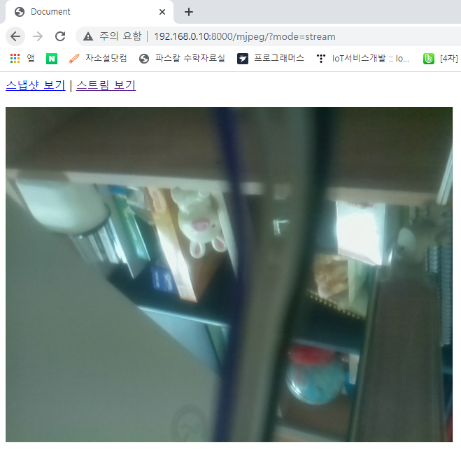

# Motion JPEG

**앱 만들기**

가상환경 활성화 : \> `conda activate iot`

디렉토리 추가 : `C:\workspace\iot_web_service\` 

프로젝트 생성 : \> `django-admin startproject mysite`

디렉토리 명 변경 : `mysite > iot`

앱 추가 : \> `python manage.py startapp mjpeg`

Code로 열기 : `C:\workspace\iot_web_service\iot\`

<br>

**Test**

test01.html

```html
<h1>MJpeg 확인</h1>

<!-- droid cam 앱 실행시에 나오는 url 입니다. -->
```

  

>   핸드폰 카메라가 실시간으로 웹 상에서 확인 된다.

<br>

**MJpeg용 HTTP 응답 메시지**

```
HTTP/1.1 200 OK
Content-Type: multipart/x-mixed-replace; boundary=frame

--frame
Content-Type: image/jpeg
Content-Length: 33377

[JPEG data]

--frame
Content-Type: image/jpeg
Content-Length: 33377

[JPEG data]

.
.
.
```

>   이러한 형식으로 보내기 위해 아래가 구성되어야함

<br>

**mysite/settings.py**

```pythoon
:
ALLOWED_HOSTS = ['192.168.0.11', '127.0.0.1', 'localhost']

INSTALLED_APPS = [
    :
    'mjpeg.apps.MjpegConfig',
]

:
LANGUAGE_CODE = 'ko-kr'
TIME_ZONE = 'Asia/Seoul'

:
```

<br>

**mysite/usbcam.py**

```python
import cv2

class USBCam:
    def __init__(self, show=False, framerate=25, width=640, height=480):
        self.size = (width, height)
        self.show = show
        self.framerate = framerate

        self.cap = cv2.VideoCapture(0) # 0번 카메라
        self.cap.set(cv2.CAP_PROP_FRAME_WIDTH, self.size[0])
        self.cap.set(cv2.CAP_PROP_FRAME_HEIGHT, self.size[1])

    def snapshot(self): # jpeg 이미지 1장 리턴
        retval, frame = self.cap.read() # 프레임 캡처, frame: numpy 배열 - BGR
        if retval:
            _, jpg = cv2.imencode('.JPEG', frame)
            return jpg.tobytes()

class MJpegStreamCam(USBCam):
    def __init__(self, show=True, framerate=25, width=640, height=480):
        super().__init__(show=show, framerate=framerate, width=width, height=height)

    def __iter__(self):  # 열거 가능객체 이기 위한 조건 for x in MJpegStreamCam()
        while True:
            retval, frame = self.cap.read()
            _, jpg = cv2.imencode('.JPEG', frame)
            yield (
                b'--myboundary\n'
                b'Content-Type:image/jpeg\n'
                b'Content-Length: ' + f"{len(jpg)}".encode() + b'\n'
                b'\n' + jpg.tobytes() + b'\n'
            )
```

<br>

**mysite/urls.py**

```python
from django.contrib import admin
from django.urls import path, include


urlpatterns = [
    path('admin/', admin.site.urls),
    path('mjpeg/', include('mjpeg.urls')),
]
```

<br>

**mjpeg/urls.py**

```python
from django.contrib import admin
from django.urls import path
from mjpeg.views import *

urlpatterns = [
    path('', CamView.as_view()),
    path('snapshot/', snapshot, name='snapshot'),
    path('stream/', mjpeg_stream, name='stream'),
]
```

<br>

**mjpeg/views.py**

```python
from django.views.generic import View, TemplateView
from django.http import HttpResponse, StreamingHttpResponse
from mysite.usbcam import MJpegStreamCam

mjpegstream = MJpegStreamCam()

class CamView(TemplateView):
    template_name = "cam.html"

    def get_context_data(self):
        context = super().get_context_data()
        context["mode"] = self.request.GET.get("mode", "#")
        return context

def snapshot(request):
    image = mjpegstream.snapshot()
    return HttpResponse(image, content_type="image/jpeg")

def mjpeg_stream(request):
    return StreamingHttpResponse(mjpegstream, content_type='multipart/x-mixed-replace;boundary=myboundary')
```

<br>

**mjpeg/templates/cam.html**

```html
<!DOCTYPE html>
<html lang="ko">
<head>
    <meta charset="UTF-8">
    <meta name="viewport" content="width=device-width, initial-scale=1.0">
    <title>Document</title>
</head>
<body>
    <div>
        <a href="?mode=snapshot">스냅샷 보기</a> |
        <a href="?mode=stream">스트림 보기</a>
    </div>
    <br>

    
        
    
        
    
        
    
</body>
</html>
```

<br>

-   \> `python manage.py runserver 0.0.0.0:8000`

-   http://192.168.0.11:8000/mjpeg/

.assets/image-20201013174031980.png)  

<br>

<br>

**jpg.tobyes() 에 .tobytes()가 없으면**

-   \> `python manage.py shell`

```shell
>>> from mysite.usbcam import *
>>> cam = USBCam()
>>> jpg = cam.snapshot()
>>> jpg
array([[255],
       [216],
       [255],
       ...,
       [135],
       [255],
       [217]], dtype=uint8)
```

>   jpg는 numpy 배열이 리턴 됐다. → 브라우저는 numpy 배열을 알 수 없다.
>
>   Bytes로 변환해야한다.

<br>

<br>

### 라즈베리파이

iot_web_service 디렉토리 라즈베리파이로 이동

-   **.bashrc**

    `export PATH=.:$PATH:/home/pi/.local/bin` 추가

-   $ `pip install django`

-   $ `source ~/.bashrc`

<br>

**mysite/settings.py**

```python
ALLOWED_HOSTS = ['192.168.0.10', '127.0.0.1', 'localhost']
```

<br>

**실행**

-   $ `python manage.py runserver 0.0.0.0:8000`

-   http://192.168.0.10:8000/mjpeg/

  

<br>

<br>

### PiCam 모듈 사용

**mysite/picam.py**

```python
import cv2
import io
import time
import numpy as np
from picamera.array import PiRGBArray
from picamera import PiCamera

class PiCam:
    def __init__(self, show=True, framerate=25, width=640, height=480):
        self.size = (width, height)
        self.show = show
        self.framerate = framerate

        self.camera = PiCamera()
        self.camera.rotation = 180
        self.camera.resolution = self.size
        self.camera.framerate = self.framerate


    def snapshot(self):
        frame = io.BytesIO()
        self.camera.capture(frame, 'jpeg',use_video_port=True)
        frame.seek(0)
        return frame.getvalue()


class MJpegStreamCam(PiCam):
    def __init__(self, show=True, framerate=25, width=640, height=480):
        super().__init__(show=show, framerate=framerate, width=width, height=height)

    def __iter__(self): 
        frame = io.BytesIO()
        while True:
            self.camera.capture(frame, 'jpeg',use_video_port=True)
            image = frame.getvalue()
            yield (
                b'--myboundary\n'
                b'Content-Type:image/jpeg\n'
                b'Content-Length: ' + f"{len(image)}".encode() + b'\n'
                b'\n' + image + b'\n')
            frame.seek(0)  # 읽기 쓰기 위치를 맨 앞으로 (기존 데이터 남아있음)
```

<br>

**mjpeg/views.py**

```python
from django.views.generic import View, TemplateView
from django.http import HttpResponse, StreamingHttpResponse
# from mysite.usbcam import MJpegStreamCam
from mysite.picam import MJpegStreamCam
```

<br>

**실행**

  


