# 카톡 메시지 보내기

### 설정

-   https://developers.kakao.com/

<br>

**플랫폼 설정**

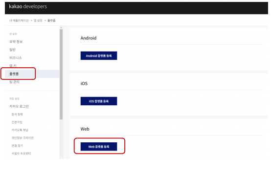  

<br>

    

>   pc와 라즈베리파이 주소를 넣어준다.

<br>

**카카오 계정 로그인 설정**

  

<br>

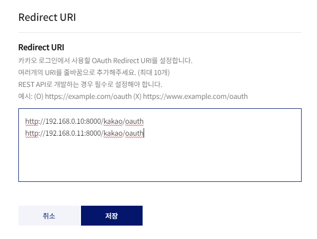  

>   라즈베리파이 주소를 준다. (PC는 혹시 몰라서)

<br>

**접근권한 관리**

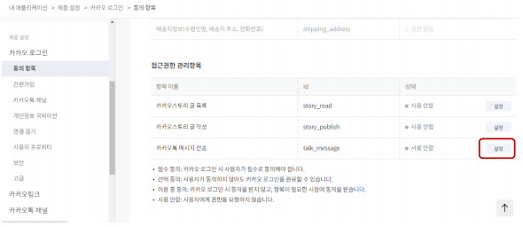  

<br>

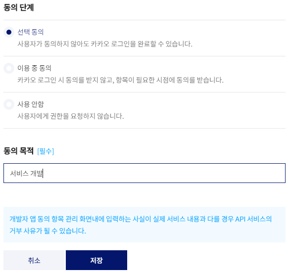  

<br>

<br>

### 카톡 메시지 보내기 앱 만들기 / Access Token 얻기

**kakao 앱 추가**

-   `python manage.py startapp kakao`

<br>

**settings.py**

```python
INSTALLED_APPS = [
    :
    'kakao.apps.KakaoConfig'
]
```

<br>

**kakao/views.py**

```python
from django.shortcuts import render
from django.views.generic import TemplateView, FormView
# from kakao.forms import KaKaoTalkForm
import json
import requests
from django.contrib import messages

client_id = ""

class KakaoLoginView(TemplateView):
    template_name = "kakao_login.html"

    def get_context_data(self, **kwargs):
        context = super().get_context_data(**kwargs)
        context["client_id"] = client_id
        return context
```

>   REST API KEY

<br>

**kakao/templates/kakao_login.html**

```html
<div>
<h1 class="my-5"> 카카오 로그인</h1>
<a href="https://kauth.kakao.com/oauth/authorize?client_id={{client_id}}&redirect_uri=http://192.168.0.10:8000/kakao/oauth&response_type=code&scope=talk_message" class="btn btn-primary">Kakao login</a>
</div>
```

<br>

**kakao/views.py**

```python
:
class KakaoAuthView(TemplateView):
    template_name = "kakao_token.html"

    def get_context_data(self, **kwargs):
        context = super().get_context_data(**kwargs)
        code = self.request.GET['code']
        token = self.getAccessToken(code)
        context["client_id"] = client_id
        context["token"] = token
        self.save_access_token(token["access_token"])

        return context

    # 세션 코드값 code 를 이용해서 ACESS TOKEN과 REFRESH TOKEN을 발급 받음
    def getAccessToken(self, code):
        url = "https://kauth.kakao.com/oauth/token"
        payload = "grant_type=authorization_code"
        payload += "&client_id=" + client_id
        # redirect url을 넣어준다. 라즈베리파이 주소
        payload += "&redirect_url=http://192.168.0.10:8000/kakao/oauth&code=" + code
        headers = {
            'Content-Type': "application/x-www-form-urlencoded",
            'Cache-Control': "no-cache",
        }
        response = requests.post(url, data=payload, headers=headers)
        return response.json()

    def save_access_token(self, access_token):
        with open("access_token.txt", "w") as f:
            f.write(access_token)
```

>   access_token 다음에 다시 쓸 수 있게 파일로 만든다.

<br>

**kakao/templates/kakao_token.html**

```html
<h1 class="my-3">카카오 토큰 정보</h1>


<div class="alert alert-danger">

    <div class="row">
        <div class="col-sm-2">error</div>
        <div class="col-sm-10">{{token.error}}</div>
    </div>
    <div class="row">
        <div class="col-sm-2">error_description</div>
        <div class="col-sm-10">{{token.error_description}}</div>
    </div>
</div>
<a href="javascript:history.back()" class="btn btn-primary">돌아가기</a>


<div>
    <div class="row">
        <div class="col-sm-2">access_token</div>
        <div class="col-sm-10">{{token.access_token}}</div>
    </div>
    <div class="row">
        <div class="col-sm-2">token_type</div>
        <div class="col-sm-10">{{token.token_type}}</div>
    </div>
    <div class="row">
        <div class="col-sm-2">scope</div>
        <div class="col-sm-10">{{token.scope}}</div>
    </div>
    <div class="row">
        <div class="col-sm-2">expires_in</div>
        <div class="col-sm-10">{{token.expires_in}}</div>
    </div>
    <div class="row">
        <div class="col-sm-2">refresh_token</div>
        <div class="col-sm-10">{{token.refresh_token}}</div>
    </div>
    <div class="row">
        <div class="col-sm-2">refresh_token_expires_in</div>
        <div class="col-sm-10">{{token.refresh_token_expires_in}}</div>
    </div>
</div>

</div>
```

<br>

**kakao/urls.py**

```python
from django.urls import path
from kakao.views import KakaoLoginView, KakaoAuthView

app_name = "kakao"

urlpatterns = [
    path('login', KakaoLoginView.as_view(), name="login"),
    path('oauth', KakaoAuthView.as_view(), name="oatuh"),
]
```

<br>

**mysite/urls.py**

```python
urlpatterns = [
    :
    path('kakao/', include('kakao.urls')),
]
```

<br>

#### 실행

\> `python manage.py runserver 0.0.0.0:8000`

-   http://192.168.0.10:8000/kakao/login

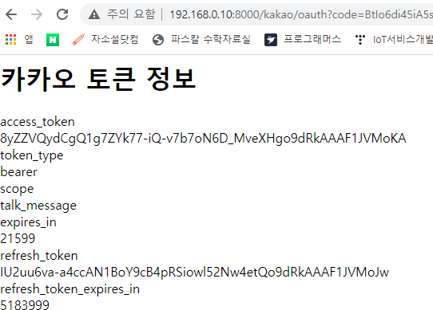  

>   21599초(≒6시간) 유효 이후 다시 로그인

<br>

<br>

### 카톡 메시지 보내기 앱 만들기 / Talk 보내기

**kakao/forms.py**

```python
from django import forms
import json
import requests

class KaKaoTalkForm(forms.Form):
    text = forms.CharField(label='전송할 Talk', max_length=300)
    web_url = forms.CharField(label='Web URL', max_length=300,
                        initial='http://192.168.0.10:8000/mjpeg?mode=stream')
    mobile_web_url = forms.CharField(label='Mobile Url', max_length=300,
                        initial='http://192.168.0.10:8000/mjpeg?mode=stream')

    def send_talk(self):
        talk_url = "https://kapi.kakao.com/v2/api/talk/memo/default/send"
        with open("access_token.txt", "r") as f:
            token = f.read()

        header = {"Authorization": f"Bearer {token}"}
        text_template = {
            'object_type': 'text',
            'text': self.cleaned_data['text'],
            'link': {
                'web_url': self.cleaned_data['web_url'],
                'mobile_web_url': self.cleaned_data['mobile_web_url']
            }
        }
        print(text_template)
        payload = {'template_object': json.dumps(text_template)}
        res = requests.post(talk_url, data=payload, headers=header)

        return res, self.cleaned_data['text']
```

<br>

**kakao/views.py**

```python
:
from kakao.forms import KaKaoTalkForm
:
class KakaoTalkView(FormView):
    form_class = KaKaoTalkForm
    template_name = "kakao_form.html"
    success_url = "/kakao/talk"

    # form 유효성 검사를 마치면 호출됨
    def form_valid(self, form):
        res, text = form.send_talk()

        if res.json().get('result_code') == 0:
            messages.add_message(self.request, messages.SUCCESS,
                                "메시지 전송 성공 : " + text)
        else:
            messages.add_message(self.request, messages.ERROR,
                                "메시지 전송 실패 : " + str(res.json()))
        return super().form_valid(form)
```

<br>

**kakao/templates/kakao_form.html**

```html
<div>
<h1>Talk 보내기</h1>


    
    <div>
        {{msg.message}}
    </div>
    


<form method="post">
    <div> {{ form.text.label }} : {{ form.text }}</div>
    <div>{{ form.web_url.label }} : {{ form.web_url }}</div>
    <div>{{ form.mobile_web_url.label }} : {{ form.mobile_web_url }}</div>
    <input type="submit" value="보내기">
</form>
</div>
```

<br>

**kakao/urls.py**

```python
:
from kakao.views import *
:
urlpatterns = [
    :
    path('talk', KakaoTalkView.as_view(), name="talk"),
]
```

<br>

#### 실행

\> `python manage.py runserver 0.0.0.0:8000`

-   http://192.168.0.10:8000/kakao/talk

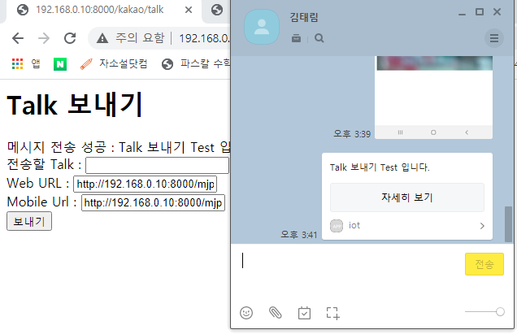  

<br>

PC에서 `자세히 보기` 클릭 시

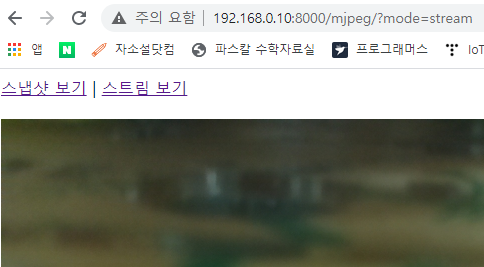  

<br>

모바일에서 `자세히 보기` 클릭 시

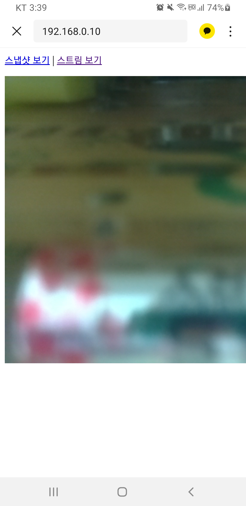  

<br>

<br>

# 카톡 메시지 템플릿

### **메시지 종류**

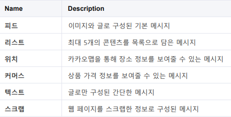  

<br>

<br>

### **텍스트 메시지**

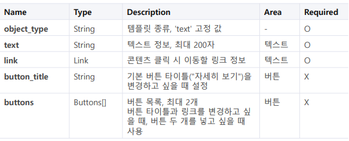  

kakao/forms.py

```python
:
        text_template = {
            'object_type': 'text',
            'text': self.cleaned_data['text'],
            'link': {
                'web_url': self.cleaned_data['web_url'],
                'mobile_web_url': self.cleaned_data['mobile_web_url']
            },
            'button_title' : '카메라 보기'
        }
:
```

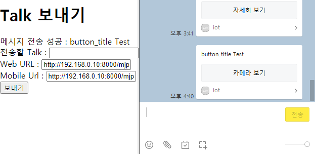  

<br>

<br>

### **피드 메시지**

➊ 이미지: 최대 3장, 최소 200px * 200px 이상, 최대 250KB 

➋ 제목/설명: 최대 4줄 표시 (제목, 설명 각각 2줄) 

➌ 소셜: 최대 3개 표시 (순서: 좋아요 > 댓글 > 공유 > 조회 > 구독) 

➍ 버튼: 최대 2개 표시, 버튼명 8자 이하 권장

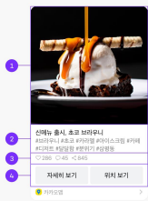  

<br>

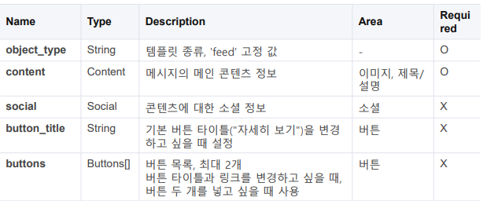  

kakao/forms.py

```python
:
        text_template = {
            "object_type": "feed",
            "content": {
                "title": "디저트 사진",
                "description": "아메리카노, 빵, 케익",
                "image_url": "https://www.thisiscolossal.com/wp-content/uploads/2019/02/moon_crop-640x640.jpg",
                "image_width": 640,
                "image_height": 640,
                "link": {
                    "web_url": "http://www.daum.net",
                    "mobile_web_url": "http://m.daum.net",
                    "android_execution_params": "contentId=100",
                    "ios_execution_params": "contentId=100"
                }
            },
            "social": {
                "like_count": 100,
                "comment_count": 200,
                "shared_count": 300,
                "view_count": 400,
                "subscriber_count": 500
            },
            "buttons": [
                {
                    "title": "웹으로 이동",
                    "link": {
                        "web_url": "http://www.daum.net",
                        "mobile_web_url": "http://m.daum.net"
                    }
                },
                {
                    "title": "앱으로 이동",
                    "link": {
                        "android_execution_params": "contentId=100",
                        "ios_execution_params": "contentId=100"
                    }
                }
            ]
        }
:
```

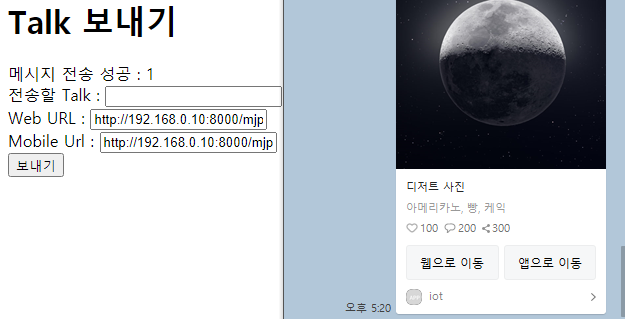  

<br>

<br>

### **리스트 메시지**

➊ 헤더 

➋ 아이템 리스트: 최대 5개 표시 

➌ 제목/설명: 최대 3줄 표시 (제목 2줄, 설명 1줄) 

➍ 이미지: 최소 200px * 200px이상, 2MB이하 

➎ 버튼: 최대 2개 표시, 버튼명 8자 이하 권장

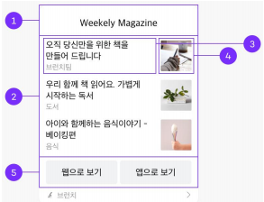  

<br>

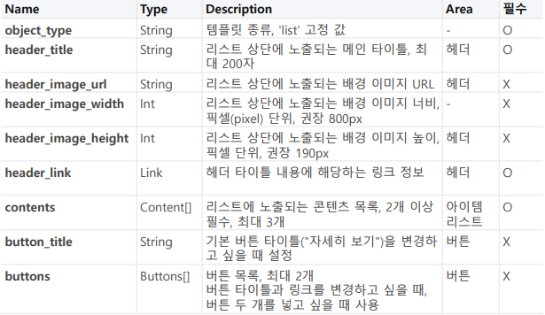  

<br>

<br>

### **위치 메시지**

➊ 이미지: 최대 1장 표시, 800px * 800px이상 권장 

➋ 제목/설명: 최대 4줄 표시 (제목, 설명 각각 2줄) 

➌ 소셜: 최대 3개 표시 (순서: 좋아요 > 댓글 > 공유 > 조회 > 구독) 

➍ 버튼: 최대 2개 표시, 버튼명 8자 이하 권장

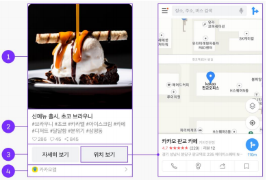  

<br>

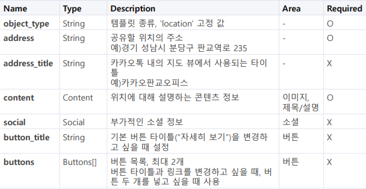  

<br>

```python
:
        text_template = {
            "object_type": "location",
            "address" : "서울시 성북구 보문로 13다길 30",
            "content": {
                "title": "달 사진",
                "description": "위치보기는 집으로",
                "image_url": "https://www.thisiscolossal.com/wp-content/uploads/2019/02/moon_crop-640x640.jpg",
                "image_width": 640,
                "image_height": 640,
                "link": {
                    "web_url": "http://www.daum.net",
                    "mobile_web_url": "http://m.daum.net",
                    "android_execution_params": "contentId=100",
                    "ios_execution_params": "contentId=100"
                }
            },
        }
:
```


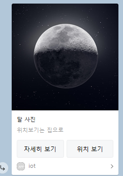  

>   위치 보기 클릭시 지도에서 지정한 주소 검색 결과 나옴

<br>

<br>

### **텍스트 메시지**

➊ 텍스트: 최대 200자 표시 

➋ 버튼: 최대 2개 표시, 버튼명 8자 이하 권장

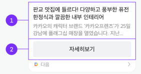  

<br>