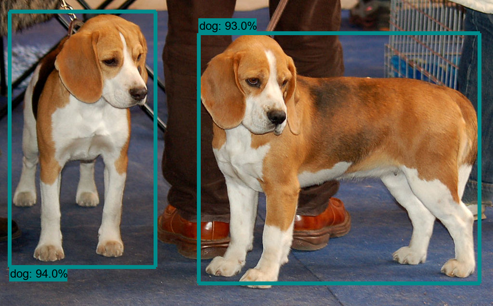
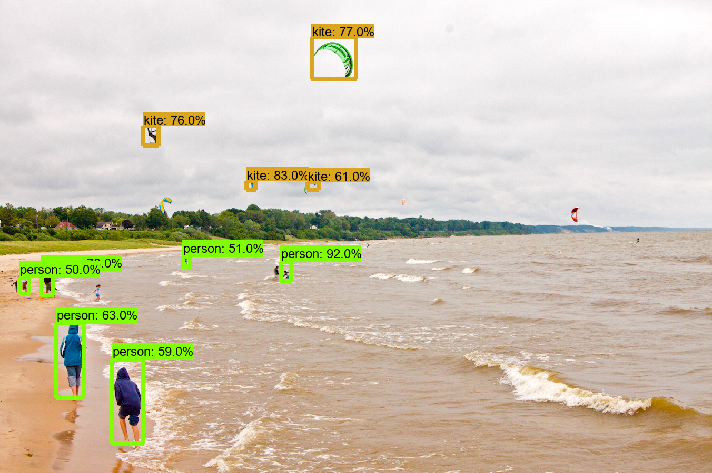
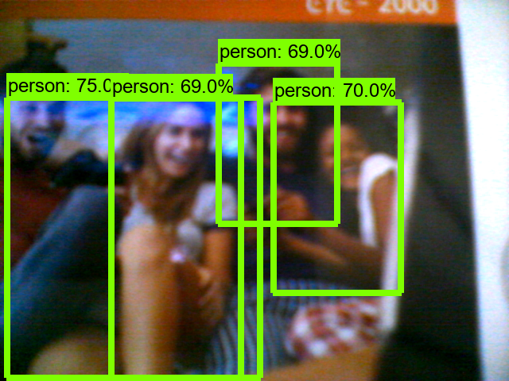

# Object Detection API (윈도우)

**홈페이지**

-   https://github.com/tensorflow/models/tree/master/research/object_detection

<br>

**Protocol Buf 설치**

-   윈도우  
    https://github.com/protocolbuffers/protobuf/releases/tag/v3.1.0

    -   `protoc-3.1.0-win32.zip` 다운로드

    -   압축 해제  

        c:\workspace\tf\protoc-3.1.0-win32

    -   PATH 환경 변수 추가  

        `c:\workspace\tf\protoc-3.1.0-win32\bin`

<br>

**기본 환경 설치(윈도우)**

-   tensorflow 설치  
    \> `conda activate iot`  
    (iot) > `pip install tensorflow `  
    (iot) > `pip install tf_slim`  
    (iot) > `pip install IPython`  
    (iot) > `pip install matplotlib pillow`  

<br>

**PYTHONPATH 환경변수 등록**

-   `c:\workspace\tf\models\research`  
    `c:\workspace\tf\models\research\slim` 

.assets/image-20201015092804332.png)  

<br>

**Object Detection API 설치**

-   c:\workspace\tf\models\research 아래에 많은 API들이 존재
    -   object_detection 디렉토리가 Object Detection API 임
-   c:\workspace\tf\models\research에서 작업
    -   (iot) > `protoc object_detection/protos/*.proto --python_out=.`
    -   (iot) > `pip install .`

<br>

**테스트 데이터**

-   models\research\object_detection\test_images 디렉토리
    .assets/image-20201015093349318.png)  
-   models\research\object_detection\data\mscoco_label_map.pbtxt
    -   라벨 맵
    -   식별가능한 객체의 id, name 정보를 가지는 사전

<br>

**예제 준비**

-   workspace\tf\examples\obj-detect-api-ex
    -   \data
        -   mscoco_label_map.pbtxt
    -   \test_images
        -   image1.jpg
        -   image2.jpg
    -   objdetect.py (강의자료)
        -    ObjDetectApi 클래스 정의
    -   cam.py
        -   UsbCam 클래스 정의(open cv에서 만듦)
-   vscode로 열기

<br>

**모델**

-   https://github.com/tensorflow/models/blob/master/research/object_detection/g3doc/tf2_detection_zoo.md

-   실험 모델

    -   ssd_mobilenet_v1_coco_2017_11_17
    -   ssdlite_mobilenet_v2_coco_2018_05_09

-   저장 위치

    C:\Users\\\<userID>\\.keras\datasets\ssd_mobilenet_v1_coco_2017_11_17

<br>

**검출 객체 인덱스(data/mscoco_label_map.pbtxt)**

.assets/image-20201015100318408.png)  

<br>

### **사진에서 객체 검출하기**

odapi-ex01.py

```python
import cv2
import pathlib
from objdetect import ObjDetectApi

PATH_TO_LABELS = 'data/mscoco_label_map.pbtxt'
MODEL_NAME = 'ssd_mobilenet_v1_coco_2017_11_17'
api = ObjDetectApi(MODEL_NAME, PATH_TO_LABELS)

# 예제 데이터
PATH_TO_TEST_IMAGES_DIR = pathlib.Path('test_images')
TEST_IMAGE_PATHS = sorted(list(PATH_TO_TEST_IMAGES_DIR.glob("*.jpg")))

# 검출 진행
for image_path in TEST_IMAGE_PATHS:
    image, output_dict = api.inference_file(image_path)
    print(output_dict)
    labeled_image = api.visualize(image, output_dict)
    labeled_image = cv2.cvtColor(labeled_image, cv2.COLOR_RGB2BGR)
    cv2.imshow('image', labeled_image)
    cv2.waitKey(0)

cv2.destroyAllWindows()
```

  

  

>   50% 이상만 화면에 보여준다.

<br>

**output_dict 사전 구조**

-   키
    -   `detection_classes`: 검출 객체의 mscoco_label_map ID
    -   `detection_boxes`: 검출 객체의 영역
    -   `detection_scores`: 검출 객체가 실제 해당 클래스일 점수(확률)
        -   0.5점(디폴트) 이상의 객체만 비주얼화
    -   `num_detections`: 검출 가능 객체의 총 개수

```python
{
    'detection_classes': array([18, 18, ..., 47], dtype=int64),
    'detection_boxes': array([
        [3.90827656e-02, 1.92147642e-02, 8.72103572e-01, 3.15773666e-01],
        [1.09515071e-01, 4.02835906e-01, 9.24646258e-01, 9.73048031e-01],
        :
        [0.00000000e+00, 3.58073592e-01, 1.63850799e-01, 5.19781828e-01]], dtype=float32),
    'detection_scores': array([ 0.9406898 , 0.9345039 , ... 0.03041759], dtype=float32),
    'num_detections': 100
}
```

<br>

### **동영상에서 객체 검출**

odapi-ex02.py

```python
import cv2
from cam import USBCam
from objdetect import ObjDetectApi

PATH_TO_LABELS = 'data/mscoco_label_map.pbtxt'
MODEL_NAME = 'ssd_mobilenet_v1_coco_2017_11_17'

api = ObjDetectApi(MODEL_NAME, PATH_TO_LABELS)

def detect(frame):
    frame_rgb = cv2.cvtColor(frame, cv2.COLOR_BGR2RGB)
    output_dict = api.inference_image(frame_rgb)
    labeled_image = api.visualize(frame_rgb, output_dict)
    labeled_image = cv2.cvtColor(labeled_image, cv2.COLOR_RGB2BGR)
    cv2.imshow('frame', labeled_image)
    key = cv2.waitKey(1)
    if key == 27:
        return False
    else:
        return True

cam= USBCam()
cam.run(detect)
```

  

<br>

**침입 발생 알림**

odapi-ex03.py

```python
import cv2
from cam import USBCam
from objdetect import ObjDetectApi

PATH_TO_LABELS = 'data/mscoco_label_map.pbtxt'
MODEL_NAME = 'ssd_mobilenet_v1_coco_2017_11_17'

api = ObjDetectApi(MODEL_NAME, PATH_TO_LABELS)

# 영상에 사람이 있는지 여부 판단
def intrusion_detection(output_dict):
    persons = []
    for ix, obj_ix in enumerate(output_dict['detection_classes']):
        if obj_ix == 1 and output_dict['detection_scores'][ix] >= 0.5:
            persons.append(ix)
    
    return len(persons)

def detect(frame):
    frame_rgb = cv2.cvtColor(frame, cv2.COLOR_BGR2RGB)
    output_dict = api.inference_image(frame_rgb)

    # 침입인지 아닌지 판단... person ID : 1
    if intrusion_detection(output_dict):
        print("침입 발생")
    # 레코딩 시작.
    # 카톡으로 알림 전송 등 후속 처리 ...

    labeled_image = api.visualize(frame_rgb, output_dict)
    labeled_image = cv2.cvtColor(labeled_image, cv2.COLOR_RGB2BGR)
    cv2.imshow('frame', labeled_image)
    key = cv2.waitKey(1)
    if key == 27:
        return False
    else:
        return True

cam= USBCam()
cam.run(detect)
```

<br>

**참고] objdetect.py**

```python
import numpy as np
import os
import pathlib
# import six.moves.urllib as urllib
import sys
import tarfile
import tensorflow as tf
import zipfile

from collections import defaultdict
from io import StringIO
from matplotlib import pyplot as plt
from PIL import Image
# from IPython.display import display


from object_detection.utils import ops as utils_ops
from object_detection.utils import label_map_util
from object_detection.utils import visualization_utils as vis_util

utils_ops.tf = tf.compat.v1
tf.gfile = tf.io.gfile

class ObjDetectApi:
  def __init__(self, model_name, path_to_labels):
    self.model = self.load_model(model_name)
    self.category_index = label_map_util.create_category_index_from_labelmap(
                            path_to_labels, use_display_name=True)

  # 모델 로더 
  def load_model(self, model_name):
    base_url = 'http://download.tensorflow.org/models/object_detection/'
    model_file = model_name + '.tar.gz'
    model_dir = tf.keras.utils.get_file(
      fname=model_name, 
      origin=base_url + model_file,
      untar=True)
    model_dir = pathlib.Path(model_dir)/"saved_model"
    model = tf.saved_model.load(str(model_dir))
    return model

  # 이미지에서 객체 검출
  def inference_image(self, image):
    # image = np.asarray(image)

    # 입력은 텐서여야하며 'tf.convert_to_tensor'를 사용하여 변환
    input_tensor = tf.convert_to_tensor(image)

    # 모델은 이미지 배치를 예상하므로 tf.newaxis로 축을 추가
    input_tensor = input_tensor[tf.newaxis,...]

    # 추론 실행
    model_fn = self.model.signatures['serving_default']
    output_dict = model_fn(input_tensor)

    # 모든 출력은 배치 텐서
    # numpy 배열로 변환하고 인덱스 [0]을 사용하여 배치 차원을 제거
    # 우리는 처음 num_detections에만 관심이 있음
    num_detections = int(output_dict.pop('num_detections'))
    output_dict = {key:value[0, :num_detections].numpy() 
                  for key,value in output_dict.items()}
    output_dict['num_detections'] = num_detections

    # detection_classes should be ints.
    output_dict['detection_classes'] = output_dict['detection_classes'].astype(np.int64)
    
    # Handle models with masks:
    if 'detection_masks' in output_dict:
      # Reframe the the bbox mask to the image size.
      detection_masks_reframed = utils_ops.reframe_box_masks_to_image_masks(
                output_dict['detection_masks'], output_dict['detection_boxes'],
                image.shape[0], image.shape[1])      
      detection_masks_reframed = tf.cast(detection_masks_reframed > 0.5,
                                        tf.uint8)
      output_dict['detection_masks_reframed'] = detection_masks_reframed.numpy()
      
    return output_dict


  # 이미지를 모델을 이용하여 객체 검출 후 시각화 
  def inference_file(self, image_path):
    image_np = np.array(Image.open(image_path))
    output_dict = self.inference_image(image_np)

    return image_np, output_dict


  def visualize(self, image_np, output_dict):
    # 검출결과 시각화 
    labeled_image = image_np.copy()
    vis_util.visualize_boxes_and_labels_on_image_array(
        labeled_image,
        output_dict['detection_boxes'],
        output_dict['detection_classes'],
        output_dict['detection_scores'],
        self.category_index,
        instance_masks=output_dict.get('detection_masks_reframed', None),
        use_normalized_coordinates=True,
        line_thickness=8)

    return labeled_image
```

<br>