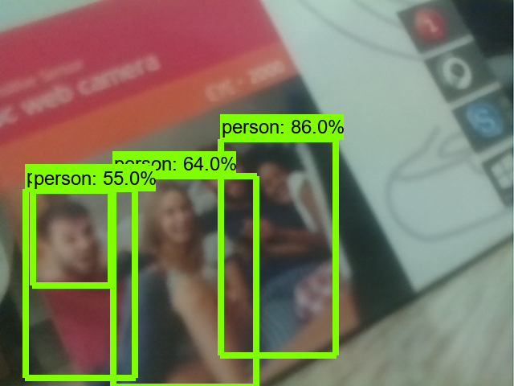

# Object Detection API (라즈베리파이)

**홈페이지**

-   https://github.com/tensorflow/models/tree/master/research/object_detection

<br>

**Protocol Buf 설치**

-   리눅스  
    $ `sudo apt-get install protobuf-compiler`  
    $ `protoc --version`  
    libprotoc 3.6.1

<br>

**기본 환경 설치(라즈베리파이)**

-   tensorflow 설치  
    $ `sudo apt install gfortran libopenblas-dev liblapack-dev libhdf5-dev`  
    $ `mkdir ~/temp`  
    $ `cd ~/temp`  
    $ `wget http://1.229.109.140:3562/tensorflow/tensorflow-2.2.0.armv7l/tensorflow-2.2.0-cp37-none-linux_armv7l.whl`  
    $ `pip3 install tensorflow-2.2.0-cp37-none-linux_armv7l.whl`  
    $ `pip3 install tf_slim`  
    $ `pip3 install pycocotools`  
    $ `pip3 install IPython`  
    $ `pip3 install matplotlib pillow`  
-   남은 용량 확인 : $ `df -m`

<br>

**Object Detection Api 다운로드**

-   라즈베리파이  
    /home/pi/workspace/tf 에서 설치  
    $ `cd ~/workspace/tf`  
    $ `git clone --depth 1 https://github.com/tensorflow/models`

<br>

**PYTHONPATH 환경변수 등록**

-   리눅스(.bashrc)
    export PYTHONPATH=$PYTHONPATH:/home/pi/workspace/tf/models/research:/home/pi/workspace/tf/models/research/slim

    export PATH=.:$PATH:/home/pi/.local/bin  

    -   주의) export 문장은 각각 한 줄로 작성  

    $ `source ~/.bashrc`

<br>

**Object Detection API 설치**

-   라즈베리파이

    $ `cd ~/workspace/tf/models/research`  
    $ `protoc object_detection/protos/*.proto --python_out=.`  
    $ `pip install .`

<br>

**테스트 데이터**

-   models/research/object_detection/test_images 디렉토리

.assets/image-20201015110351579.png)  

-   models/research/object_detection/data/mscoco_label_map.pbtxt
    -   라벨 맵
    -   식별가능한 객체의 id, name 정보를 가지는 사전

<br>

**예제 준비**

-   workspace\tf\examples\obj-detect-api-ex
    -   \data
        -   mscoco_label_map.pbtxt
    -   \test_images
        -   image1.jpg
        -   image2.jpg
    -   objdetect.py (강의자료)
        -    ObjDetectApi 클래스 정의
    -   cam.py
        -   UsbCam 클래스 정의(open cv에서 만듦)
-   vscode로 열기

<br>

**모델**

-   https://github.com/tensorflow/models/blob/master/research/object_detection/g3doc/tf2_detection_zoo.md

-   실험 모델

    -   ssd_mobilenet_v1_coco_2017_11_17
    -   ssdlite_mobilenet_v2_coco_2018_05_09

-   저장 위치

    \home\\pi\\.keras\datasets\ssd_mobilenet_v1_coco_2017_11_17

<br>

**검출 객체 인덱스(data/mscoco_label_map.pbtxt)**

.assets/image-20201015110557036.png)  

<br>

### **사진에서 객체 검출하기**

odapi-ex01.py

```python
import cv2
import pathlib
from objdetect import ObjDetectApi

PATH_TO_LABELS = 'data/mscoco_label_map.pbtxt'
MODEL_NAME = 'ssd_mobilenet_v1_coco_2017_11_17'
api = ObjDetectApi(MODEL_NAME, PATH_TO_LABELS)

# 예제 데이터
PATH_TO_TEST_IMAGES_DIR = pathlib.Path('test_images')
TEST_IMAGE_PATHS = sorted(list(PATH_TO_TEST_IMAGES_DIR.glob("*.jpg")))

# 검출 진행
for image_path in TEST_IMAGE_PATHS:
    image, output_dict = api.inference_file(image_path)
    print(output_dict)
    labeled_image = api.visualize(image, output_dict)
    labeled_image = cv2.cvtColor(labeled_image, cv2.COLOR_RGB2BGR)
    cv2.imshow('image', labeled_image)
    cv2.waitKey(0)

cv2.destroyAllWindows()    
```

<br>

**output_dict 사전 구조**

-   키
    -   `detection_classes`: 검출 객체의 mscoco_label_map ID
    -   `detection_boxes`: 검출 객체의 영역
    -   `detection_scores`: 검출 객체가 실제 해당 클래스일 점수(확률)
        -   0.5점(디폴트) 이상의 객체만 비주얼화
    -   `num_detections`: 검출 가능 객체의 총 개수

```python
{
    'detection_classes': array([18, 18, ..., 47], dtype=int64),
    'detection_boxes': array([
        [3.90827656e-02, 1.92147642e-02, 8.72103572e-01, 3.15773666e-01],
        [1.09515071e-01, 4.02835906e-01, 9.24646258e-01, 9.73048031e-01],
        :
        [0.00000000e+00, 3.58073592e-01, 1.63850799e-01, 5.19781828e-01]], dtype=float32),
    'detection_scores': array([ 0.9406898 , 0.9345039 , ... 0.03041759], dtype=float32),
    'num_detections': 100
}
```

<br>

### **동영상에서 객체 검출**

odapi-ex02.py

```python
import cv2
from cam import USBCam
from objdetect import ObjDetectApi

PATH_TO_LABELS = 'data/mscoco_label_map.pbtxt'
MODEL_NAME = 'ssd_mobilenet_v1_coco_2017_11_17'

api = ObjDetectApi(MODEL_NAME, PATH_TO_LABELS)

def detect(frame):
    frame_rgb = cv2.cvtColor(frame, cv2.COLOR_BGR2RGB)
    output_dict = api.inference_image(frame_rgb)
    labeled_image = api.visualize(frame_rgb, output_dict)
    labeled_image = cv2.cvtColor(labeled_image, cv2.COLOR_RGB2BGR)
    cv2.imshow('frame', labeled_image)
    key = cv2.waitKey(1)
    if key == 27:
        return False
    else:
        return True

cam= USBCam()
cam.run(detect)  
```

>   많이 느리다.
>
>   라즈베리파이에서 서버로 넘겨주어 처리할 예정

<br>

<br>

### 라즈베리파이 → 서버 stream

**MJpeg 실행**

-   $ `cd ~/workspace/iot_web_service/iot/`
-   $ `python manage.py runserver 0.0.0.0:8000`

<br>

C:\workspace\tf\examples\obj-detect-api-ex\cam.py

```python
:
def run(self, callback):
        # self.cap = cv2.VideoCapture(0) # 0번 카메라
        self.cap = cv2.VideoCapture("http://192.168.0.10:8000/mjpeg/stream/")
        self.cap.set(cv2.CAP_PROP_FRAME_WIDTH, self.size[0])
        self.cap.set(cv2.CAP_PROP_FRAME_HEIGHT, self.size[1])
:
```

<br>

**실행**

-   \> `python odapi-ex02.py`

  

>   라즈베리파이 Django로 MJpeg 실행 → stream 이미지 정보 → 서버
>   PC로 tensorflow 실행 → 객체 검출