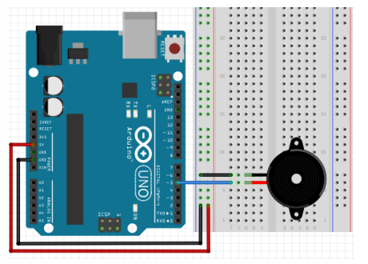

# 피에조 부저

  <br>

## 피에조 부저

**부저**

-   Active Buzzer
    -   회로 내장형
    -   전원만 인가되면 단일음
-   Passive Buzzer
    -   회로 내장하지 않음
    -   필요한 음역대의 주파수(펄스)를 제공하여 멜로디 연주 가능
    -   PWM 이용

<br>

**회로구성**



<br>

## 능동 부저

```c++
int buzzerPin = 5;
void setup()
{
    pinMode(buzzerPin, OUTPUT);
}
void loop() {
    digitalWrite(buzzerPin,HIGH);
    delay(50);
    digitalWrite(buzzerPin,LOW);
    delay(400);
}
```

<br>

## 수동 부저

**Passive Buzzer**

-   주파수
    -   HIGH/LOW 신호의 비율
    -   신호음의 음 또는 음높이 결정
    -   Hz 단위 

  <br>

**제어 함수**

-   tone(핀번호, 주파수 [, 기간]) 
    -   피에조 스피커에 특정 주파수를 발생
        -   주파수 : unsigned int
        -   기간 : unsinged long
    -   tone(9, 2000)
        -   2000 Hz 주파수 소리를 냄
    -   tone(9, 2000, 3000)
        -   9000 Hz 주파수 소리를 3초간 냄
-   noTone(핀번호)
    -   피에조 스피커에 주파수 발생 중지

```c++
int speakerPin = 5;
void setup()
{
}
void loop()
{
    tone(speakerPin, 5000, 1000); // 비동기 함수
    delay(2000); // 1초 동안 소리, 1초 동안 소리X
}
```

  <br>

**도레미파솔라시도 연주하기**

```c++
int speakerPin = 5;
int melody[] = {262, 294, 330, 349, 392, 440, 494, 523};
void setup()
{
    for (int i = 0; i < 8; i++)
    {
        tone(speakerPin, melody[i], 250);
        delay(400);
        noTone(speakerPin);
    }
}
void loop()
{
}
```

  <br>

```c++
int speakerPin = 5;
int melody[] = {262, 294, 330, 349, 392, 440, 494, 523};
void setup()
{
    pinMode(speakerPin, OUTPUT);
}
void loop()
{
    // 도파도솔
    tone(speakerPin, melody[0], 230);
    delay(250);
    tone(speakerPin, melody[3], 230);
    delay(250);
    tone(speakerPin, melody[0], 230);
    delay(250);
    tone(speakerPin, melody[4], 230);
    delay(250);
    delay(2000);
}
```

  <br>

**피에조 부저로 연주하기**

```c++
#define C 262
#define D 294
#define E 330
#define _F 349
#define G 392
#define A 440
#define B 494
#define H 523
int pzoPin = 5;
int tempo = 200; // 음 재생 시간 설정
int notes[25] = {
    G, G, A, A, G, G, E, G, G, E, E, D, G, G, A, A, G, G, E, G, E, D, E, C};
void setup()
{
    pinMode(pzoPin, OUTPUT);
}
void loop()
{
    for (int i = 0; i < 12; i++)
    {
        tone(pzoPin, notes[i], tempo);
        delay(300);
    }
    delay(100);
    for (int i = 12; i < 25; i++)
    {
        tone(pzoPin, notes[i], tempo);
        delay(300);
    }
}
```

  <br>

**멜로디 만들기**

-   음계별 주파수

    C:\Program Files (x86)\Arduino\examples\02.Digital\toneMelody\pitches.h

    <문서>\Arduino\libraries\mylib\pitches.h로 복사

```c++
#include <pitches.h>
int speakerPin = 5;
int melody[] = {
    NOTE_C4, NOTE_G3, NOTE_G3, NOTE_A3, NOTE_G3, 0, NOTE_B3, NOTE_C4,
};
// 음표의 길이 4 = 4분음표(한박자), 8 = 8분 음표(반 박자)
int noteDurations[] = {4, 8, 8, 4, 4, 4, 4, 4};
void setup()
{
    for (int thisNote = 0; thisNote < 8; thisNote++)
    {
        int noteDuration = 1000 / noteDurations[thisNote];
        tone(speakerPin, melody[thisNote], noteDuration);
        // 음을 구별하기 위해 그 사이에 최소한의 간격을 둔다.
        int pauseBetweenNotes = noteDuration * 1.30;
        delay(pauseBetweenNotes);
        noTone(speakerPin); // 멜로디 멈춤
    }
}
void loop() {}
```

