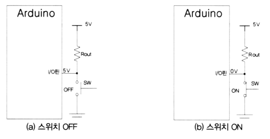
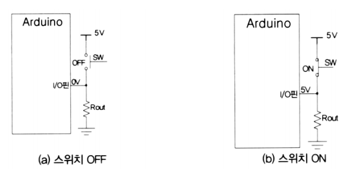
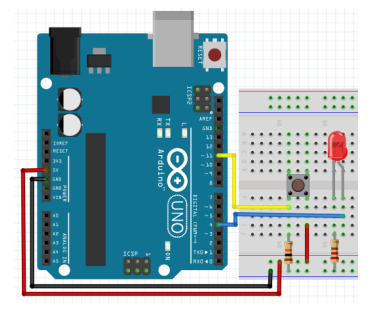
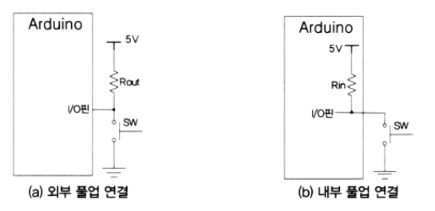
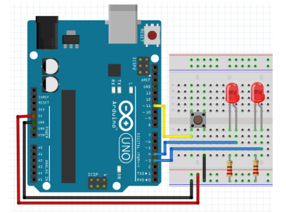
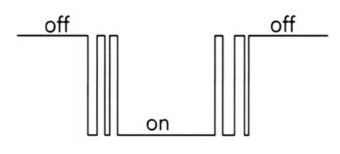
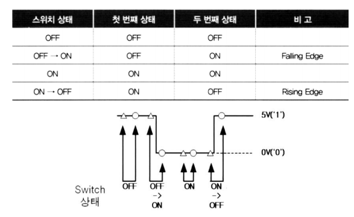

# 버튼

<br>

## 버튼

### 택트(Tact) 스위치


<br>

### 풀업 방식 스위치 on, off 상태

-   **풀업 저항**

    -   전압 소스와 회로 내에 있는 입력 핀 사이에 배치 - 디폴트 HIGH
    -   버튼/스위치는 입력 핀과 접지(GND) 사이에 배치 - 스위치를 누르면 LOW

    

  <br>

### 풀다운 방식 스위치 on, off 상태

-   **풀다운 저항**

    -   접지와 회로 내에 있는 입력 핀 사이에 배치 - 디폴트 LOW
    -   버튼/스위치는 전원 소스와 핀 사이에 배치 - 스위치를 누르면 HIGH

    

<br>

### 디지털 입력 읽기

-   digitalRead(핀번호)
    -   해당 핀 번호의 값 읽기
    -   HIGH/LOW 리턴

<br>

### 풀다운 버튼

-   버튼 연결 저항 : 10K옴
-   디폴트 : LOW
-   누른 경우: HIGH



<br>

**버튼으로 LED 켜고 끄기(풀다운)**

```c++
int LED = 4;
int BUTTON = 11;
void setup()
{
    pinMode(BUTTON, INPUT);
    pinMode(LED, OUTPUT);
}
void loop()
{
    if (digitalRead(BUTTON))
    { // 누른 경우
        digitalWrite(LED, HIGH);
    }
    else
    {
        digitalWrite(LED, LOW);
    }
    delay(10);
}
```

  <br>

### 풀업 버튼

-   버튼 연결 저항 : 10K옴
-   디폴트 : HIGH
-   누른 경우: LOW
-   권장 구성


<br>

**버튼으로 LED 켜고 끄기(풀업)**

```c++
int LED = 4;
int BUTTON = 11;
void setup()
{
    pinMode(BUTTON, INPUT);
    pinMode(LED, OUTPUT);
}
void loop()
{
    if (digitalRead(BUTTON) == LOW)
    { // 누른 경우
        digitalWrite(LED, HIGH);
    }
    else
    {
        digitalWrite(LED, LOW);
    }
    delay(10);
}
```

  <br>

### 내부 풀업 저항 사용 시 I/O



  <br>

### 내부 풀업 저항 사용


  <br>

**내부 풀업 저항 스위치로 LED 제어하기**

```c++
const int ledPin = 4;
const int inputPin = 11;
void setup()
{
    pinMode(ledPin, OUTPUT);
    pinMode(inputPin, INPUT_PULLUP); // 내부 풀업 스위치
}
void loop()
{
    int swInput = digitalRead(inputPin);
    if (swInput == LOW)
        digitalWrite(ledPin, HIGH);
    else
        digitalWrite(ledPin, LOW);
}
```

  <br>

### 2개 LED의 1개의 버튼

-   12번 LED는 1초간격으로 점멸
-   13번 LED는 버튼을 누른 경우에만 켜짐



  <br>

**2개 LED의 1개의 버튼**(누르고 땔때 바로 동작하지 않음)

```c++
int pin_LED1 = 4;
int pin_LED2 = 3;
int pin_button = 11;
boolean LED_state = false;
void setup()
{
    pinMode(pin_LED1, OUTPUT);
    digitalWrite(pin_LED1, LED_state);
    pinMode(pin_LED2, OUTPUT);
    digitalWrite(pin_LED2, false);

    pinMode(pin_button, INPUT_PULLUP); // ☆☆☆☆☆☆
}
void loop()
{
    LED_state = !LED_state;
    digitalWrite(pin_LED1, LED_state);
    delay(1000);
    // 버튼 상태를 읽어서 13번 핀에 연결된 LED에 표시
    digitalWrite(pin_LED2, !digitalRead(pin_button));
}
```

<br>

**2개 LED의 1개의 버튼**(위 문제 해결)

```c++
#include<SimpleTimer.h>

int pin_LED1 = 4;
int pin_LED2 = 3;
int pin_button = 11;
boolean LED_state = false;

SimpleTimer timer;

// 함수명 의미: 함수의 시작주소를 가지고 있는 포인터 상수다.
// 배열명의 의미 ? in a[10]; 변수 a 자체는 첫 번째 엘리먼트의 주소를 가리키는 포인터(상수)

void blink() {
    LED_state = !LED_state;
    digitalWrite(pin_LED1, LED_state);
}
void setup()
{
    pinMode(pin_LED1, OUTPUT);
    digitalWrite(pin_LED1, LED_state);
    pinMode(pin_LED2, OUTPUT);
    digitalWrite(pin_LED2, false);

    pinMode(pin_button, INPUT_PULLUP); // ☆☆☆☆☆☆
    timer.setInterval(1000, blink);  // 1초 간격으로 블링크
}
void loop()
{
    timer.run();  // 타이머 운영
    digitalWrite(pin_LED2, !digitalRead(pin_button));
}
```

  <br>

**디지털 신호 입력 시간 측정하기**

```c++
const int pin_button = 11;
long startTime = 0;
long swCountTimer = 0;

void setup() {
    Serial.begin(9600);
    pinMode(pin_button, INPUT_PULLUP);
}

void loop() {
    if(digitalRead(pin_button) == LOW) { // 스위치가 눌러진 경우
        startTime = millis(); // 현재 시간 측정
        while(digitalRead(pin_button) == LOW); // 눌러진 시간 동안 지연
        
        // 스위치를 뗀 시간을 측정하여 차이 계산
        swCountTimer = millis() - startTime;
        
        Serial.print(swCountTimer);
        Serial.println(" ms");
    }
}
```

  <br>

### 채터링

-   버튼을 눌르거나 뗄 때 물리적 접촉 발생으로 짧은 시간 동안 ON/OFF를 반복하는 것
    
-   해결 방법(디바운스, debounce)
    -   채터링이 끝날 때까지 조금 대기

  <br>

### 스위치 상태 변경 시점 감지



  <br>

**버튼을 누른 횟수 세기**

```c++
int pin_button = 11;
boolean state_previous = true;
boolean state_current;
int count = 0;
void setup()
{
    Serial.begin(9600);
    pinMode(pin_button, INPUT_PULLUP);
}
void loop()
{
    state_current = digitalRead(pin_button);
    if (!state_current) { // 누른 경우
        if (state_previous == true)
        {
            // 버튼을 누른 시점에서 해야할 작업
            count++;
            state_previous = false;
            Serial.println(count);
        }
        delay(10);  // 추가!
    }
    else
    {
        state_previous = true;
    }
}
```

  <br>

### 예제

버튼을 한 번 누르면 13번 LED를 켜고 버튼을 다시 누르면 13번 LED를 끄세요.

```c++
int pin_button = 11;
int led = 13;
boolean state_previous = true;
boolean state_current;
void setup()
{
    Serial.begin(9600);
    pinMode(pin_button, INPUT_PULLUP);
    pinMode(led, OUTPUT);
}

void work() {
    int ledState = digitalRead(led);
    digitalWrite(led, !ledState);
}

void loop()
{
    state_current = digitalRead(pin_button);
    if (!state_current) { // 누른 경우
        if (state_previous == true)
        {
            state_previous = false;
            // 버튼을 누른 시점에서 해야할 작업
            work();
        delay(10);  // 추가!
    }
    else
    {
        state_previous = true;
    }
}
```

<br>

  <br>

## led 객체화

Led.h

```c++
#pragma once

#include <Arduino.h>

class Led {  // Digital Device
protected:
    int pin;

public:
    Led(int pin);
    void on();
    void off();
    void toggle();
    void set(int value);
};
```

  <br>

Led.cpp

```c++
#include "Led.h"


Led::Led(int pin) : pin(pin){
    pinMode(pin, OUTPUT);
}

void Led::on(){
    digitalWrite(pin, HIGH);
}

void Led::off(){
    digitalWrite(pin, LOW);
}

void Led::toggle(){
    int state = digitalRead(pin);
    digitalWrite(pin, !state);
}

void Led::set(int value){
    digitalWrite(pin, value);
}
```

<br>

**버튼 누르고 있는 동안 켜지는 LED**

app.ino

```c++
#include "Led.h"

Led led(4);


int pin_button = 11;
int led = 13;
boolean state_previous = true;
boolean state_current;

void setup()
{
    Serial.begin(9600);
    pinMode(pin_button, INPUT_PULLUP);
}

void work() {
    led.toggle();
}

void loop()
{
    state_current = digitalRead(pin_button);
    led.set(!state_current);  // 풀업 버튼인 경우 반전
}
```

  <br>

<br>

## 버튼 객체화

Button.h

```c++
#pragma once

typedef void (*button_callback_t)();  // 이후 조이스틱 이용시 추가

#include <Arduino.h>

class Button {
protected:
    int pin;
    bool state_previous = true;
    bool state_current;
    void (*callback)();

public:
    Button(int pin);
    int read();
    void setCallback(void (*callback)()); // 매개변수가 return 타입이 void인 함수의 대한 포인터 전달 받음.
    int check();
};
```

  <br>

Button.cpp

```c++
#include "Button.h"

Button::Button(int pin) : pin(pin){
    pinMode(pin, INPUT_PULLUP);
    state_previous = true; // 디폴트 상태가 HIGH.
    callback = NULL;
}

int Button::read() {
    return !digitalRead(pin); // 풀업이라 반전
    // 실제 하드웨어는 pullup, 소프트웨어에선 pulldown형식으로 운영하기 위해 반전
}

void Button::setCallback(void (*callback)()) {
    this->callback = callback;
}

int Button::check() {
    state_current = digitalRead(pin);
    if(!state_current) { //누른경우
        if(state_previous == true) {
            state_previous = false;
            //버튼을 누른 시점에서 해야할 작업
            // work();  // timer.setInterval(100, work); // work: 함수에 대한 포인터
            if (callback != NULL) {
                callback();
            }
        }
        delay(5);
    } else {
        state_previous = true;
    }
}
```

  <br>

**버튼 누르고 있는 동안 켜지는 LED**

app.ino

```c++
#include "Led.h"
#include "Button.h"

Led led(4);
Button btn(10);

void setup() {
    Serial.begin(9600);
    btn.setCallback(work);
}

void work() {
    led.toggle();
}

void loop()
{
    // led.set(btn.read());
    btn.check(); // 에지(Falling)가 발생했는지 체크
    // workPtr = work; // 매개변수가 없고 리턴타입이 void인 함수
}

// 함수 포인터 형식: void (*포인트_변수명)(매개변수);
```

​    <br>

<br>

## 예제

### LED + 버튼 (기존 신호등 이용)

버튼1 : 버튼 누르고 있으면 켜짐

버튼2 : 토글

버튼3 : 블링크

```c++
#include "Led.h"
#include "Button.h"
#include <SimpleTimer.h>

SimpleTimer timer;

Led led1(4);
Led led2(3);
Led led3(2);
Button btn1(10);
Button btn2(9);
Button btn3(8);

bool blinkPlay = false;  // 블링크 중인지 여부, 디폴트는 중지
int blinkTimer = -1; // 블링크용 타이머 ID

void led2OnOff() {
    led2.toggle();
}

void led3Blink() {
    led3.toggle();
}

void led3BlinkControl() {
    blinkPlay = !blinkPlay;  //상태반전
    if(!blinkPlay) {         // 이제 블링크 중지면
        led3.off();
    }
    timer.toggle(blinkTimer);  // 타이머 활성/비활성 토클
}


void setup() {
    Serial.begin(9600);
    btn2.setCallback(led2OnOff);
    btn3.setCallback(led3BlinkControl);
    blinkTimer = timer.setInterval(500, led3Blink);
    timer.disable(blinkTimer); // 타이머 중지 상태로 시작
}

void loop()
{
    timer.run();
    led1.set(btn1.read());
    btn2.check();  // 에지(Falling)가 발생했는지 체크
    btn3.check();
}
```

>   SimpleTimer 주요 메서드 참고

  <br>

<br>

## 예제

### 스탑워치 (Stopwatch)

**버튼** 1번 : start,stop  2번 : lap time  3번 : reset

**LED** 1번 : ready state  2번 : run blink

```c++
#include <Led.h>
#include <Button.h>
#include <SimpleTimer.h>
#include <LiquidCrystal_I2C.h>

LiquidCrystal_I2C lcd(0x27, 16, 2);
SimpleTimer timer;

// Led led1(4);
Led led2(3);  // 정지상태에서 on, 가동중 off
Led led3(2);  // 가동중 블링크

Button btn1(10);  // start, stop
Button btn2(9);   // lap time
Button btn3(8);   // reset

int timerId = -1;      // stopwatch용 타이머
int blinkTimerId = -1; // 블링크용 타이머

bool state = false;      // 0: 준비상태, 1: 가동 상태
unsigned long startTime = 0; // 시작 버튼을 누른 시점의 시간 *****

void printTime(unsigned long t, int row) {  // 매개 변수로 시간을 전달 받음
    char buf[17];

    //milisecond -> 시:분:초로 변환해서 출력
    int misec = t % 1000 /100; //100ms 단위
    t = t / 1000; // 밀리초 -> 초
    int h = t / 3600; // 초 -> 시간
    int m = (t - (h*3600)) / 60; //초 -> 분
    int s = t - ( h*3600 + m*60); //초

    sprintf(buf, "%02d:%02d:%02d.%d", h, m, s, misec);

    lcd.setCursor(0, row);
    lcd.print(buf);
}

void printTime() {
    unsigned long t = millis();
    unsigned long diff = t - startTime;
    printTime(diff, 0);  // 첫번째 줄에 출력
}

// 버튼 하나로 2가지 동작
void startStop() {
    if(state == false){  // 리셋 이후 처음 버튼을 누른 경우
        // 최초 가동 시작
        startTime = millis();  // 기준 시간 설정
        timer.enable(blinkTimerId);
        led2.off();
        state = true;  // 기동중임을 설정
    }
    timer.toggle(timerId);
}

void laptime() {
    if(state) { // 가동중일 때만 출력
        unsigned long t = millis();
        unsigned long diff = t - startTime;
        printTime(diff, 1); // 두번째 줄에 출력
    }
}

void reset() {
    state = false;
    lcd.clear();
    lcd.setCursor(0,0);
    lcd.print("00:00:00.0");
    led2.on();
    led3.off();
    timer.disable(timerId);
    timer.disable(blinkTimerId);
}

void blink() {
    led3.toggle();
}

void setup() {
    Serial.begin(9600);
    lcd.init();
    lcd.backlight();

    // 타이머 ID, 0부터 배정
    timerId = timer.setInterval(100, printTime);  // 스탑워치용 0.1초 간격으로 호출
    blinkTimerId = timer.setInterval(250, blink);  // 블링크용 0.25초 간격으로 호출
    reset();

    btn1.setCallback(startStop);
    btn2.setCallback(laptime);
    btn3.setCallback(reset);
}

void loop() {
    timer.run();
    btn1.check();
    btn2.check();
    btn3.check();
}
```

