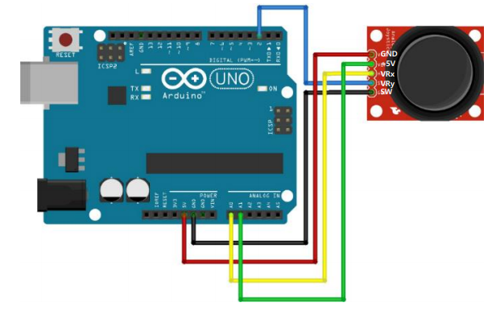

# 조이스틱

<br>

<br>

## 아두이노 조이스틱

### 조이스틱

-   VRx : x축 가변 저항(아날로그 입력 연결)
-   VRy : y축 가변 저항(아날로그 입력 연결)
-   SW : 스위치(디지털 입력 연결)



  <br>

**조이스틱 제어/LED**

```c++
#include <AnalogSensor.h>
#include <LiquidCrystal_I2C.h>
#include <SimpleTimer.h>
#include <Button.h>

AnalogSensor jX(A0, 0, 1023);
AnalogSensor jY(A1, 0, 1023);
Button btn(2);


LiquidCrystal_I2C lcd(0x27, 16, 2);
SimpleTimer timer;

void readJoystick() {
    char buf[17];

    int x = jX.read();
    int y = jY.read();
    int z = btn.read();
    sprintf(buf, "x: %4d, y: %4d", x, y);
    lcd.setCursor(0, 0);
    lcd.print(buf);

    sprintf(buf, "z: %4d", z);
    lcd.setCursor(0, 1);
    lcd.print(buf);
}

void setup() {
    lcd.init();
    lcd.backlight();
    lcd.clear();

    timer.setInterval(50, readJoystick);
    Serial.begin(9600);
}

void loop() {
    timer.run();
}
```

  <br>

## 조이스틱 객체화

Button.h 변경 : **타입 선언**(함수의 대한 포인터 전달 변수 선언)

```c++
#pragma once

typedef void (*button_callback_t)();

#include <Arduino.h>

class Button {
protected:
    int pin;
    bool state_previous = true;
    bool state_current;

    // void (*callback)();
    button_callback_t callback;

public:
    Button(int pin);
    int read();
    // void setCallback(void (*callback)()); // 매개변수가 return 타입이 void인 함수의 대한 포인터 전달 받음.
    void setCallback(button_callback_t);
    int check();
};
```

  <br>

Button.cpp 변경

```c++
#include "Button.h"

Button::Button(int pin) : pin(pin){
    pinMode(pin, INPUT_PULLUP);
    state_previous = true; // 디폴트 상태가 HIGH.
    callback = NULL;
}

int Button::read() {
    return !digitalRead(pin); // 풀업이라 반전
    // 실제 하드웨어는 pullup, 소프트웨어에선 pulldown형식으로 운영하기 위해 반전
}

void Button::setCallback(button_callback_t callback) {
    this->callback = callback;
}

int Button::check() {
    state_current = digitalRead(pin);
    if(!state_current) { //누른경우
        if(state_previous == true) {
            state_previous = false;
            //버튼을 누른 시점에서 해야할 작업
            // work();  // timer.setInterval(100, work); // work: 함수에 대한 포인터
            if (callback != NULL) {
                callback();
            }
        }
        delay(5);
    } else {
        state_previous = true;
    }
}

```

  <br>

**joystick.h**

```c++
#pragma once

#include <Arduino.h>
#include <AnalogSensor.h>
#include <Button.h>

typedef struct {  // 기본적으로 public
    int x;
    int y;
    int z;
} joystick_value_t;

class JoyStick {
protected:  // 상속..    private : 상속이 안된다. ☆☆☆☆☆
    AnalogSensor jX;
    AnalogSensor jY;
    Button btn;

public:
    JoyStick(int x, int y, int z);

    int readX();
    int readY();
    void setRangeX(int toMin, int toMax);
    void setRangeY(int toMin, int toMax);

    int readZ();  // 버튼의 상태 읽는 것
    void setCallback(button_callback_t callback);
    void check();

    joystick_value_t read();  // 파이썬에서는 리스트, 튜플
};
```

>   **참고** : typedef struct 선언 이유
>
>   ```c++
>   int a[3];
>   a= read(); // [20, 20, 1]: 배열 대입 안된다.
>   // 배열명은 포인터 상수.
>   ```
>
>   하지만 아래의 경우 가능
>
>   ```c++
>   JoyStick a, b;
>   a = b;  // 디폴트 복사 생성자 때문.. 얕은 복사
>   ```

  <br>

**joystick.cpp**

```c++
#include "joystick.h"

JoyStick::JoyStick(int x, int y, int z)
    : jX(x), jY(y), btn(z) {

}

int JoyStick::readX() {
    return jX.read();
}

int JoyStick::readY() {
    return jY.read();
}

void JoyStick::setRangeX(int toMin, int toMax) {
    jX.setRange(toMin, toMax);
}

void JoyStick::setRangeY(int toMin, int toMax) {
    jY.setRange(toMin, toMax);
}

int JoyStick::readZ() {
    return btn.read();
}

void JoyStick::setCallback(button_callback_t callback) {
    btn.setCallback(callback);
}

void JoyStick::check() {
    btn.check();
}

joystick_value_t JoyStick::read() {
    joystick_value_t value;
    value.x = readX();
    value.y = readY();
    value.z = readZ();
    return value;
}
```

  <br>

### 조이스틱, LED, 서보모터

**app.ino**

```c++
#include <LiquidCrystal_I2C.h>
#include <Servo.h>
#include <SimpleTimer.h>
#include <joystick.h>
#include <Led.h>

const int SERVO_PIN = 9;
Servo servo;
JoyStick joy(A0, A1, 3);
bool mode = true;  // true : 주행모드, false: 카메라 방향 모드
SimpleTimer timer;
LiquidCrystal_I2C lcd(0x27, 16, 2);
Led led(13);

// joystick 값 읽고 출력하기.
void readJoystick() {
    joystick_value_t value = joy.read();
    char buf[17];

    if(mode) {  //주행모드
        sprintf(buf, "X:%4d/Y:%4d", value.x, value.y);
        lcd.setCursor(0, 0);
        lcd.print(buf);
    } else {  // 카메라 방향 모드
        servo.write(value.x);  // 카메라 방향 조정
        sprintf(buf, "Angle: %3d", value.x);
        lcd.setCursor(0, 1);
        lcd.print(buf);
    }
}

// joystick 운영 모드 변경
void changeMode() {
    mode = !mode;
    if(mode) {  // 주행 모드
        joy.setRangeX(-255,255);
        led.off();
    } else {  // 카메라 방향 모드
        joy.setRangeX(0, 180);
        led.on();
    }
}

void setup() {
    lcd.init();
    lcd.backlight();
    lcd.clear();
    servo.attach(SERVO_PIN);
    // DC 모터 : 속도 조절은 PWM: 0 ~ 255, 전진, 후진 :
    joy.setRangeX(-255, 255);
    joy.setRangeY(-255, 255);
    joy.setCallback(changeMode);

    led.off();

    timer.setInterval(50, readJoystick);

    Serial.begin(9600);
}

void loop() {
    timer.run();
    joy.check();
}
```

