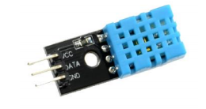
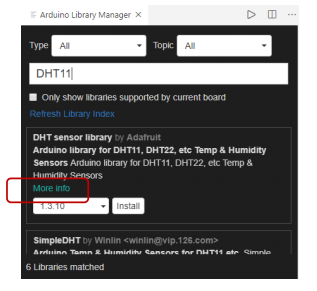
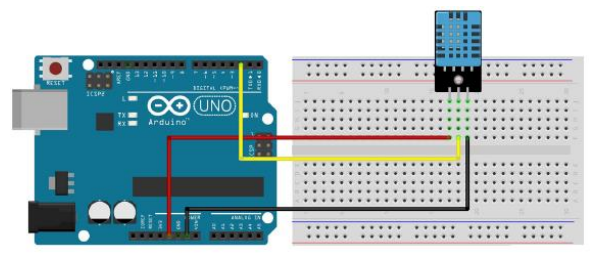

# DHT11

  <br>

## DHT11

### DHT11

-   온/습도 센서

    -   내부에 써미스터와 정전식 습도 센서가 내장되어있는 온습도 센서

    -   내부 써미스터는 온도에 따라 저항 값이 변하는 소자

    -   정전식 습도 센서는 습도에 따라 저항 값이 변하는 소자

    -   총 3개의 핀으로 구성되어 있으며 각각 VCC, DATA, GND로 구성

    -   온도 측정시 써미스터 특성상 약 1분정도의 시간이 소요

        

  <br>

### DHT11 라이브러리

-   DHT sensor library by Adafruit 설치

    -   <문서>\Arduino\libraries\DHT_sensor_library

    

<br>

### Adafruit Unified Sensor Driver

-   https://github.com/adafruit/Adafruit_Sensor 
    -   <문서>\Arduino\libraries\Adafruit_Sensor

  <br>

### 온도, 습도 센서

-   실습 센서에 VCC, GND 확인 (그림과 다를 수 있음)
    

<br>

### 라이브러리 준비

-   `#include <DHT.h>`

      <br>

### 객체 생성

-   `DHT dht(pin, DHT타입);`

-   `dht.begin();`

      <br>

### 센서 값 읽기

-   `dht.readHumidity(); // 습도 값 읽기`
-   `dht.readTemperature(); // 온도 값 읽기`

<br>

**주의사항**

-   읽을 때마다 최소 2초 이상 간격으로 읽기 실행
-   2초보다 작은 시간간격으로 읽을 시 에러 발생

  <br>

**온도, 습도 Serial 출력**

```c++
#include <DHT.h> // DHT.h 라이브러리를 포함한다

#define DHTPIN 3
#define DHTTYPE DHT11

DHT dht(DHTPIN, DHTTYPE); // DHT설정 - dht (디지털3, dht11)

void setup() {
    Serial.begin(9600); // 9600 속도로 시리얼 통신을 시작한다
    dht.begin();
}

void loop() {
    delay(2000);
    // LCD는 float 출력을 못한다.
    float h = dht.readHumidity();    // 변수 h에 습도 값을 저장
    float t = dht.readTemperature(); // 변수 t에 온도 값을 저장

    Serial.print("Humidity: ");
    Serial.print(h);
    Serial.print("%\t");
    Serial.print("Temperature: ");
    Serial.print(t);
    Serial.println(" C");
}
```

>   Humidity: **65.00%**  Temperature: **31.20 C**

  <br>

## LCD, timer 객체화

**MiniCom.h**

```c++
#pragma once

#include <Arduino.h>
#include <LiquidCrystal_I2C.h>
#include <SimpleTimer.h>

class MiniCom {
protected:
    LiquidCrystal_I2C lcd;
    SimpleTimer timer;

public:
    MiniCom();    // 생성자
    void init();  // 초기화 코드
    // SimpleTimer.h 의 setInterval 매개변수
    int setInterval(unsigned long d, timer_callback f);  // 타이머 콜백 등록
    void run();   // 타이머 운영 및 기타 처리

    // LCD 출력 지원 함수(helper 함수)
    void print(int col, int row, const char *pMsg);
    void print(int row, const char *pMsg);  // 정해진 행에 메시지 출력
    void print(int row, const char *pTitle ,int value);
    void print(int row, const char *pTitle, double value, int width=6);
};

// 위 두 함수 역할
// title: int value
// title: double value
```

  <br>

**MiniCom.cpp**

```c++
#include "MiniCom.h"

MiniCom::MiniCom() : lcd(0x27, 16, 2) {

}

void MiniCom::init() {
    Serial.begin(9600);
    lcd.init();
    lcd.backlight();

}

int MiniCom::setInterval(unsigned long d, timer_callback f) {
    return timer.setInterval(d, f);
}

void MiniCom::run() {
    timer.run();
}

void MiniCom::print(int col, int row, const char *pMsg) {
    lcd.setCursor(col, row);
    char buf[17];
    sprintf(buf, "%-16s", pMsg);  // 이전의 긴 문장을 덮어쓰기 위해 -16s (clear 할 필요 없음)
    lcd.print(buf);
}

void MiniCom::print(int row, const char *pMsg) {
    print(0, row, pMsg);
}

void MiniCom::print(int row,const char *pTitle , int value) {
    char buf[17];
    sprintf(buf, "%s: %d", pTitle, value);
    print(0, row, buf);
}

void MiniCom::print(int row, const char *pTitle, double value, int width) {
    char buf[17];
    char temp[14];
    dtostrf(value, width, 2, temp);
    sprintf(buf, "%s: %s", pTitle, temp);
    print(0, row, buf);
}
```

<br>

**온도, 습도 LCD 출력**

**app.ino**

```c++
#include <DHT.h> // DHT.h 라이브러리를 포함한다
#include "MiniCom.h"
#define DHTPIN 3
#define DHTTYPE DHT11

DHT dht11(DHTPIN, DHTTYPE); // DHT설정 - dht (디지털3, dht11)

MiniCom com;

void checkHumiTemp() {
    float h = dht11.readHumidity();    // 변수 h에 습도 값을 저장
    float t = dht11.readTemperature(); // 변수 t에 온도 값을 저장

    com.print(0, "Humi", h);
    com.print(1, "Temp", t);
}

void setup() {
    com.init();
    com.setInterval(2000, checkHumiTemp);
    com.print(0, "MiniCom start...");
    com.print(1, "Humi/Temp Ex");
    dht11.begin();
}

void loop() {
    com.run();
}
```

