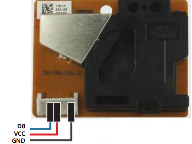

# 미세먼저 센서

**미세먼지 센서**

-   SW-PWM-03A-02
-   수직으로 세워서 측정
-   특성상 눕여 놓으면 먼지가 쌓임

  

<br>

**국제 미세먼지농도에 따른 경계단계 기준분류**

-   30ug/m³ 이하 : 좋음
-   30~80ug/m³ : 보통
-   80~150ug/m³ : 나쁨
-   150ug/m³ 초과 : 매우 나쁨

<br>

dust_ex01/app.ino

```cpp
#include <MiniCom.h>
#include "Ultra.h"

MiniCom com;
Ultra ultra(2, 3);

void checkDistance() {
    int distance = ultra.read();
    com.print(0, "distance", distance);
}

void setup() {
    com.init();
    com.setInterval(1000, checkDistance);
}

void loop() {
    com.run();
}
```

