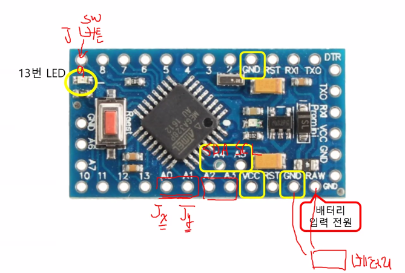

# 블루투스 컨트롤러

**블루투스 조정기**

-   Joystick으로 컨트롤

<br>

  

<br>

**bt_controller/app.ino**

```c++
#include <Led.h>
#include <JoyStick.h>
#include <BtMiniCom.h>

Led led(13);
JoyStick joy(A0, A1, 8);
BtMiniCom com(10, 11, NULL);

bool mode = true; // true : 주행모드, false: 카메라 방향 모드

void setup(){
    com.init();
    com.print(0, "MiniCom Start");
    joy.setRangeX(255, -255);
    joy.setRangeY(-255, 255);
    joy.setCallback(changeMode);
    led.off();
    com.setInterval(50, readJoystick);
}

void loop() {
    joy.check();
    com.run();
}

// joystick 값 읽고 출력하기
void readJoystick(){
    joystick_value_t value = joy.read();
    char buf[17];

    if(mode){ // 주행 모드
        com.print(0, "X", value.x, "Y", value.y);
        sprintf(buf, "0,%d,%d", value.x, value.y);
    } else{ // 카메라 방향 모드
        com.print(1,"Angle",value.x);
        sprintf(buf, "1,%d", value.x);
    }
    com.send(buf);
}

// joystick 운영 모드 변경
void changeMode(){
    mode = !mode;
    if(mode){ // 주행 모드
        joy.setRangeX(-255, 255);
        led.off();
    } else{ // 카메라 방향 모드
        joy.setRangeX(90, -90);
        led.on();
    }
}
```

>   라즈베리파이 07_bluetooth/bt_ex02_2.py 실행으로 블루투스 수신도 확인

<br>

