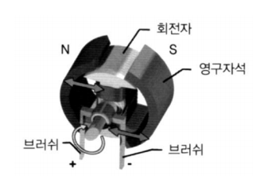
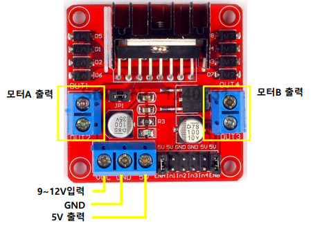
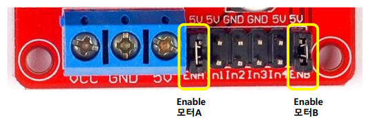
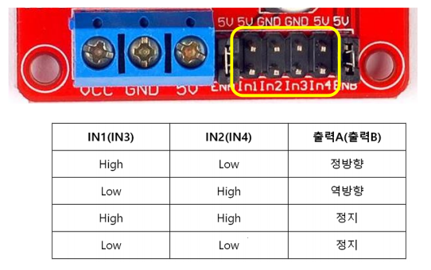
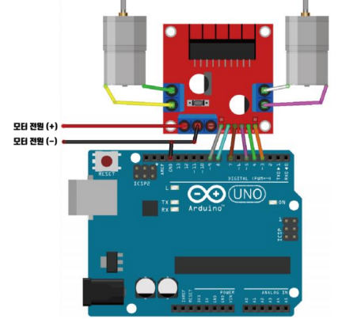

# DC 모터

**DC 모터**

  

<br>

**L298N**

-   모터 드라이버 모듈

      

<br>

**속도 설정**

  

-   ENA, ENB
    -   점퍼스위치가 있는 경우 정속도(속도 조절 불가)
    -   점퍼스위치를 제거하고 PWM 핀에 연결하면 속도 조절 가능

<br>

**모터 방향 설정**

  

<br>

  

<br>

**CAR-EX/app.ino**

```cpp
// 우측 바퀴
int IN1 = 8;
int IN2 = 7;
int EN1 = 9;

// 좌측 바퀴
int IN3 = 5;
int IN4 = 4;
int EN2 = 3;  // PWM 제어

void setup()
{
    pinMode(IN1, OUTPUT);
    pinMode(IN2, OUTPUT);
    pinMode(EN1, OUTPUT);
    pinMode(IN3, OUTPUT);
    pinMode(IN4, OUTPUT);
    pinMode(EN2, OUTPUT);
}

void loop()
{
    // 전진
    digitalWrite(IN1, HIGH);
    digitalWrite(IN2, LOW);
    analogWrite(EN1, 200);
    digitalWrite(IN3, HIGH);
    digitalWrite(IN4, LOW);
    analogWrite(EN2, 200);
    delay(1000);

    // 정지
    digitalWrite(IN1, LOW);
    digitalWrite(IN2, LOW);
    digitalWrite(IN3, LOW);
    digitalWrite(IN4, LOW);
    delay(2000);
}
```


<br>

<br>

<br>

<br>

<br>

<br>