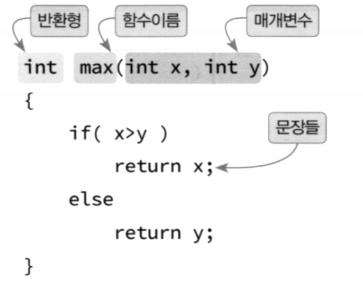
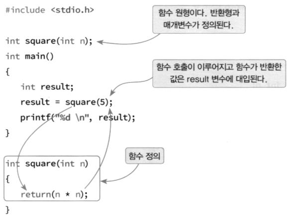
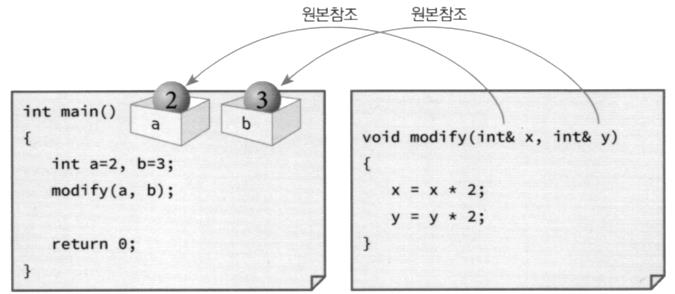
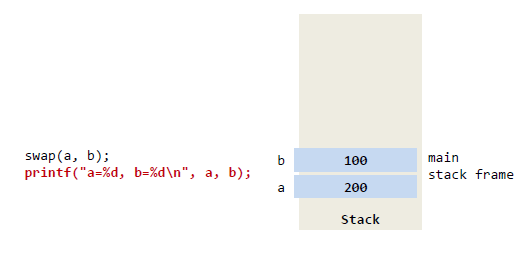
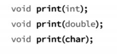
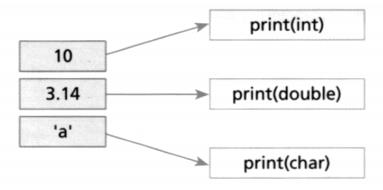
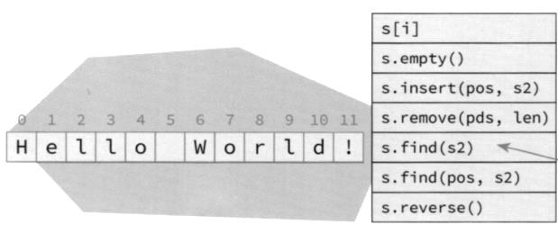
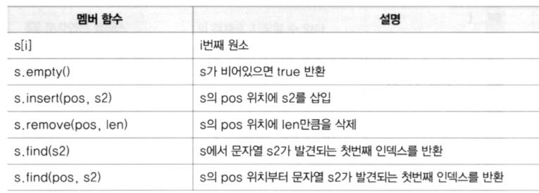

# 함수와 문자열

<br>

## 함수

- **함수의 구조**

  

<br>

- **함수의 호출**
  

  ```c++
  #include <iostream>
  using namespace std;
  
  int max(int x, int y);  // 함수 원형
  
  int main(int argc, char const *argv[]) {
      int n;
      n = max(2, 3);
      cout << "함수 호출 결과 : " << n << endl;
      return 0;
  }
  
  int max(int x, int y) {
      if(x>y)
          return x;
      else
          return y;
  }
  ```

  함수 호출 결과 : 3

  ---

<br>

- **함수 원형**
  
  

<br>

- **함수 인자 전달 방법**

  - **call by value**
    


    ```c++
    #include <iostream>
    using namespace std;
    void swap(int x, int y)
    {
        int t;
        t = x;
        x = y;
        y = t;
    }
    int main(int argc, char const *argv[])
    {
        int a = 100, b = 200;
        printf("a=%d, b=%d\n", a, b);
        swap(a, b);
        printf("a=%d, b=%d\n", a, b);
        return 0;
    }
    ```
    
    a=100, b=200
    a=100, b=200
    
    ---

  <br>

<br>


  - **call by reference**
    

    - 참조 변수 - 기존 변수에 새로운 이름을 추가하는 것
      

    <br>

    ```c++
    #include <iostream>
    using namespace std;
    void swap(int &x, int &y)
    {
        int t;
        t = x;
        x = y;
        y = t;
    }
    int main(int argc, char const *argv[])
    {
        int a = 100, b = 200;
        printf("a=%d, b=%d\n", a, b);
        swap(a, b);
        printf("a=%d, b=%d\n", a, b);
        return 0;
    }
    ```

    a=100, b=200
    a=200, b=100

    ---

    

    

    

    

    

    

    <br>

  - **call by address(pointer)**

    - 추후

<br>

<br>

- **중복함수 (overload)**

  - 함수의 이름은 동일하지만 함수의 인자가 다르면 다른 함수로 인식
  - 리턴 타입은 상관없음

  
  
  

  ```c++
  #include <iostream>
  using namespace std;
  int square(int i)
  {
      cout << "square(int) 호출" << endl;
      return i * i;
  }
  double square(double i)
  {
      cout << "square(double) 호출" << endl;
      return i * i;
  }
  int main(int argc, char const *argv[])
  {
      cout << square(10) << endl;
      cout << square(2.0) << endl;
      return 0;
  }
  ```

  square(int) 호출
  100
  square(double) 호출
  4

  ---

  <br>

  - **인수의 디폴트 값**

    - 함수 호출시 인수 값을 지정하지 않았을 때 가지는 값

    ```c++
    #include <iostream>
    using namespace std;
    void display(char c = '*', int n = 10)
    {
        for (int i = 0; i < n; i++)
        {
            cout << c;
        }
        cout << endl;
    }
    int main(int argc, char const *argv[])
    {
        display();
        display('#');
        display('#', 5);
        return 0;
    }
    ```

    \*\*\*\*\*\*\*\*\*\*

    ##########
    #####

    ---

    <br>

  - **인수의 디폴트 값 지정시 주의 사항**

    - 뒤에서 부터 배정
    - 앞에서 부터 배정하는 경우 에러

    

    <br>

  - 예제(함수의 변수를 배열로 받기)

    ```c++
    #include <iostream>
    using namespace std;
    
    // int array[] = {1, 2, 3, ...};
    void initArray(int array[], int size, int value = 0) {
        for(int i=0; i < size; i++) {
            array[i] = value;
        }
    }
    
    // 배열1 = 배열2;  // 값 복사 x --> 배열은 call by value가 안됨.
    
    void printArray(int array[],int size) {
        for(int i=0; i < size; i++){
            cout << array[i] << ", ";
        }
        cout << endl;
    }
    
    int main(int argc, char const *argv[]) {
        int intList[10];
    
        initArray(intList, 10, 100); // 100으로 초기화
        printArray(intList, 10);
        
        initArray(intList, 10);  // 0으로 초기화
        printArray(intList, 10);
    
        return 0;
    }
    ```

    100, 100, 100, 100, 100, 100, 100, 100, 100, 100,
    0, 0, 0, 0, 0, 0, 0, 0, 0, 0,

    ---

    > 배열의 크기를 매개변수로 전달 (sizeof 이용은 추후)

<br>

<br>

# 문자열

- **string 클래스**

  - 문자열 데이터 저장 및 문자열 처리 함수(메서드) 제공
  - \#include \<string> 을 먼저 지정 후 사용
    

  

  ```c++
  #include <iostream>
  #include <string>
  using namespace std;
  int main(int argc, char const *argv[])
  {
      string s1 = "Slow", s2 = "steady";
      string s3 = "the race.";
      string s4;
      s4 = s1 + " and " + s2 + " wins " + s3;
      cout << s4 << endl;
      return 0;
  }
  ```

  Slow and steady wins the race.

  ---

  <br>

  ```c++
  #include <iostream>
  #include <string>
  using namespace std;
  int main(int argc, char const *argv[])
  {
      string s1, addr;
      cout << "이름을 입력하세요: ";    // 홍길동\r\n
      cin >> s1;
      cin.ignore(); // 엔터키 제거
  
      cout << "주소를 입력하세요: ";
      getline(cin, addr);
      
      cout << addr << "의" << s1 << "씨 안녕하세요?" << endl;
      return 0;
  }
  ```

  이름을 입력하세요: `홍길동`
  주소를 입력하세요: `서울시 종로구`
  **서울시 종로구의홍길동씨 안녕하세요?**

  ---

  <br>
  

  

  <br>

  ```c++
  #include <iostream>
  #include <string>
  using namespace std;
  
  int main(int argc, char const *argv[])
  {
      string s = "When in Rome, do as the Romans.";
      
      int size = s.size();
      int index = s.find("Rome");
      
      cout << size << endl;
      cout << index << endl;
  
      cout << sizeof(s) << endl;  // string 객체의 단위는 항상 32Byte이다.
      
      s.insert(0, "Hello !! ");  // 맨 앞에 문자열 추가
      cout << s << endl;
  
      s += " End of World";  // 맨 뒤에 문자열 추가
      // s = s + " End of World";
      cout << s << endl;
  
      s.append("\n------\n"); // 맨 뒤에 문자열 추가
      cout << s;
      
      return 0;
  
  }
  ```

  31
  8
  32
  Hello !! When in Rome, do as the Romans.
  Hello !! When in Rome, do as the Romans. End of World
  Hello !! When in Rome, do as the Romans. End of World

  \-\-\-\-\-\-

  ---

  <br>

  **call by value, call by reference 읽기 쓰기**


  ```c++
  #include <iostream>
  #include <string>
  
  using namespace std;
  
  int main(int argc, char const *argv[])
  {
      string s = "When in Rome, do as the Romans.";
      // 읽기
      for (auto& ch : s)  // char &ch = s[i]
      {
          cout << ch << ' ';
      }
      cout << endl;
  
      for (auto ch : s)  // char ch = s[i]
      {
          cout << ch << ' ';
      }
      cout << endl;
  
      // 쓰기
      for (auto& ch : s)  // char &ch = s[i]
      {
          ch = 'T';
      }
      cout << s << endl;
  
      for (auto ch : s)  // char ch = s[i]
      {
          ch = 'W';
      }
      cout << s << endl;
      
      return 0;
  }
  ```

  W h e n   i n   R o m e ,   d o   a s   t h e   R o m a n s .  
  W h e n   i n   R o m e ,   d o   a s   t h e   R o m a n s .  
  TTTTTTTTTTTTTTTTTTTTTTTTTTTTTTT
  TTTTTTTTTTTTTTTTTTTTTTTTTTTTTTT

---

  <br>


  ```c++
  #include <iostream>
  #include <string>
  using namespace std;
  int main(int argc, char const *argv[])
  {
      string list[] = {"홍길동", "고길동", "둘리"};
      for (auto &name : list)
      {
          cout << name << endl;
      }
      return 0;
  }
  ```

  홍길동
  고길동
  둘리

---

  

