# 객체 배열


## 객체 배열

- **객체를 요소로 가지는 배열**
- 클래스명 배열\_이름[배열\_크기];
  - Circle objArray[3];
    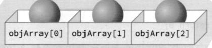
  - objArray[0].calcArea();
    


  ```c++
  #include <iostream>
  using namespace std;
  
  class Circle {
  public:
      int x, y;
      int radius;
  
      Circle(): x(0), y(0), radius(0) {}
      Circle(int x, int y, int r) : x(x), y(y), radius(r) {}
      void print() {
          cout << "radius: " << radius << " @(" << x << "," << y << ")" << endl;
      }
  };
  
  int main() {
      Circle objArray[10]; // 10개의 요소가 디폴트 생성자에 의해 생성
  
      for(Circle c : objArray) {  // 초기화가 어떻게 됐는지 확인
          c.print();
      }
      cout << "-----------" << endl;
      
      for (Circle& c: objArray) {
          c.x = rand() % 500;
          c.y = rand() % 300;
          c.radius = rand() % 100;
      }
      
      for (Circle c: objArray) {
          c.print();
      }
      cout << "-----------" << endl;
      cout << "Circle memory size: " << sizeof(Circle) << endl;  // Circle 인스턴스의 크기
      cout << "array length : " << sizeof(objArray) / sizeof(Circle) << endl;
  
      return 0;
  }
  ```

  radius: 0 @(0,0)
  radius: 0 @(0,0)
  radius: 0 @(0,0)
  radius: 0 @(0,0)
  radius: 0 @(0,0)
  radius: 0 @(0,0)
  radius: 0 @(0,0)
  radius: 0 @(0,0)
  radius: 0 @(0,0)
  radius: 0 @(0,0)
  \-\-\-\-\-\-\-\-\-\-\-
  radius: 34 @(41,167)
  radius: 24 @(0,269)
  radius: 62 @(478,258)
  radius: 45 @(464,5)
  radius: 61 @(281,27)
  radius: 42 @(491,295)
  radius: 91 @(327,36)
  radius: 53 @(104,2)
  radius: 21 @(292,82)
  radius: 95 @(216,218)
  \-\-\-\-\-\-\-\-\-\-\-
  Circle memory size: 12
  array length : 10

---

<br>

- **객체 배열의 초기화**
  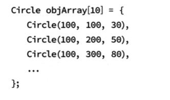

<br>

## 벡터

- **벡터**

  - 배열은 크기가 고정되어 있는 단점이 있음
  - 벡터는 동적으로 크기를 자동 조정
  - \#include \<vector\>

  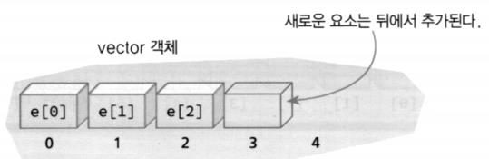


- **벡터의 기초**

  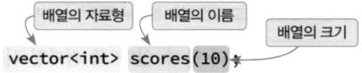
  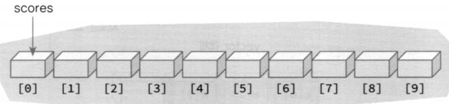

  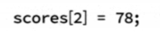

  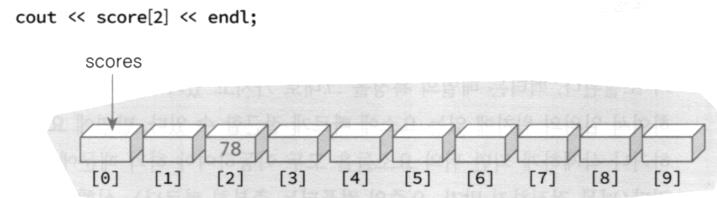


  ```c++
  #include <vector>
  #include <iostream>
  using namespace std;
  int main() {
      vector<int> fibo = {0, 1, 1, 2, 3, 5, 8, 13, 21, 34, 55, 89};
      for (auto& number: fibo) {
          cout << number << ' ';
      }
      cout << endl;
      return 0;
  }
  ```

  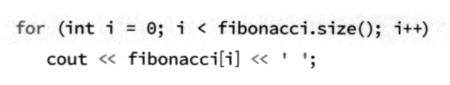
  0 1 1 2 3 5 8 13 21 34 55 89

---

<br>

- **push_back()과 pop_back()**

  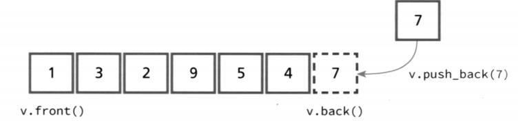

  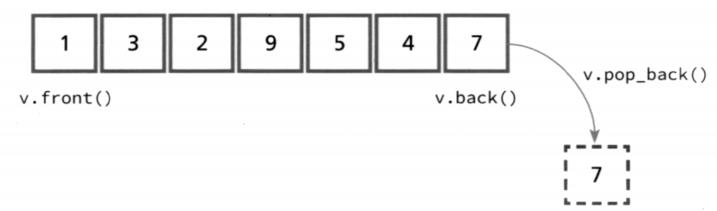

  ```c++
  #include <vector>
  #include <iostream>
  using namespace std;
  
  int main() {
      vector<int> v;
  
      cout << "size : " << v.size() << endl;
      cout << "capacity : "  << v.capacity() <<endl;
  
      v.push_back(10);
      v.push_back(20);
      v.push_back(30);
      v.push_back(40);
      v.push_back(50);
  
      for (auto& e: v) {
          cout << e << ' ';
      }
      cout << endl;
  
      cout << "size : " << v.size() << endl;
      cout << "capacity : "  << v.capacity() <<endl;
  
      return 0;
  }
  ```

  size : 0
  capacity : 0
  10 20 30 40 50
  size : 5
  capacity : 8

  ---

  > capacity는 기존 용량의 2배 씩 늘려간다.

  <br>

  ```c++
  #include <vector>
  #include <iostream>
  using namespace std;
  
  int main() {
      vector<int> v;
      for (int i = 0; i < 10; i++) {
          v.push_back(i);
      }
  
      for (auto &e: v) {
          cout << e << ' ';
      }
      cout << endl;
      cout << "delete" << endl;
  
      while (v.empty() != true) {
          cout << v.back() << " ";
          v.pop_back();
      }
      cout << endl;
      
      cout << "size : " << v.size() << endl;
      cout << "capacity : "  << v.capacity() <<endl;
  
  
      return 0;
  }
  ```

  0 1 2 3 4 5 6 7 8 9
  delete
  9 8 7 6 5 4 3 2 1 0
  size : 0
  capacity : 16

  ---

<br>

- **벡터에서 요소의 위치**
  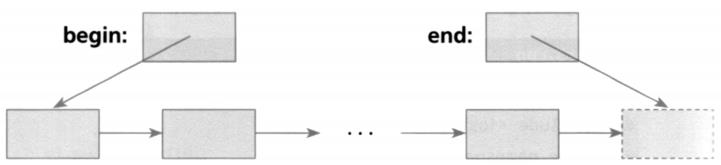
  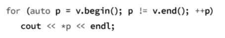

<br>

- **중간에서 삭제하는 방법**

  - v.erase(v.begin()+i);

    > 포인터 이후 자세히

<br>

- **벡터와 연산자**

  ```c++
  #include <vector>
  #include <iostream>
  using namespace std;
  
  int main() {
      vector<int> v1{1, 2, 3, 4, 5};
      vector<int> v2(v1);
  
      if (v1 == v2) {
          cout << "The two vectors match." << endl;
      }
  
      return 0;
  }
  ```

  The two vectors match.

  ---

  > 포인터 이후 자세히

  <br>

- **객체의 저장**

  ```c++
  #include <vector>
  #include <iostream>
  using namespace std;
  
  class Circle {
  public:
      int x, y;
      int radius;
      Circle() : x(0), y(0), radius(0) {}
      Circle(int x, int y, int r) : x(x), y(y), radius(r) {}
      void print() {
          cout << "radius: " << radius << " @(" << x << "," << y << ")" << endl;
      }
  };
  
  int main() {
      vector<Circle> objArray;
  
      for (int i = 0; i < 10; i++) {
          Circle obj{rand() % 300, rand() % 300, rand() % 100};
          objArray.push_back(obj);
      }
  
      for (auto &c : objArray) {
          c.print();
      }
      return 0;
  }
  ```

  radius: 34 @(41,167)
  radius: 24 @(100,269)
  radius: 62 @(78,258)
  radius: 45 @(164,5)
  radius: 61 @(181,27)
  radius: 42 @(191,295)
  radius: 91 @(27,36)
  radius: 53 @(204,2)
  radius: 21 @(292,82)
  radius: 95 @(116,218)

  ---

  