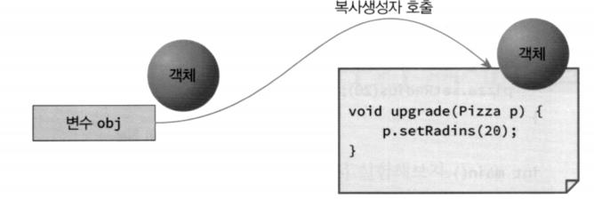
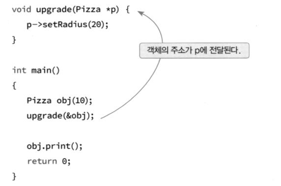
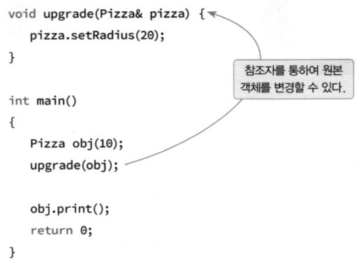
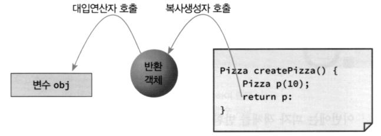
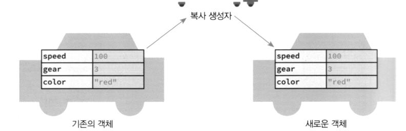
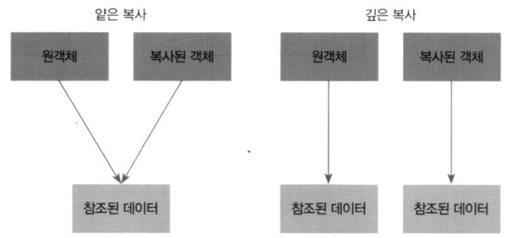
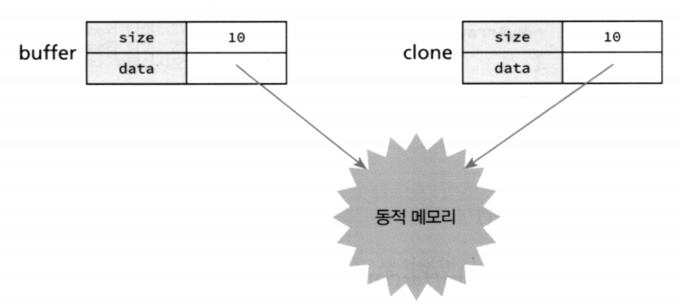
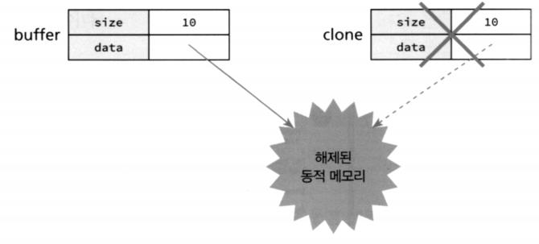
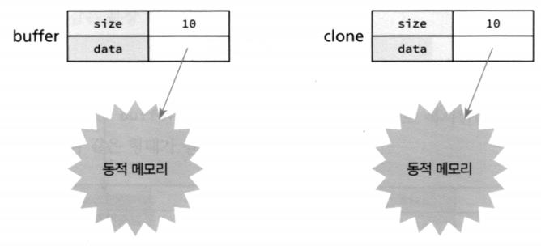

# 복사생성자와 정적멤버

<br>

## 함수로 객체 전달하기

-   **객체를 함수로 전달하기**

    -   함수 호출 시 객체를 매개변수로 전달하면 객체의 복사가 일어남

    

-   **객체의 주소를 함수로 전달하기**

    -   함수 호출시 객체의 주소를 전달하면 객체의 복사가 일어나지 않음

    

<br>

-   **참조자 매개변수 사용하기**

    -   효과는 포인터를 넘기는 것과 동일하나 포인터 보다 가독성이 좋아짐

    


-   **함수가 객체를 반환**

    -   객체를 함수의 매개변수로 전달할 때와 같이 객체의 복사가 일어남
    -   `Pizza pizza = createPizza(); // 이런 함수를 팩토리 함수라고 한다.`

    

<br>

-   **복사 생성자가 사용되는 시점**

    -   함수의 매개변수로 객체를 전달할 때
    -   객체를 대입할 때

    

  <br>

-   **복사 생성자**

    ```c++
    MyClass(const MyClass & other){ // 복사생성자의 매개변수타입은 지정되어있다.
        // 객체 초기화               // 반드시 참조변수(&)로 받아야 한다
    }
    ```

    - MyClass(**MyClass other**)로 하면 무한 루프 발생하므로 주의!
    - 복사 생성자를 정의하지 않으면 자동으로 추가
        - 멤버 변수에  대한 **얕은 복사** 진행 
    - 깊은 복사가 필요한 경우 복사 생성자 정의 필요

  <br>

<br>

-   **복사 생성자**

    -   얕은 복사와 깊은 복사

        -   얕은 복사 - **참조되는 주소값을 복사**하여 주소값에 있는 값을 참조
        -   깊은 복사 - **참조되는 값까지 복사**하여 그 값을 참조

        

          

**복사 생성자 - 디폴트 복사 생성자**

```c++
#include <iostream>
#include <string>
using namespace std;
class Person
{
    public:
    int age;
    Person(int a) : age(a) {}
};

int main(int argc, char const *argv[])
{
    Person kim{21};
    Person clone{kim}; // 복사 생성자 호출
    cout << "kim의 나이: " << kim.age << " clone의 나이: " << clone.age << endl;
    kim.age = 23;
    cout << "kim의 나이: " << kim.age << " clone의 나이: " << clone.age << endl;
    return 0;
}
```

kim의 나이: 21 clone의 나이: 21
kim의 나이: 23 clone의 나이: 21

---

<br>
    
**복사 생성자 - 얕은 복사의 문제점**

```c++
#include <iostream>
#include <string>
using namespace std;

class MyArray{
    public:
    int size;
    int *data;
    MyArray(int size){
        this->size = size;
        data = new int[size];
    }
    ~MyArray(){
        if(data != NULL){
            delete []data;
        }
    }
};

int main(int argc, char const *argv[]) {
    MyArray buffer(10);
    buffer.data[0] = 1;
    {
        MyArray clone = buffer; // 복사 생성자 호출
    } // clone 삭제
    buffer.data[0] = 2;
    cout << buffer.data[0] << endl;
    return 0;
}
```

2

---

<br>

-   MyArray clone = buffer; // 복사 생성자 호출  



<br>

**복사 생성자 - 깊은 복사**

```c++
class MyArray{
    public:
    int size;
    int *data;
    MyArray(const MyArray& other){
        size = other.size;
        data = new int[other.size];
        for(int i=0; i<size; i++){
            data[i] = other.data[i]; // 복사 생성자 호출
        }
    }
    ~MyArray(){
        if(data != NULL){
            delete []data;
        }
    }
};
```

