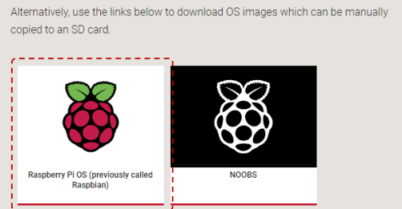
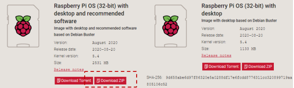
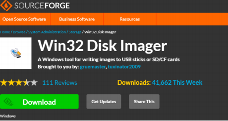
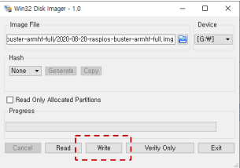
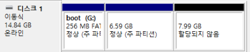
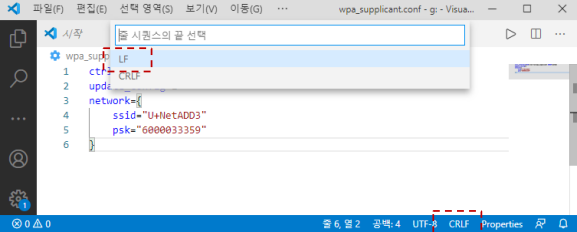
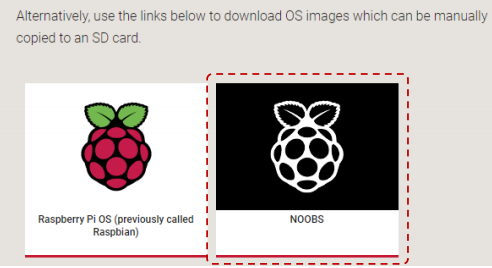
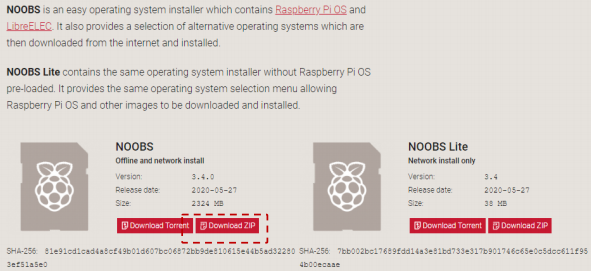

# 라즈베리파이 설치 1 (Image 설치)

### https://www.raspberrypi.org/downloads/



<br>

### 라즈비안 OS 이미지 다운로드

-   크기 2.5G 



<br>

### Win32 Disk Imager 설치

-   https://sourceforge.net/projects/win32diskimager/?source=typ_redirect



<br>

### 라즈비언 이미지 SDCard 심기

-    10분 정도 소요



<br>

### 파티션 구성

-   부팅 및 시스템 설정 파티션(256 MB)
-   주 파티션(6.59 GB)
-   미할당 영역(7.99 GB)
    -   확장 필요



<br>

### SSH 활성화하기

-   boot 파티션에 ssh 파일 생성
    -   확장명 무, 내용 무

### WiFi 접속설정 파일 만들기

-   boot 파티션에 wpa_supplicant.conf 작성

```
ctrl_interface=DIR=/var/run/wpa_supplicant GROUP=netdev
update_config=1
network={
    ssid="네트워크이름"
    psk="네트워크비번"
}
```

부팅 후 우측 상단 와이파이 아이콘에 마우스 올리면 IP 주소 확인 가능

<br>

### 개행문자 조정

-    CRLF -> LF



<br>

### 부팅

-   최초 부팅 약간 시간 걸림

    -   자동 파티션 확장

    -   화면에 아무것도 안 나와도 기다림.

        >   내 IP: 192.168.0.10

        cmd > `ssh pi@192.168.0.10`

        password : raspberry

<br>

<br>

# 라즈베리파이 설치 2 (NOOBS 설치)

### https://www.raspberrypi.org/downloads/



<br>

### NOOBS 다운로드



<br>

### microSD 카드 준비

-   micro SD카드 Fat32 포맷
-   NOOBS_v3_4_0 파일 압축해제
-   파일/디렉토리를 micro SD카드에 복사