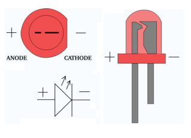
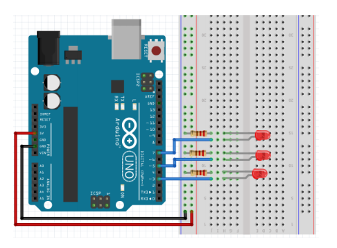
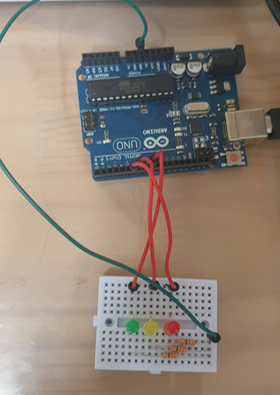

# LED

  

## LED

**브레드 보드(Bread board, 빵팡)** 

-   남땜이 필요없는 프로토타입용 보드
    ① VCC (빨간색) 
    ② GND (검은색) 
    ③ 부품 연결선


  

**점퍼선**

-   브레드 보드에 부품들을 서로 연결할 때 이용


  

**LED 발광 다이오드**

-   전류가 흐르면서 빛을 발하는 반도체
-   다이오드 : 전류를 한쪽 방향으로만 흐르게 함
-   과다 전류가 흐를 경우 파손
    -   LED에 저항을 배치



  

**저항**

-   전기의 흐름을 제한


  

**기본 구성**


  

**pinMode()**

-    디지털 핀의 모드를 출력 또는 입력으로 설정하는 함수
-   pinMode(핀 번호, 모드)
    -   매개변수
        -   핀 번호 : 모드를 설정하고자 하는 핀 번호
        -   모드： 출력인 경우 OUTPUT, 입력인 경우 INPUT
    -   반환값 : 없음
-   사용 예
    -   `piMode(13, OUTPUT);` //13번 핀을 출력 모드로 설정
    -   `pinMode(13, INPUT);` //13번 핀을 입력 모드로 설정

  

**digitalWrite()**

-   디지털 핀의 전압을 HIGH 또는 LOW로 설정하는 함수
    -   digitalWrite() 사용하려는 핀은 꼭 pinMode()로 출력 모드 설정
-   digitalWrite (핀 번호, 전압)
    -   매개변수
        -   핀 번호: 전압을 설정하고자 하는 핀 번호입니다.
        -   전압: HIGH인 경우 HIGH, LOW인 경우 LOW를 입력합니다.
    -   반환값 : 없음
-    사용 예
    -   `digitalWrite(13, HIGH);` //13번 핀의 전압을 HIGH로 설정
    -   `digitalWrite(13, LOW);` //13번 핀의 전압을 LOW로 설정

  

**delay()**

-   아두이노 보드를 일정 시간 멈추는 함수
-   delay(멈출 시간)
    -   매개변수
        -   멈출 시간: 단위는 밀리초
    -   반환 값 : 없음
-   사용 예
    -   `delay(1000);` // 아두이노 보드를 1초 멈춤

  

  

## LED 기본 점등

```c++
void setup() {
  pinMode(13, OUTPUT);
  digitalWrite(13, false);  // H/F, T/F, 1/0 가능
}

void loop() {
  digitalWrite(13, HIGH);
  delay(300);
  digitalWrite(13, LOW);
  delay(600);
}  // BUILT_IN_LED
```


**상태 변수로 LED 점등하기**

```c++
int pin_LED = 7;
boolean LED_state = false;

void setup() {
  pinMode(pin_LED, OUTPUT);
  digitalWrite(pin_LED, LED_state);
}

void loop() {
  LED_state = !LED_state;
  digitalWrite(pin_LED, LED_state);
  delay(1000);
}
```

  

**delay 함수를 이용한 점등 시간 변화**

```c++
int pin_LED = 7;

void setup() {
  pinMode(pin_LED, OUTPUT);
}

void loop() {
  digitalWrite(pin_LED, HIGH);
  delay(500);
  digitalWrite(pin_LED, LOW);
  delay(500);
  digitalWrite(pin_LED, HIGH);
  delay(1000);
  digitalWrite(pin_LED, LOW);
  delay(1000);
  digitalWrite(pin_LED, HIGH);
  delay(2000);
  digitalWrite(pin_LED, LOW);
  delay(2000);
}
```

함수이용

```c++
int pin_LED = 7;

void blink(int pin, long time) {
  digitalWrite(pin, HIGH);
  delay(time);
  digitalWrite(pin, LOW);
  delay(time);
}

void setup() {
  pinMode(pin_LED, OUTPUT);
}

void loop() {
  blink(pin_LED, 500);
  blink(pin_LED, 1000);
  blink(pin_LED, 2000);
}
```


  

## 여러개의 LED 점등하기

**2개 LED 점멸**


```c++
const int pin_LED1 = 7;
const int pin_LED2 = 8;


void setup() {
  pinMode(pin_LED1, OUTPUT);
  pinMode(pin_LED2, OUTPUT);
}

void loop() {
  digitalWrite(pin_LED1, HIGH);
  digitalWrite(pin_LED2, LOW);
  delay(100);
  digitalWrite(pin_LED1, LOW);
  digitalWrite(pin_LED2, HIGH);
  delay(100);
}
```

  

**3개 LED 순차 점등**



```c++
int pin_LED1 = 8;
int pin_LED2 = 7;
int pin_LED3 = 6;

void setup() {
  pinMode(pin_LED1, OUTPUT);
  pinMode(pin_LED2, OUTPUT);
  pinMode(pin_LED3, OUTPUT);
}

void loop() {
  digitalWrite(pin_LED1, HIGH);
  delay(2000);
  digitalWrite(pin_LED1, LOW);
  digitalWrite(pin_LED2, HIGH);
  delay(1000);
  digitalWrite(pin_LED2, LOW);
  digitalWrite(pin_LED3, HIGH);
  delay(2000);
  digitalWrite(pin_LED3, LOW);
}
```

  

**신호등**

```c++
int greenLed = 8;
int yelloLed = 7;
int redLed = 6;

void setup() {
    pinMode(greenLed, OUTPUT);
    pinMode(yelloLed, OUTPUT);
    pinMode(redLed, OUTPUT);
}

void go(int duration=0) {
    digitalWrite(redLed, LOW);
    digitalWrite(yelloLed, LOW);
    digitalWrite(greenLed, HIGH);
    if(duration!=0) {
        delay(duration);
    }
}

void stop(int duration=0) {
    digitalWrite(redLed, HIGH);
    digitalWrite(yelloLed, LOW);
    digitalWrite(greenLed, LOW);
    if(duration!=0) {
        delay(duration);
    }
}

void leftTurn(int duration=0) {
    digitalWrite(redLed, LOW);
    digitalWrite(yelloLed, HIGH);
    digitalWrite(greenLed, HIGH);
    if(duration!=0) {
        delay(duration);
    }
}

void blink(int pin, int duration) {
    digitalWrite(pin, HIGH);
    delay(duration);
    digitalWrite(pin, LOW);
    delay(duration);
}

void leftTurnWarning(int duration=0) {
    digitalWrite(redLed, LOW);
    digitalWrite(yelloLed, HIGH);

    // 5회 점등
    int interval = duration / 5 ;
    for(int i=0; i<5; i++) {
        blink(yelloLed, interval);
    }
}

// 5초간 직진 신호
// 2초간 직진, 좌회전 동시 신호
// 2초간 직진 및 좌회전 블링크
// 2초간 정지 신호

void loop() {
    go(5000);
    leftTurn(2000);
    leftTurnWarning(2000);
    stop(2000);
}
```


### 신호등 파일 분리

app.ino

```c++
#include "TrafficLight.h"

TrafficLight lights(8,7,6);

void setup() {
}

void loop() {
    lights.run();
}
```


TrafficLight.h

```c++
#ifndef __TRAFFIC_LIGHT_H__
#define __TRAFFIC_LIGHT_H__

#include <Arduino.h>

class TrafficLight {
private:  // 멤버 변수의 접근 제한자
    int greenLed;
    int yellowLed;
    int redLed;

public:  // 멤버 함수의 접근 제한자
    TrafficLight(int greenLed, int yellowLed, int redLed);

    void go(int duration=0);
    void leftTurn(int duration=0);
    void leftTurnWarning(int duration=0);
    void stop(int duration=0);
    void blink(int pin, int duration);

    void run();  // 신호등 운영 메서드

};

#endif
```


TrafficLight.cpp

```c++
#include "TrafficLight.h"

TrafficLight::TrafficLight(int greenLed, int yellowLed, int redLed)
    : greenLed(greenLed), yellowLed(yellowLed), redLed(redLed) {  // this->greenLed = greenLed; // 이렇게도 가능하다.

    pinMode(greenLed, OUTPUT);
    pinMode(yellowLed, OUTPUT);
    pinMode(redLed, OUTPUT);
}

void TrafficLight::go(int duration) {
    digitalWrite(redLed, LOW);
    digitalWrite(yellowLed, LOW);
    digitalWrite(greenLed, HIGH);
    if(duration!=0) {
        delay(duration);
    }
}

void TrafficLight::leftTurn(int duration) {
    digitalWrite(redLed, LOW);
    digitalWrite(yellowLed, HIGH);
    digitalWrite(greenLed, HIGH);
    if(duration!=0) {
        delay(duration);
    }
}

void TrafficLight::leftTurnWarning(int duration) {
    digitalWrite(redLed, LOW);
    digitalWrite(yellowLed, HIGH);

    // 5회 점등
    int interval = duration / 5 ;
    for(int i=0; i<5; i++) {
        blink(yellowLed, interval);
    }
}

void TrafficLight::stop(int duration){
    digitalWrite(redLed, HIGH);
    digitalWrite(yellowLed, LOW);
    digitalWrite(greenLed, LOW);
    if(duration!=0) {
        delay(duration);
    }
}

void TrafficLight::blink(int pin, int duration){
    digitalWrite(pin, HIGH);
    delay(duration/2);
    digitalWrite(pin, LOW);
    delay(duration/2);
}

// 신호등 운영 메서드
void TrafficLight::run() {
    go(5000);
    leftTurn(2000);
    leftTurnWarning(2000);
    stop(2000);
}
// 5초간 직진 신호
// 2초간 직진, 좌회전 동시 신호
// 2초간 직진 및 좌회전 블링크
// 2초간 정지 신호
```


>   내 PC > 문서 > Arduino > libraries > mylib `TrafficLight.cpp`, `TrafficLight.h` 이동
>
>   app.ino에서 `#include <TrafficLight.h>`
>
>   VSCode 빈 곳 우클릭 > Add Folder to Workspace에 libraries 추가 가능
>
>   라이브러리 포함 폴더 저장 File > Save Workspace As



​    

**4개 LED 순차적으로 점등**


```c++

```

