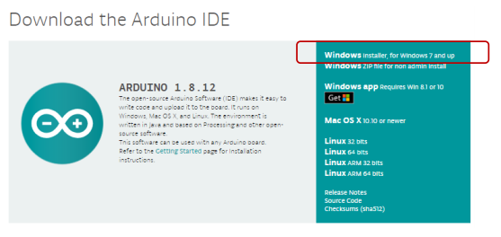
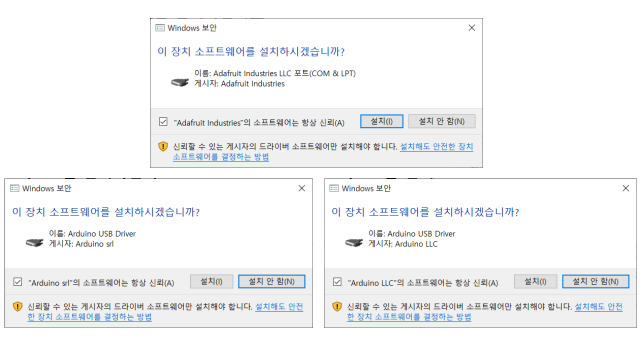

# 개발환경 구축


  

## 개발 환경 구축

**Arduino IDE**

-   https://www.arduino.cc/
    -   Software > DOWNLOADS
        


**드라이버 모두 설치**




**Arduino IDE**

-   디폴트로 설치 진행
    -   C:\Program Files (x86)\Arduino


## 개발환경 구축 - VSCode

**Vscode를 위한 설정**

-   아두이노 설치 폴더

    -   arduino_debug.l4j.ini, arduino.l4j.ini 
        -   java 머신의 설정파일

-   arduino_debug.l4j.ini

    ```ini
    -Xms128M
    -Xmx512M
    -DDEBUG=false
    -Dfile.encoding=UTF8
    -Djava.net.preferIPv4Stack=true
    ```

    

  

## Arduino IDE

