# 개발환경 구축


  

## 개발 환경 구축

**Arduino IDE**

-   https://www.arduino.cc/
    -   Software > DOWNLOADS
        


**드라이버 모두 설치**


**Arduino IDE**

-   디폴트로 설치 진행
    -   C:\Program Files (x86)\Arduino


## 개발환경 구축 - VSCode

**Vscode를 위한 설정**

-   아두이노 설치 폴더

    -   arduino_debug.l4j.ini, arduino.l4j.ini 
        -   java 머신의 설정파일

-   arduino_debug.l4j.ini

    ```ini
    -Xms128M
    -Xmx512M
    -DDEBUG=false
    -Dfile.encoding=UTF8
    -Djava.net.preferIPv4Stack=true
    ```

    

  

## Arduino IDE

**보드 선택**

-   툴 > 보드 > Arduino Uno

**포트 선택**

-   툴 > 포트 > COM 번호 선택 (각 컴퓨터마다 다름)

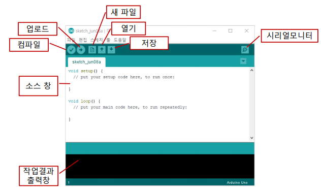


  

## 스케치 프로그램 구조

**스케치는 C/C++을 기반으로 함**


**main 함수는 존재하지 않음**

-   main 함수는 숨겨져 있으므로 신경 쓰지 않아도 됨


**2개의 기본 함수로 구성**

-   setup() 함수
    -   초기화 함수
    -   스케치 실행이 시작될 때 한 번만 실행
-   loop() 함수
    -   반복 실행 함수
    -   프로그램에서 메인/이벤트 루프에 해당

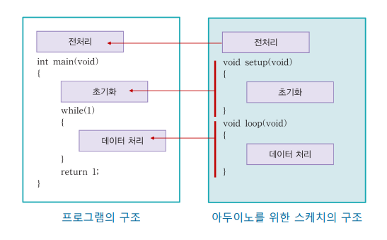

  

**새 파일**

```c++
void setup() {
  // put your setup code here, to run once:
  Serial.begin(9600);             // 시리얼통신 시작(속도:9600)
  Serial.println("hello, Arduino"); // 시리얼모니터에 "hello, Arduino"를 출력
}

void loop() {
  // put your main code here, to run repeatedly:
  Serial.println("hello, Arduino");
  delay(500);  // 500ms 동안 대기...
}
```

  

**저장 > hello**

-   '내 문서\Arduino\hello\hello.ino' 결로 저장됨


## Arduino IDE

**컴파일**

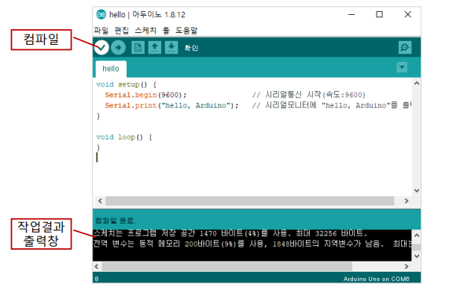

  

**업로드**

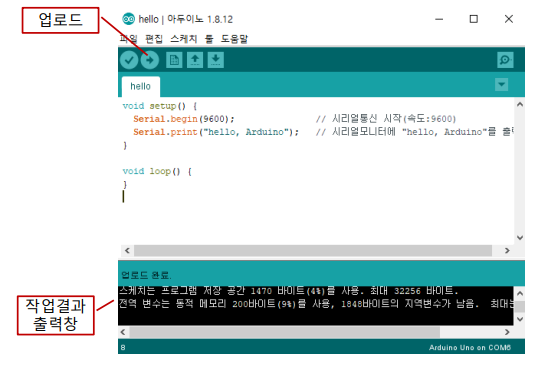

  

**시리얼 모니터**

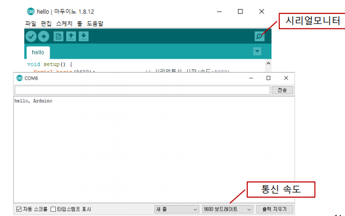

  


## 개발환경 구축 - VSCode

**VSCode - Arduino 확장 팩**

-   확장팩

    -   Arduino 검색

        -   Microsoft가 제공하는 확장팩 설치

        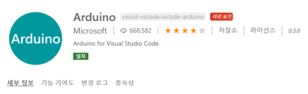

  

 **.vscode/arduino.json**

-   아두이노 초기화 명령으로 자동 생성
    -   F1 > Arduino: Initialize

  

**파일명**

-   app.ino

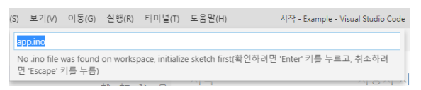

  

**보드 선택**

-   Arduino Uno

    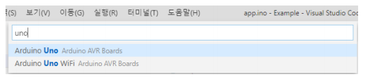

  

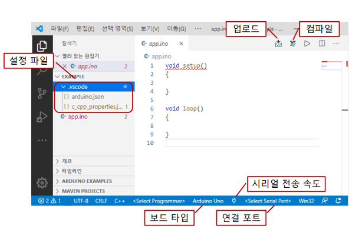


**포트선택**

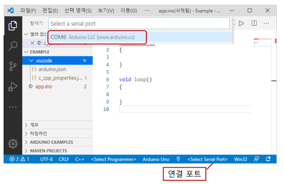


**전송 속도 설정**

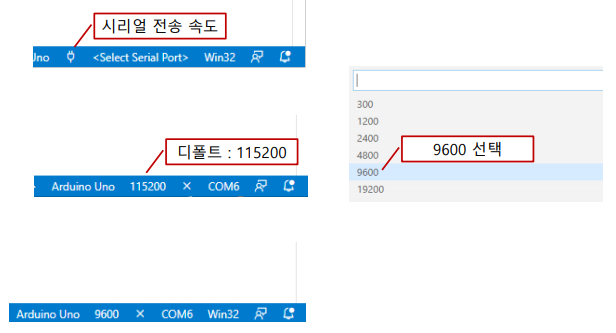


  

**.vscode/arduino.json**

-   아두이노 초기화 명령으로 자동 생성

    ```json
    {
        "sketch": "app.ino",
        "board": "arduino:avr:uno",
        "port": "COM6"
    }
    ```

  

**컴파일 환경 정보: .vscode\c_cpp_properties.json**

```json
{
    "configurations": [
        {
            "name": "Win32",
            "includePath": [
                "C:\\Program Files (x86)\\Arduino\\tools\\**",
                "C:\\Program Files (x86)\\Arduino\\hardware\\arduino\\avr\\**",
                "C:\\Program Files (x86)\\Arduino\\hardware\\tools\\avr\\**"
            ],
            "forcedInclude": [
                "C:\\Program Files (x86)\\Arduino\\hardware\\arduino\\avr\\cores\\arduino\\Arduino.h"
            ],
            "intelliSenseMode": "gcc-x64",
            "compilerPath": "C:\\Program Files\\mingw-w64\\x86_64-8.1.0-posix-seh-rt_v6-rev0\\mingw64\\bin\\gcc.exe",
            "cStandard": "gnu18",
            "cppStandard": "gnu++14",
            "defines": ["USBCON"]
        }
    ],
    "version": 4
}
```


