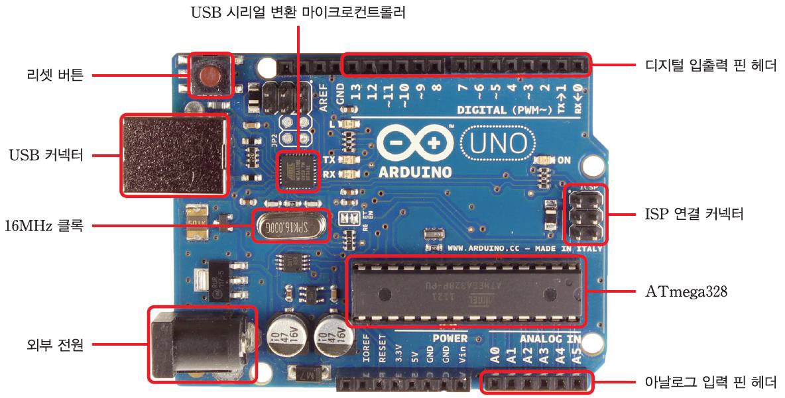
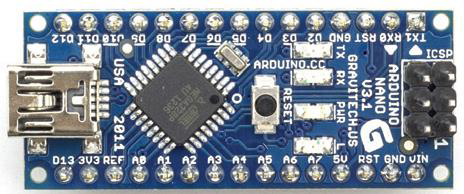
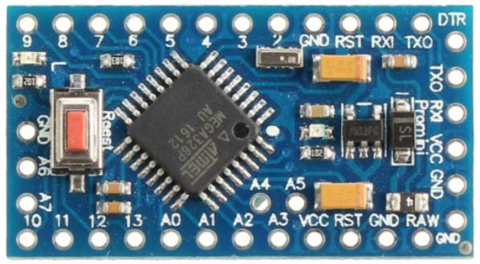
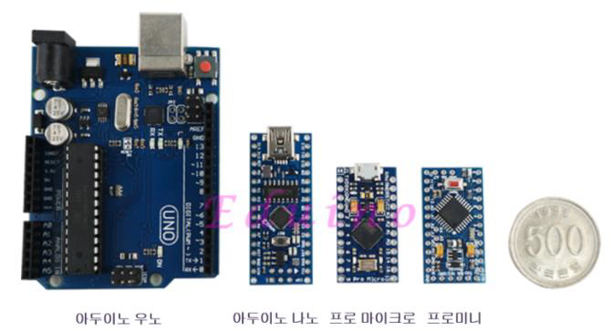
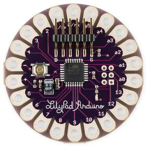
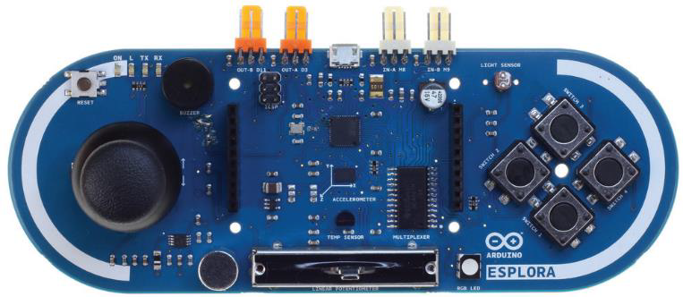
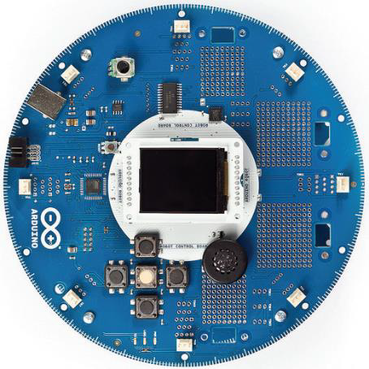
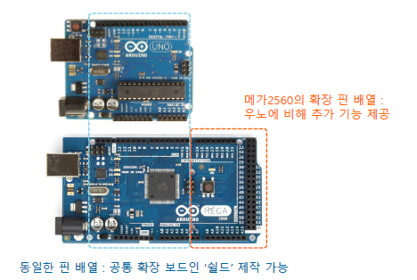
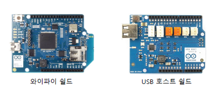
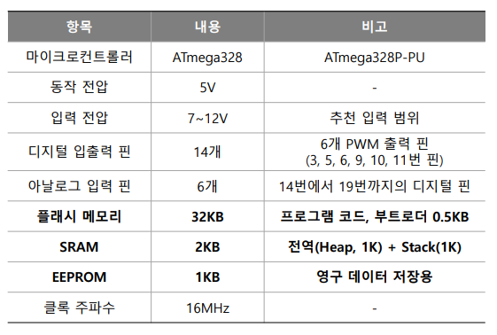

# 아두이노 소개

 

## 아두이노?

**2005년 이탈리아 이브레아에서 예술가와 디자이너를 위한 마이크로 컨트롤러 프로젝트로 시작**

 

**아두이노**

-   하드웨어(아트멜의 AVR 시리즈 마이크로컨트롤러)와
-   소프트웨어(프로그램 개발을 위한 전용 라이브러리를 포함하는 개발 환경)를 함께 지칭

 

**아두이노 하드웨어는 마이크로컨트롤러 보드의 일종임**

-   아두이노 보드라고도 함
-   마이크로컨트롤러(AVR uC) + 커넥터 + α

 

**아두이노의 하드웨어와 소프트웨어는 모두 오픈 소스 정책에 따라 공개되어 있음**

 

   

## 아두이노 우노

 

## 특수 목적용 아두이노 보드

아두이노 나노

   

아두이노 프로 미니

   

 

## 크기 비교

 

   

## 특수 목적용 아두이노 보드

릴리패드: 웨어러블 제작

에스플로라: 센서 및 입력 장치 포함

로봇: 주행장치 개발

## 아두이노 우노와 아두이노 메가2560

 

   

## 쉴드 (Shield)

**아두이노 보드의 기능 확장을 위한 하드웨어**

**다양한 아두이노의 공식 쉴드 및 써드 파티 업체의 호환 쉴드 존재**

-   호환 쉴드는 아두이노의 오픈 하드웨어 정책에 따라 가능

 

## 아두이노 우노

**아두이노 보드 중 가장 기본이 되는 보드**

**8비트 CPU 포함**

**20개의 디지털 입출력 핀 사용 가능**

-   0번에서 19번까지 핀 단위의 번호 지정
-   6개의 핀으로 PWM 신호 출력 가능
    -   3, 5, 6, 9, 10, 11번 핀

**6개의 아날로그 입력 핀 사용 가능**

-   14번에서 19번까지의 디지털 입력 핀과 동일
-   10비트 ADC 사용 (0~1023의 양자화된 값)
    -   DAC는 포함되어 있지 않으므로 아날로그 값 출력은 불가능

**아두이노 메가2560은 디지털/아날로그 핀의 수만 다르고 기본적인 기능은 아두이노 우노와 동일**

 

   

## 아두이노 우노 사양

