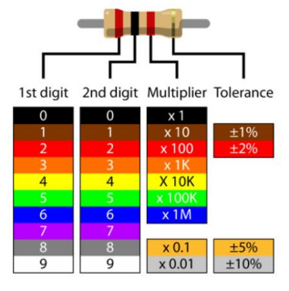
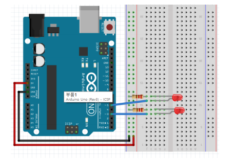

# LED

  

## LED

**브레드 보드(Bread board, 빵팡)** 

-   남땜이 필요없는 프로토타입용 보드
    ① VCC (빨간색) 
    ② GND (검은색) 
    ③ 부품 연결선


  

**점퍼선**

-   브레드 보드에 부품들을 서로 연결할 때 이용


  

**LED 발광 다이오드**

-   전류가 흐르면서 빛을 발하는 반도체
-   다이오드 : 전류를 한쪽 방향으로만 흐르게 함
-   과다 전류가 흐를 경우 파손
    -   LED에 저항을 배치


  

**저항**

-   전기의 흐름을 제한




  

**기본 구성**


  

**pinMode()**

-    디지털 핀의 모드를 출력 또는 입력으로 설정하는 함수
-   pinMode(핀 번호, 모드)
    -   매개변수
        -   핀 번호 : 모드를 설정하고자 하는 핀 번호
        -   모드： 출력인 경우 OUTPUT, 입력인 경우 INPUT
    -   반환값 : 없음
-   사용 예
    -   `piMode(13, OUTPUT);` //13번 핀을 출력 모드로 설정
    -   `pinMode(13, INPUT);` //13번 핀을 입력 모드로 설정

  

**digitalWrite()**

-   디지털 핀의 전압을 HIGH 또는 LOW로 설정하는 함수
    -   digitalWrite() 사용하려는 핀은 꼭 pinMode()로 출력 모드 설정
-   digitalWrite (핀 번호, 전압)
    -   매개변수
        -   핀 번호: 전압을 설정하고자 하는 핀 번호입니다.
        -   전압: HIGH인 경우 HIGH, LOW인 경우 LOW를 입력합니다.
    -   반환값 : 없음
-    사용 예
    -   `digitalWrite(13, HIGH);` //13번 핀의 전압을 HIGH로 설정
    -   `digitalWrite(13, LOW);` //13번 핀의 전압을 LOW로 설정

  

**delay()**

-   아두이노 보드를 일정 시간 멈추는 함수
-   delay(멈출 시간)
    -   매개변수
        -   멈출 시간: 단위는 밀리초
    -   반환 값 : 없음
-   사용 예
    -   `delay(1000);` // 아두이노 보드를 1초 멈춤

  

  

## LED 기본 점등

```c++
void setup() {
  pinMode(13, OUTPUT);
  digitalWrite(13, false);  // H/F, T/F, 1/0 가능
}

void loop() {
  digitalWrite(13, HIGH);
  delay(300);
  digitalWrite(13, LOW);
  delay(600);
}  // BUILT_IN_LED
```


**상태 변수로 LED 점등하기**

```c++
int pin_LED = 7;
boolean LED_state = false;

void setup() {
  pinMode(pin_LED, OUTPUT);
  digitalWrite(pin_LED, LED_state);
}

void loop() {
  LED_state = !LED_state;
  digitalWrite(pin_LED, LED_state);
  delay(1000);
}
```

  

**delay 함수를 이용한 점등 시간 변화**

```c++
int pin_LED = 7;

void setup() {
  pinMode(pin_LED, OUTPUT);
}

void loop() {
  digitalWrite(pin_LED, HIGH);
  delay(500);
  digitalWrite(pin_LED, LOW);
  delay(500);
  digitalWrite(pin_LED, HIGH);
  delay(1000);
  digitalWrite(pin_LED, LOW);
  delay(1000);
  digitalWrite(pin_LED, HIGH);
  delay(2000);
  digitalWrite(pin_LED, LOW);
  delay(2000);
}
```

함수이용

```c++
int pin_LED = 7;

void blink(int pin, long time) {
  digitalWrite(pin, HIGH);
  delay(time);
  digitalWrite(pin, LOW);
  delay(time);
}

void setup() {
  pinMode(pin_LED, OUTPUT);
}

void loop() {
  blink(pin_LED, 500);
  blink(pin_LED, 1000);
  blink(pin_LED, 2000);
}
```


  

## 여러개의 LED 점등하기

**2개 LED 점멸**



```c++
const int pin_LED1 = 7;
const int pin_LED2 = 8;


void setup() {
  pinMode(pin_LED1, OUTPUT);
  pinMode(pin_LED2, OUTPUT);
}

void loop() {
  digitalWrite(pin_LED1, HIGH);
  digitalWrite(pin_LED2, LOW);
  delay(100);
  digitalWrite(pin_LED1, LOW);
  digitalWrite(pin_LED2, HIGH);
  delay(100);
}
```

  

**3개 LED 순차 점등**


```c++
int pin_LED1 = 8;
int pin_LED2 = 7;
int pin_LED3 = 6;

void setup() {
  pinMode(pin_LED1, OUTPUT);
  pinMode(pin_LED2, OUTPUT);
  pinMode(pin_LED3, OUTPUT);
}

void loop() {
  digitalWrite(pin_LED1, HIGH);
  delay(2000);
  digitalWrite(pin_LED1, LOW);
  digitalWrite(pin_LED2, HIGH);
  delay(1000);
  digitalWrite(pin_LED2, LOW);
  digitalWrite(pin_LED3, HIGH);
  delay(2000);
  digitalWrite(pin_LED3, LOW);
}
```

  

**신호등**

```c++
int greenLed = 8;
int yelloLed = 7;
int redLed = 6;

void setup() {
    pinMode(greenLed, OUTPUT);
    pinMode(yelloLed, OUTPUT);
    pinMode(redLed, OUTPUT);
}

void go(int duration=0) {
    digitalWrite(redLed, LOW);
    digitalWrite(yelloLed, LOW);
    digitalWrite(greenLed, HIGH);
    if(duration!=0) {
        delay(duration);
    }
}

void stop(int duration=0) {
    digitalWrite(redLed, HIGH);
    digitalWrite(yelloLed, LOW);
    digitalWrite(greenLed, LOW);
    if(duration!=0) {
        delay(duration);
    }
}

void leftTurn(int duration=0) {
    digitalWrite(redLed, LOW);
    digitalWrite(yelloLed, HIGH);
    digitalWrite(greenLed, HIGH);
    if(duration!=0) {
        delay(duration);
    }
}

void blink(int pin, int duration) {
    digitalWrite(pin, HIGH);
    delay(duration);
    digitalWrite(pin, LOW);
    delay(duration);
}

void leftTurnWarning(int duration=0) {
    digitalWrite(redLed, LOW);
    digitalWrite(yelloLed, HIGH);

    // 5회 점등
    int interval = duration / 5 ;
    for(int i=0; i<5; i++) {
        blink(yelloLed, interval);
    }
}

// 5초간 직진 신호
// 2초간 직진, 좌회전 동시 신호
// 2초간 직진 및 좌회전 블링크
// 2초간 정지 신호

void loop() {
    go(5000);
    leftTurn(2000);
    leftTurnWarning(2000);
    stop(2000);
}
```


### 신호등 파일 분리

app.ino

```c++
#include "TrafficLight.h"

TrafficLight lights(8,7,6);

void setup() {
}

void loop() {
    lights.run();
}
```


TrafficLight.h

```c++
#ifndef __TRAFFIC_LIGHT_H__
#define __TRAFFIC_LIGHT_H__

#include <Arduino.h>

class TrafficLight {
private:  // 멤버 변수의 접근 제한자
    int greenLed;
    int yellowLed;
    int redLed;

public:  // 멤버 함수의 접근 제한자
    TrafficLight(int greenLed, int yellowLed, int redLed);

    void go(int duration=0);
    void leftTurn(int duration=0);
    void leftTurnWarning(int duration=0);
    void stop(int duration=0);
    void blink(int pin, int duration);

    void run();  // 신호등 운영 메서드

};

#endif
```


TrafficLight.cpp

```c++
#include "TrafficLight.h"

TrafficLight::TrafficLight(int greenLed, int yellowLed, int redLed)
    : greenLed(greenLed), yellowLed(yellowLed), redLed(redLed) {  // this->greenLed = greenLed; // 이렇게도 가능하다.

    pinMode(greenLed, OUTPUT);
    pinMode(yellowLed, OUTPUT);
    pinMode(redLed, OUTPUT);
}

void TrafficLight::go(int duration) {
    digitalWrite(redLed, LOW);
    digitalWrite(yellowLed, LOW);
    digitalWrite(greenLed, HIGH);
    if(duration!=0) {
        delay(duration);
    }
}

void TrafficLight::leftTurn(int duration) {
    digitalWrite(redLed, LOW);
    digitalWrite(yellowLed, HIGH);
    digitalWrite(greenLed, HIGH);
    if(duration!=0) {
        delay(duration);
    }
}

void TrafficLight::leftTurnWarning(int duration) {
    digitalWrite(redLed, LOW);
    digitalWrite(yellowLed, HIGH);

    // 5회 점등
    int interval = duration / 5 ;
    for(int i=0; i<5; i++) {
        blink(yellowLed, interval);
    }
}

void TrafficLight::stop(int duration){
    digitalWrite(redLed, HIGH);
    digitalWrite(yellowLed, LOW);
    digitalWrite(greenLed, LOW);
    if(duration!=0) {
        delay(duration);
    }
}

void TrafficLight::blink(int pin, int duration){
    digitalWrite(pin, HIGH);
    delay(duration/2);
    digitalWrite(pin, LOW);
    delay(duration/2);
}

// 신호등 운영 메서드
void TrafficLight::run() {
    go(5000);
    leftTurn(2000);
    leftTurnWarning(2000);
    stop(2000);
}
// 5초간 직진 신호
// 2초간 직진, 좌회전 동시 신호
// 2초간 직진 및 좌회전 블링크
// 2초간 정지 신호
```


>   내 PC > 문서 > Arduino > libraries > mylib `TrafficLight.cpp`, `TrafficLight.h` 이동
>
>   app.ino에서 `#include <TrafficLight.h>`
>
>   VSCode 빈 곳 우클릭 > Add Folder to Workspace에 libraries 추가 가능
>
>   라이브러리 포함 폴더 저장 File > Save Workspace As


​    

**4개 LED 순차적으로 점등**


```c++
int pins[] = {8, 7, 6, 5};
int state = 0;

void setup() {
    Serial.begin(9600);
    for (int i = 0; i < 4; i++) {
        pinMode(pins[i], OUTPUT);
        digitalWrite(pins[i], LOW);
    }
}

void loop() {
    for (int i = 0; i < 4; i++) {
        if (i == state) {
            Serial.print("0 ");
            digitalWrite(pins[i], HIGH);
        } else {
            Serial.print("X ");
            digitalWrite(pins[i], LOW);
        }
    }
    Serial.println();
    state = (state + 1) % 4;
    delay(1000);
}
```

  

## 시리얼 모니터를 통한 제어

**시리얼 입력으로 LED 켜고 끄기**

```c++
int pin_LED = 13;

void setup() {
    Serial.begin(9600);
    pinMode(pin_LED, OUTPUT);
}

void loop() {
    if (Serial.available()) {
        char inChar = Serial.read();
        if (inChar == '\r' || inChar == '\n') return;
        if (inChar == '1') {
            digitalWrite(pin_LED, HIGH);
        } else {
            digitalWrite(pin_LED, LOW);
        }
    }
}
```

>   시리얼 입력: `F1` > `send text` > `입력`

  

**시리얼 모니터를 통한 LED 점멸 제어**

```c++
int pins[] = {8, 7, 6, 5};
int state = 0;

void setup() {
    Serial.begin(9600);
    for (int i = 0; i < 4; i++) {
        pinMode(pins[i], OUTPUT);
        digitalWrite(pins[i], LOW);
    }
}

void loop() {
    if (Serial.available()) {
        char data = Serial.read();
        if (data == '\r' || data == '\n') return;

        Serial.println(String("You entered \'") + data + '\'');

        if (data >= '1' && data <= '4') {
            state = data - '0' - 1; // LED 인덱스로 변환
            Serial.print("LED ");
            Serial.print(state + 1);
            Serial.println(" i On...");
        } else {
            Serial.println("* Invalid LED number ...");
            state = -1;
        }

        for (int i=0; i<4; i++) {
            if (i == state) {
                Serial.print("O ");
                digitalWrite(pins[i], HIGH);
            } else {
                Serial.print("X ");
                digitalWrite(pins[i], LOW);
            }
        }
        Serial.println();
    }
}
```

  

  

## blink without delay ☆☆☆

**시간 측정 함수**

-   millis()
    -   현재 시간을 ms로 리턴 (reset된 시간부터!)
    -   unsigned long 타입으로 리턴


**지연함수 없이 점등하기(1개)**

```c++
int pin_LED = 13;
boolean LED_state = false;
unsigned long time_previous;  // 초기화 되는 첫번째 시간
unsigned long time_current;  // 현재 시간
unsigned long count = 0;

void setup() {
    pinMode(pin_LED, OUTPUT);
    digitalWrite(pin_LED, LED_state);
    Serial.begin(9600);
    time_previous = millis();
}

void loop() {
    time_current = millis();
    count++;

    // 1초 이상 시간이 경과한 경우
    if (time_current - time_previous >= 1000) {
        time_previous = time_current;

        LED_state = !LED_state;
        digitalWrite(pin_LED, LED_state);
        
        Serial.println(count);
        count = 0;
    }
}
```

  

**지연함수 없이 점등하기(2개)**

```c++
int pin_LED1 = 7;
int pin_LED2 = 6;
boolean LED_state1 = false;
boolean LED_state2 = false;
unsigned long time_previous1;  // 초기화 되는 첫번째 시간
unsigned long time_current1;  // 현재 시간
unsigned long time_previous2;  // 초기화 되는 첫번째 시간
unsigned long time_current2;  // 현재 시간

void setup() {
    pinMode(pin_LED1, OUTPUT);
    digitalWrite(pin_LED1, LED_state1);
    pinMode(pin_LED2, OUTPUT);
    digitalWrite(pin_LED2, LED_state2);
    Serial.begin(9600);
    time_previous1 = millis();
    time_previous2 = millis();
}

void blink_1000() {
    time_current1 = millis();
    if (time_current1 - time_previous1 >= 1000) {
        time_previous1 = time_current1;  // 1초가 지나고 time_previous를 현재 시간으로 바꿔줌
        LED_state1 = !LED_state1;
        digitalWrite(pin_LED1, LED_state1);
    }
}

void blink_500() {
    time_current2 = millis();
    if (time_current2 - time_previous2 >= 500) {
        time_previous2 = time_current2;
        LED_state2 = !LED_state2;
        digitalWrite(pin_LED2, LED_state2);
    }
}

void loop() {
    blink_1000();
    blink_500();
}
```

  


## SimplerTimer 라이브러리 설치

-   https://github.com/schinken/SimpleTimer
-   C:\Users\i\Documents\Arduino\libraries


**SimplerTimer 시리얼 모니터 출력**

```c++
#include <SimpleTimer.h>

SimpleTimer timer;

void printTest1() {
    Serial.println("simple called by 1 sec");
}

void printTest2() {
    Serial.println("simple called by 0.5 sec");
}


void setup() {
    Serial.begin(9600);
    timer.setInterval(1000, printTest1);
    timer.setInterval(500, printTest2);
}

void loop() {
    timer.run();
}
```

  

**SimplerTimer 다수 LED 점등**

```c++
#include <SimpleTimer.h>

int pin_LED1 = 7;
int pin_LED2 = 6;
int pin_LED3 = 5;

SimpleTimer timer;

void setup() {
    pinMode(pin_LED1, OUTPUT);
    pinMode(pin_LED2, OUTPUT);
    pinMode(pin_LED3, OUTPUT);
    timer.setInterval(1000, blink_1000);
    timer.setInterval(500, blink_500);
    timer.setInterval(200, blink_200);
}

void blink_1000() {
    int state = digitalRead(pin_LED1);  // 지정한 핀의 현재 상태 읽기
    digitalWrite(pin_LED1, !state);
}

void blink_500() {
    int state = digitalRead(pin_LED2);
    digitalWrite(pin_LED2, !state);
}

void blink_200() {
    int state = digitalRead(pin_LED3);
    digitalWrite(pin_LED3, !state);
}

void loop() {
    timer.run();
}
```


  

## LED 밝기 조절(아날로그 출력)

**아날로그 출력 방식**

-   디지털 출력을 조절해서 동일한 효과를 구현
-   PWM(Pulse Width Modulation) : 펄스 폭 변조
    -   디지털 값 → 아날로그 값 : 아날로그 출력
        
    -   아날로그의 값의 비율 만큼 HIGH의 폭을 가변
    -   PWM 주파수 : 500Hz

  

**듀티비, 듀티사이클(Duty rate, Duty cycle)**

-   500Hz → 2ms 초마다 바뀜

-   analogWrite()는 0 ~ 255 값 출력

    -   analogWrite(255) : 항상 켜짐, 100%
    -   analogWrite(127) : 50%

    

  

**analogWrite()**

-   아날로그 출력 핀의 전압을 설정하는 함수

-   전압을 0V에서 5V 사이에 원하는 값으로 설정

-   틸트(〜) 표시가 있는 핀을 사용(6개)

    ~3, ~5, ~6, ~9, ~10, ~11

-   analogWrite(핀 번호, 전압)

    -   매개변수
        -   핀 번호: 전압을 설정하고자 하는 핀 번호.
        -   전압: 0~255. 0V는 0, 5V는 255를 입력
    -   반환값 : 없음

  

-   사용 예
    -   analogWrite(9, 0);      // 9번 핀의 전압을 0V로 설정
    -   analogWrite(9, 127);  // 9번 핀의 전압을 약 2.5V로 설정
    -   analogWrite(9, 255);  // 9번 핀의 전압을 5V로 설정

  


**LED 밝기 조절하기**

```c++
int pin_LED = 3;
void setup() {
    pinMode(pin_LED, OUTPUT);
}
void loop() {
    for (int i = 0; i <= 255; i++) {
        analogWrite(pin_LED, i);
        delay(20);
    }
    for (int i = 255; i >= 0; i--) {
        analogWrite(pin_LED, i);
        delay(20);
    }
}
```


**LED 3개 순차적으로 밝기 조절하기**

```c++
int leds[] = {3,5,6};

void setup() {
    for(auto &pin : leds) {
        pinMode(pin, OUTPUT);
    }
}

void fade(int pin) {
    for(int i=0; i<=255; i++) {
        analogWrite(pin, i);
        delay(10);
    }
    for(int i=255; i>=0; i--) {
        analogWrite(pin, i);
        delay(10);
    }
}

void loop() {
    for(auto &pin : leds) {
        fade(pin);
    }
}
```

