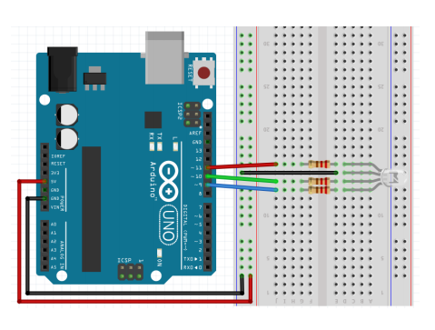

# 3색 LED


## 3색 LED

**3색 LED**

-   R, G, B 핀에 0~255 사이의 값을 analogWrite() 함수로 출력
-   3색의 조합으로 색상 결정



  

**자동으로 랜덤하게 색 바꾸기**

```c++
const int redPin = 7; // RED
const int greenPin = 5; // GREEN
const int bluePin = 3; // BLUE

void setup() {
    randomSeed(analogRead(A0));
    // 랜덤한 숫자가 필요하다, 아두이노 A0 핀에 아무것도 꽂혀있지 않으면 랜덤값을 뿌려주기 때문에 이용
    analogWrite(redPin, 255); // 0~255 random
    delay(1000);
    analogWrite(redPin, 0);
    analogWrite(greenPin, 255);
    delay(1000);
    analogWrite(greenPin, 0);
    analogWrite(bluePin, 255);
    delay(1000);
}

void loop() {
    analogWrite(redPin, random(256)); // 0~255 random
    analogWrite(greenPin, random(256));
    analogWrite(bluePin, random(256));
    delay(1000);
}
```


