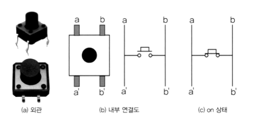
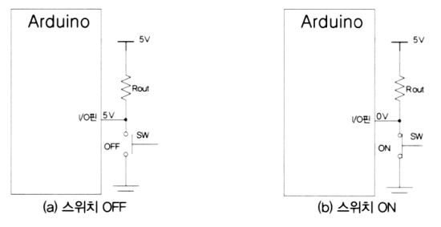
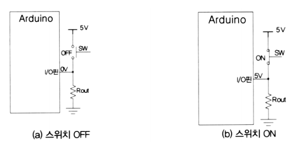
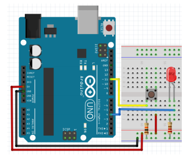
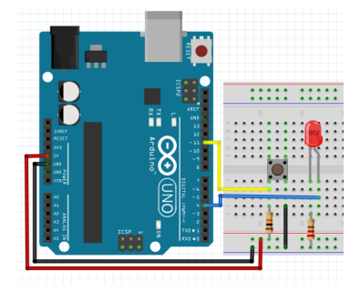
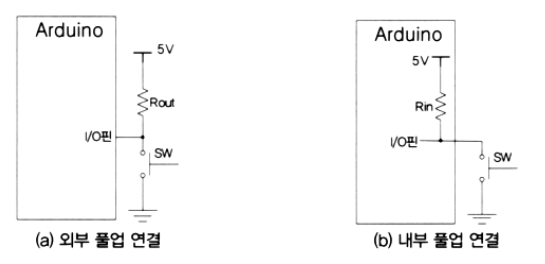
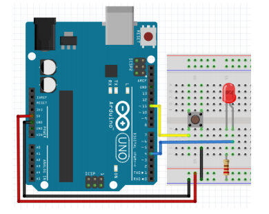
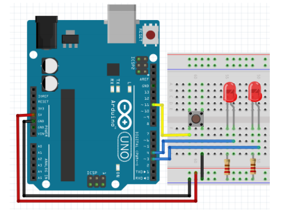

# 버튼


## 버튼

### 택트(Tact) 스위치




### 풀업 방식 스위치 on, off 상태

-   **풀업 저항**

    -   전압 소스와 회로 내에 있는 입력 핀 사이에 배치 - 디폴트 HIGH
    -   버튼/스위치는 입력 핀과 접지(GND) 사이에 배치 - 스위치를 누르면 LOW

    

  

### 풀다운 방식 스위치 on, off 상태

-   **풀다운 저항**

    -   접지와 회로 내에 있는 입력 핀 사이에 배치 - 디폴트 LOW
    -   버튼/스위치는 전원 소스와 핀 사이에 배치 - 스위치를 누르면 HIGH

    


### 디지털 입력 읽기

-   digitalRead(핀번호)
    -   해당 핀 번호의 값 읽기
    -   HIGH/LOW 리턴


### 풀다운 버튼

-   버튼 연결 저항 : 10K옴
-   디폴트 : LOW
-   누른 경우: HIGH




**버튼으로 LED 켜고 끄기(풀다운)**

```c++
int LED = 4;
int BUTTON = 11;
void setup()
{
    pinMode(BUTTON, INPUT);
    pinMode(LED, OUTPUT);
}
void loop()
{
    if (digitalRead(BUTTON))
    { // 누른 경우
        digitalWrite(LED, HIGH);
    }
    else
    {
        digitalWrite(LED, LOW);
    }
    delay(10);
}
```

  

### 풀업 버튼

-   버튼 연결 저항 : 10K옴
-   디폴트 : HIGH
-   누른 경우: LOW
-   권장 구성




**버튼으로 LED 켜고 끄기(풀업)**

```c++
int LED = 4;
int BUTTON = 11;
void setup()
{
    pinMode(BUTTON, INPUT);
    pinMode(LED, OUTPUT);
}
void loop()
{
    if (digitalRead(BUTTON) == LOW)
    { // 누른 경우
        digitalWrite(LED, HIGH);
    }
    else
    {
        digitalWrite(LED, LOW);
    }
    delay(10);
}
```

  

### 내부 풀업 저항 사용 시 I/O



  

### 내부 풀업 저항 사용



  

**내부 풀업 저항 스위치로 LED 제어하기**

```c++
const int ledPin = 4;
const int inputPin = 11;
void setup()
{
    pinMode(ledPin, OUTPUT);
    pinMode(inputPin, INPUT_PULLUP); // 내부 풀업 스위치
}
void loop()
{
    int swInput = digitalRead(inputPin);
    if (swInput == LOW)
        digitalWrite(ledPin, HIGH);
    else
        digitalWrite(ledPin, LOW);
}
```

  

### 2개 LED의 1개의 버튼

-   12번 LED는 1초간격으로 점멸
-   13번 LED는 버튼을 누른 경우에만 켜짐



  

**2개 LED의 1개의 버튼**(delay 생김)

```c++
int pin_LED1 = 4;
int pin_LED2 = 3;
int pin_button = 11;
boolean LED_state = false;
void setup()
{
    pinMode(pin_LED1, OUTPUT);
    digitalWrite(pin_LED1, LED_state);
    pinMode(pin_LED2, OUTPUT);
    digitalWrite(pin_LED2, false);

    pinMode(pin_button, INPUT_PULLUP); // ☆☆☆☆☆☆
}
void loop()
{
    LED_state = !LED_state;
    digitalWrite(pin_LED1, LED_state);
    delay(1000);
    // 버튼 상태를 읽어서 13번 핀에 연결된 LED에 표시
    digitalWrite(pin_LED2, !digitalRead(pin_button));
}
```

