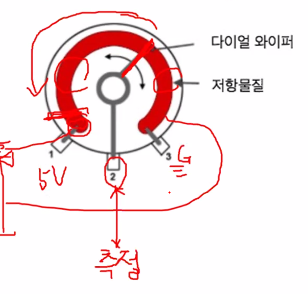

# 가변 저항


## 가변저항

### 가변저항 특성

-   값이 변하는 저항

-   세 개의 선으로 회로에 연결

-   연결 방법에 따라 두가지 기능 제공

    -   바깥 단자와 중간 단자만 연결하는 경우
        
    -   세번째 단자도 회로에 연결하는 경우
        -   전형적인 전압 분압기

    


  

### 가변저항의 모양

-   trimmer 타입
    -   스크류 드라이버를 이용하여 저항을 조절
-   rotary 타입
    -   손잡이로 저항을 조정




  

### 보드 설정하기

-   아날로그 입력

    -   A0~A5

    -   칩 내부에서 ADC(Analog to Digital Converter) 모듈로 연결

        >   LCD I2C 사용한다면 A0~A3 이용가능

        -   아날로그 → 디지털
        -   아날로그 값의 범위 0~5V → 0~1023 사이의 디지털 값으로 변환

    -    대부분의 센서들은 아날로그 입력 핀으로 연결

  

### 가변 저항

-   ADC로 연결되는 부품
    -   센서의 입력 원리와 같다
    -   센서는 환경에 따라 변하고, 가변저항은 사람이 조정하는 점이 차이


  

### 아날로그 값 읽기

-   아날로그 입력 핀 사용

    -   A0 ~ A5 핀

    -   0~5V 사이의 입력 전압의 변화 감지

    -    analogRead(핀번호)

        -   0~1023 범위의 아날로그 값으로 리턴
        -   해당 입력값을 Voltage로 변환

        ```c++
        float voltage= sensorValue * (5.0 / 1023.0);
        ```

          

**가변 저항 테스트**

```c++
int vResister = A0;
void setup()
{
    Serial.begin(9600);
    pinMode(vResister, INPUT);
}
void loop()
{
    Serial.println(analogRead(vResister));
    delay(1000);
}
```

  

**가변저항으로 LED 빛 조절하기**


```c++
int LED = 3;
void setup()
{
    pinMode(LED, OUTPUT);
}
void loop()
{
    int readVal = analogRead(A0);
    int brightVal = readVal / 4;  //PWM의 범위는 0~255
    analogWrite(LED, brightVal);
    delay(10);
}
```

  

### map(value, fromLow, fromHigh, toLow, toHigh);

-   숫자를 한 범위에서 다른 곳으로 변환
    
-   매개변수
    -   value: 변환할 수
    -   fromLow: 현재 범위 값의 하한
    -   fromHigh: 현재 범위 값의 상한
    -   toLow: 목표 범위 값의 하한
    -   toHigh: 목표 범위 값의 상한
    
-   반환값
    -   새로운 범위의 값


**가변 저항 - map() 함수** (Serial에 표시)

```c++
const int ledPin = 3;
const int potentiometerPin = A0;
int potentiometerValue;
int brightness;
void setup()
{
    Serial.begin(9600);
}
void loop()
{
    potentiometerValue = analogRead(potentiometerPin);
    Serial.print("potentiometer Value : ");
    Serial.println(potentiometerValue);
    brightness = map(potentiometerValue, 0, 1023, 0, 255);
    Serial.print("potentiometer Value : ");
    Serial.println(brightness);
    analogWrite(ledPin, brightness);
}
```

  

**가변 저항 - map() 함수** (LCD에 표시)

```c++
#include <LiquidCrystal_I2C.h>

LiquidCrystal_I2C lcd(0x27, 16, 2);

const int ledPin = 3;
const int potentiometerPin = A0;
int potentiometerValue;
int brightness;

void setup() {
    lcd.init();
    lcd.backlight();
    lcd.clear();
    Serial.begin(9600);
}

void loop() {
    char buf[17];

    potentiometerValue = analogRead(potentiometerPin);

    sprintf(buf, "org : %4d", potentiometerValue);
    lcd.setCursor(0, 0);
    lcd.print(buf);

    brightness = map(potentiometerValue, 0, 1023, 180, 0); // 밝기 단계 확인 후
    // brightness = map(potentiometerValue, 0, 1023, 0, 255);

    sprintf(buf, "bright : %4d", brightness);
    lcd.setCursor(0, 1);
    lcd.print(buf);

    analogWrite(ledPin, brightness);
}
```

  

## PWMLed 객체화

**PWMLed.h**

```c++
#pragma once

#include <Arduino.h>
#include <Led.h>

class PWMLed : public Led {  // pin,on(),off(),set()는 Led.h에 있어서 상속받는다.
protected:
    int value;

public:
    PWMLed(int pin);
    
    int getValue();
    void fadeIn(int step=1);  // 점점 밝아지는 것
    void fadeOut(int step=1); // 점점 어두워지는 것
    void set(int value);
};
```

  

**PWMLed.cpp**

```c++
#include "PWMLed.h"

// : Led(pin), value(0) 없으면 에러 - 부모의 디폴트 생성자가 없기 때문에
PWMLed::PWMLed(int pin) : Led(pin), value(0) {  

}

int PWMLed::getValue() {
    return value;
}
    
// 점점 밝아지는 것
void PWMLed::fadeIn(int step) {
    value += step;
    if(value > 255) {
        value = 0;
    }
    analogWrite(pin, value);
}

// 점점 어두워지는 것
void PWMLed::fadeOut(int step) {
    value -= step;
    if(value < 0) {
        value = 255;
    }
    analogWrite(pin, value);
}

//set override
void PWMLed::set(int value) {  // 오버라이드(Led.cpp 에서는 digitalWrite를 해줬음)
    analogWrite(pin, value);
}
```

  


## AnalogSensor 객체화

**AnalogSensor.h** 

-   아날로그 센서값 map 함수 이용 디지털 변환

```c++
#pragma once;

#include <Arduino.h>

class AnalogSensor {
protected:
    int pin;
    int toMin;  // map의 새로운 범위 최소값
    int toMax;  // map의 새로운 범위 최대값

public:
    AnalogSensor(int pin, int toMin=0, int toMax=255);
    void setRange(int toMin, int toMax);
    int read();
};
```

  

**AnalogSensor.cpp**

```c++
#include "AnalogSensor.h"

AnalogSensor::AnalogSensor(int pin, int toMin, int toMax)
    : pin(pin), toMin(toMin), toMax(toMax) {

}

void AnalogSensor::setRange(int toMin, int toMax) {
    this->toMin = toMin;
    this->toMax = toMax;
}

int AnalogSensor::read() {
    int value = analogRead(pin);
    return map(value, 0, 1023, toMin, toMax);
}
```

  

### 가변저항 LED 표시 객체화 이후

**app.ino**

```c++
#include <LiquidCrystal_I2C.h>
#include "PWMLed.h"
#include "AnalogSensor.h"

PWMLed led(3);
AnalogSensor poten(A0, 0, 180);

LiquidCrystal_I2C lcd(0x27, 16, 2);

void setup() {
    lcd.init();
    lcd.backlight();
    lcd.clear();
    Serial.begin(9600);
}

void loop() {
    char buf[17];

    int brightness = poten.read();
    sprintf(buf, "bright : %4d", brightness);
    lcd.setCursor(0, 0);
    lcd.print(buf);

    led.set(brightness);
}
```

