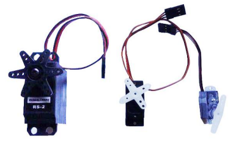
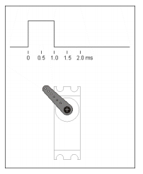
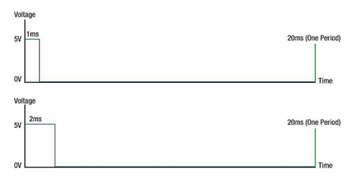
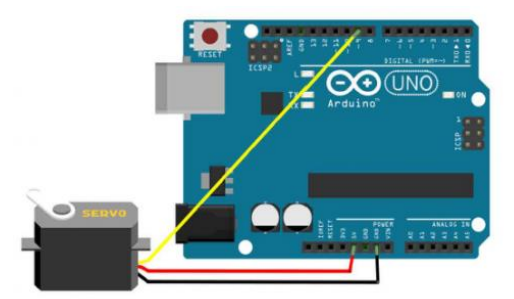
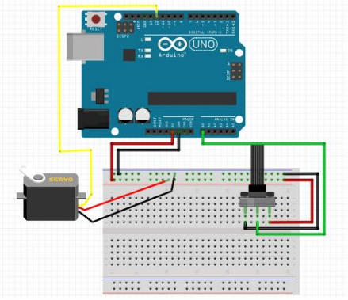

# 서보모터 제어


## 서보 모터 제어하기

### 서보 모터

-   미리 정해진 범위 내에서 모터의 축을 세부 조정하도록 제한된 모터

-   취미용 서보

    -   축의 움직임 범위 180도

    -    50Hz의 주파수 내에서 주파수를 이용해 동작

        → 20ms의 신호주기

    -   제어를 위한 특별한 회로 없음 → 바로 연결 가능

    

-   마이크로 서보모터(SG-90)

    -   0~180도 회전
    -   선구분
        -   주항 : 디지털 핀
        -   빨강 : 전원 Vcc
        -   갈색 : Gnd

    

  

### 서보 모터 제어

-   신호가 HIGH로 설정된 시간 양 → 서보의 각도

    -   가장 왼쪽에 배치
        -   1ms 동안 HIGH 유지, 남은 시간은 LOW 유지
    -   가장 오른쪽에 배치
        -   2ms 동안 HIGH 유지, 남은 시간은 LOW 유지

    

    -   3개의 핀
        -   빨간 선 : Vin / +5V에 연결
        -   검은 선 : GND 연결
        -   기타(오렌지 또는 흰색) : 디지털 출력 핀으로 연결

  

### 연결

-   주황색선을 9번 핀에 연결

    

  

### Servor 클래스 객체

-   서보모터 제어 메서드 제공

-   Servo.h 포함

    ```c++
    #include <Servo.h>
    
    Servo servoMotor;
    ```

-   서보 모터의 데이터선 연결 핀 설정

    ```c++
    servomotor.attach(핀번호);
    ```

-   서보 모터에 전달할 각도값 설정

    ```c++
    servomotor.write(각도); // 0~179
    ```

  

**서보모터 실행**

```c++
#include <Servo.h>

Servo servoMotor;

const int servoMotorPin = 9;
int angle;

void setup() {
    servoMotor.attach(servoMotorPin);
    servoMotor.write(0);
    delay(1000);
}

void loop() {
    for (angle = 0; angle <= 179; angle++) {
        servoMotor.write(angle);
        delay(10);
    }
    delay(100);

    for (angle = 179; angle >= 0; angle--) {
        servoMotor.write(angle);
        delay(10);
    }
    delay(100);
}
```

  

### 가변저항으로 모터 제어하기



내 풀이

```c++
#include "AnalogSensor.h"
#include <Servo.h>

Servo servo;
const int servoPin = 9;
int val;

AnalogSensor poten(A0, 0, 180);

void setup()
{
    servo.attach(servoPin);
    servo.write(0);
    delay(15);
}
void loop()
{
    val = poten.read();
    servo.write(val);
    delay(15);
}
```

  

**LED에 저항값 표시**

```c++
#include "AnalogSensor.h"
#include <Servo.h>
#include <LiquidCrystal_I2C.h>

AnalogSensor poten(A0, 0, 180);
LiquidCrystal_I2C lcd(0x27, 16, 2);
Servo servoMotor;

const int servoPin = 9;

void setup()
{   
    lcd.init();
    lcd.backlight();
    lcd.clear();

    servoMotor.attach(servoPin);
    servoMotor.write(poten.read());
    
    Serial.begin(9600);
}
void loop()
{   
    char buf[17];

    int angle = poten.read();
    servoMotor.write(angle);

    sprintf(buf, "angle : %3d", angle);
    lcd.setCursor(0, 0);
    lcd.print(buf);
}
```

  

**1초에 20번만 모터 움직이게 하기**

```c++
#include <AnalogSensor.h>
#include <Servo.h>
#include <LiquidCrystal_I2C.h>
#include <SimpleTimer.h>

AnalogSensor poten(A0, 0, 179);
LiquidCrystal_I2C lcd(0x27, 16, 2);
Servo servoMotor;
SimpleTimer timer;

const int servoPin = 9;

void motorControl()
{   
    char buf[17];

    int angle = poten.read();
    servoMotor.write(angle);

    sprintf(buf, "angle : %3d", angle);
    lcd.setCursor(0, 0);
    lcd.print(buf);
}

void setup() {   
    lcd.init();
    lcd.backlight();
    lcd.clear();

    servoMotor.attach(servoPin);
    servoMotor.write(poten.read());
    timer.setInterval(50, motorControl);
    Serial.begin(9600);
}

void loop() {
    timer.run();
}
```


