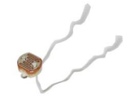
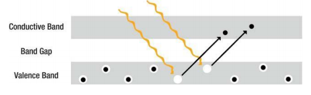
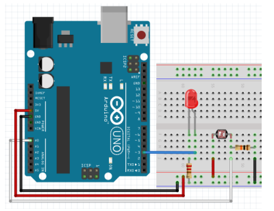

# 조도 센서

  

## 빛 저항으로 빛 세기 감지하기

### 빛 저항

-   빛에 노출되면 저항이 줄어드는 저항 - 광전자 효과

    
    


### 회로 구성

-   빛 저항 연결

    -   한쪽은 VCC에 연결
    -   다른 한쪽은 A0에 연결
    -   10K 옴 저항 연결

    

  

**조도(밝기) 센서로 LED 켜고 끄기**

```c++
int pSensor = A0;
int ledPin = 3;
void setup()
{
    Serial.begin(9600);
    pinMode(ledPin, OUTPUT);
}
void loop()
{
    int readVal = analogRead(pSensor);
    Serial.print("Read Value = ");
    Serial.println(readVal);
    if (readVal < 200)
    { // 어두워지면 LED 켜기
        digitalWrite(ledPin, HIGH);
    }
    else
    {
        digitalWrite(ledPin, LOW);
    }
    delay(200);
}
```

  

**조도(밝기) 센서로 LED 켜고 끄기 - LCD 출력**

```c++
#include <LiquidCrystal_I2C.h>
#include <Led.h>
#include <AnalogSensor.h>

LiquidCrystal_I2C lcd(0x27, 16, 2);
AnalogSensor illu(A0, 0, 100);

Led led(3);

void setup() {
    Serial.begin(9600);
    lcd.init();
    lcd.backlight();
    led.off();   
}

void printIllu(int value) {
    char buf[17];
    sprintf(buf, "brightness : %3d", value);
    lcd.setCursor(0, 0);
    lcd.print(buf);
}

void loop() {
    int readVal = illu.read();
    printIllu(readVal);
    if(readVal < 20) {
        led.on();
    } else {
        led.off();
    }
    delay(200);
}
```

  

**조도(밝기) 센서로 LED 밝기 조절 - LCD 출력**

```c++
#include <LiquidCrystal_I2C.h>
#include <Led.h>
#include <AnalogSensor.h>
#include <PWMLed.h>

LiquidCrystal_I2C lcd(0x27, 16, 2);
AnalogSensor illu(A0, 0, 100);

// Led led(3);
PWMLed led(3);

void setup() {
    Serial.begin(9600);
    lcd.init();
    lcd.backlight();
    led.off();   
}

void printIllu(int value) {
    char buf[17];
    sprintf(buf, "brightness : %3d", value);
    lcd.setCursor(0, 0);
    lcd.print(buf);
}

void loop() {
    int readVal = illu.read();
    int brightness = map(readVal, 0, 255, 255, 0);
    printIllu(readVal);
    led.set(brightness);
    // if(readVal < 20) {
    //     led.on();
    // } else {
    //     led.off();
    // }
    delay(200);
}
```

>   밝기 변화가 티가 나지 않는다. 그래서 다음 함수 이용

  

### constrain(x, a, b)

-   숫자를 어느 범위로 제한
    -   x: 제한할 수
    -   a: 범위의 하한
    -   b: 범위의 상한
-   반환
    -   x: x가 a 와 b 사이에 있으면
    -   a: x가 a보다 작으면
    -   b: x가 b보다 크면
-   센서 값을 10에서 150 사이로 제한.
    -   sensVal = constrain(sensVal, 10, 150); 

  

**주위 밝기에 따라 LED 빛 바꾸기**

```c++
#include <LiquidCrystal_I2C.h>
#include <Led.h>
#include <AnalogSensor.h>
#include <PWMLed.h>

LiquidCrystal_I2C lcd(0x27, 16, 2);
AnalogSensor illu(A0, 0, 1023);

// Led led(3);
PWMLed led(3);

void setup() {
    Serial.begin(9600);
    lcd.init();
    lcd.backlight();
    led.off();   
}

void printIllu(int value) {
    char buf[17];
    sprintf(buf, "brightness : %3d", value);
    lcd.setCursor(0, 0);
    lcd.print(buf);
}

void loop() {
    int readVal = illu.read();
    readVal = constrain(readVal, 0, 200);
    int brightness = map(readVal, 0, 200, 255, 0);
    printIllu(readVal);
    led.set(brightness);
    // if(readVal < 20) {
    //     led.on();
    // } else {
    //     led.off();
    // }
    delay(200);
}
```

