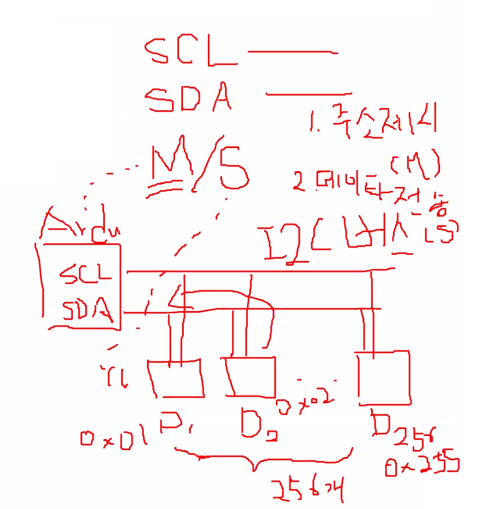

# 16x2 LCD

  

## 16x2 LCD

 **1602 Character LCD (16×2, LiquidCrystalDisplay 1602 V1)** 

-   1줄에 16개의 문자씩 2줄을 보여주는 LCD 모듈

-   백라이트는 5V, 가변 저항으로 폰트의 명암을 조절

    

  

**LCD Interface Converter** 

-   **I2C 인터페이스**를 사용해서 LCD를 제어

    -   단 4개 선으로 LCD 조작

    -   공급전압 : DC 2.5-6V

    -   점퍼 스위치 : LCD 백라이트 ON/OFF 제어

    -   가변저항 : LCD 명암 조절

    -   I2C 주소 초기값 : 0x27 또는 0x3F

        
        
        

  


  

**실수값을 문자열로 변경하기**

-   char * dtostrf(double \_\_val, signed char \_\_width, 
                             unsigned char \__prec, char * __s);

    -   \_\_val : 변환할 실수 값
    -   \_\_width : 전체 자리 수(소수점은 제외)
    -   \_\_prec: 소수점 이하 유효숫자 수
    -   \_\_s : 변한된 문자열을 저장할 버퍼

    ```c++
    float fltValue = 123.456;
    char pChrBuffer[50];
    
    dtostrf(fltValue , 5, 2, pChrBuffer);// 5 : width, 2 : precision
    ```

      

  

 **라이브러리 준비**

-   https://github.com/johnrickman/LiquidCrystal_I2C

-   코드 다운로드 및 압축 해제 
    -   <문서>\Arduino\libraries\LiquidCrystal_I2C


**주요 메소드**

```c++
lcd.init(); // LCD 초기화
lcd.backlight(); // LCD 백라이트를 켠다
lcd.noBacklight(); // LCD 백라이트를 끈다
lcd.noDisplay(); // LCD 표시된 내용을 숨긴다
lcd.display(); // LCD 표시내용을 보여준다
lcd.cursor(); // 커서를 표시한다
lcd.noCursor(); // 커서를 없앤다.
lcd.setCursor(0,0); // 해당 LCD 좌표로 커서 이동
lcd.home(); // 커서를 0,0 좌표로 이동
lcd.blink(); // 커서를 깜빡임
lcd.noBlink(); // 커서를 깜빡이지 않음
lcd.write(36); // LCD 화면에 값 출력, 아스키코드 입력 시 해당문자 출력
lcd.print("TEST"); // LCD 화면에 값을 출력
lcd.clear(); // LCD 모든 내용 지움
lcd.scrollDisplayRight(); // lcd 내용을 우측으로 1칸 스크롤
lcd.scrollDisplayLeft(); // lcd 내용을 좌측으로 1칸 스크롤
lcd.autoscroll(); // 출력내용을 자동으로 우에서 좌로 스크롤
```

  

**I2C 주소 스캐닝**

```c++
#include <Wire.h>
void setup()
{
    Wire.begin();
    Serial.begin(9600);
}

void loop()
{
    byte error, address;
    int nDevices = 0;
    Serial.println("Start Scanning...");
    for (address = 1; address < 127; address++)
    {
        // 1바이트의 의미 없는 데이터를 전송
        Wire.beginTransmission(address);
        error = Wire.endTransmission();
        if (error == 0)
        {
            Serial.print("I2C device found at address 0x");
            if (address < 16)
                Serial.print("0");
            Serial.print(address, HEX);
            Serial.println();
            nDevices++;
        }
    }
    if (nDevices == 0)
        Serial.println("No I2C devices found\n");
    delay(5000); // 5초 후 다시 스캐닝
}
```

>   0x27

  

**LCD 기본 출력**

```c++
#include <LiquidCrystal_I2C.h>

// I2C 주소, 칸 수(X), 줄 수(Y)
LiquidCrystal_I2C lcd(0x27, 16, 2);

void setup()
{
    lcd.init(); // LCD 초기화
    lcd.backlight(); // 백라이트 켜기
    lcd.setCursor(3,0); // 커서 위치 설정 (x,y)
    
    // 문자열 출력
    lcd.print("Hello, world!");
}

void loop() {
    lcd.backlight();
    delay(1000);
    lcd.noBacklight();
    delay(1000);
}
```

  

**LCD 출력 위치 설정**

```c++
#include <Wire.h>
void setup()
{
    Wire.begin();
    Serial.begin(9600);
}

void loop()
{
    byte error, address;
    int nDevices = 0;
    Serial.println("Start Scanning...");
    for (address = 1; address < 127; address++)
    {
        // 1바이트의 의미 없는 데이터를 전송
        Wire.beginTransmission(address);
        error = Wire.endTransmission();
        if (error == 0)
        {
            Serial.print("I2C device found at address 0x");
            if (address < 16)
                Serial.print("0");
            Serial.print(address, HEX);
            Serial.println();
            nDevices++;
        }
    }
    if (nDevices == 0)
        Serial.println("No I2C devices found\n");
    delay(5000); // 5초 후 다시 스캐닝
}
```

