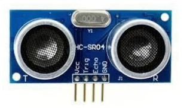
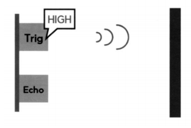
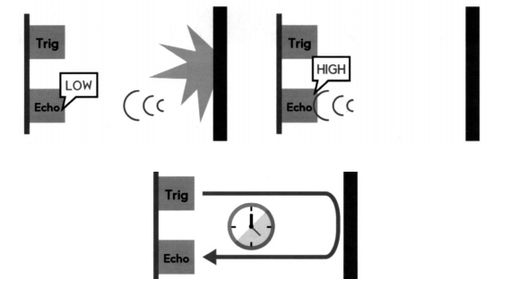
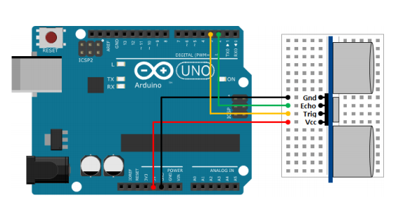

# 초음파 센서


## 초음파 센서

### 초음파 센서

-   초음파를 이용하여 벽이나 사물의 거리를 측정하는 센서

-   HC-SR04 모듈

    -   Vcc: 전원
    -   Trig : 트리거 (초음파 송출 제어)
    -   Echo : 에코(초음파 수신)
    -   GND: 접지

    

  

## 초음파센서 사용하기

### 초음파 센서 동작 원리

-   Trig에 HIGH 전압 인가시 초음파 발사
-   Echo에서 초음파 수신(처음에는 LOW)
-   시간차이를 측정하여 거리 계산





  

### 거리 계산

-   음속 : 340 m/s
-   비례식
    -   1,000,000 us : 34,000 cm = x us : y cm
    -   y = 34,000\*x/1,000,000 = 0.034*x cm
-   왕복 반영
    -   y = 0.034*x/2 = 0.017 *x cm = x/58 cm

  

###  delayMicroseconds()

-   아두이노 보드를 일정 시간 멈추는 함수입니다.
-   delayMicroseoonds(멈출 시간)
-   매개변수
    -   멈출 시간: 단위는 마이크로초로 (0.000001초)
-   반환 값
    -   없음
-   사용 예
    -   ` delayMicroseconds(2);` 
        // 아두이노 보드를 0.002 밀리초(0.000002초) 멈춥니다.

  

### pulseln()

-   디지털 입력 핀의 전압이 LOW 또는 HIGH가 될 때까지 걸린 시간 측정

-   핀은 꼭 pinMode 함수를 이용해 입력 모드로 설정

-   pulseln(핀 번호，전압)

    -   매개변수
        -   핀 번호: 전압이 바뀌는 시간을 재고자 하는 핀 번호
        -   전압: 바뀌는 전압. HIGH - LOW에서 HIGH가 될 때

-   반환값

    -   전압이 바뀌는 데 걸린 시간을 마이크로초 기준으로 반환
    -   만약 1초 동안 기다렸는데도 전압이 바뀌지 않으면 0을 반환

-   사용 예

    -   `long duration = pulseln(3, HIGH);`

        //3번 핀의 전압이 HIGH가 될 때까지 걸린 시간

  



  

**초음파 센서 거리 측정**

```c++
int echoPin = 2;
int triggerPin = 3;

void setup() {
    Serial.begin(9600);
    pinMode(echoPin, INPUT);      // 수신
    pinMode(triggerPin, OUTPUT);  // 출력
}

void loop() {
    // trigger 핀으로 10us의 펄스를 발생
    digitalWrite(triggerPin, HIGH);
    delayMicroseconds(10);  // HIGH의 폭이 10㎲
    digitalWrite(triggerPin, LOW);

    // echo 핀 입력으로부터 거리를 cm 단위로 계산
    int distance = pulseIn(echoPin, HIGH) / 58;  // 시간 측정 후 /58해서 거리를 알 수 있다.

    Serial.println("Distance(cm) = " + String(distance));
    delay(1000);
}
```

  

**초음파 센서 거리 측정 LCD** (MiniCom.h)

```c++
#include <MiniCom.h>

MiniCom com;

int echoPin = 2;
int triggerPin = 3;

void checkDistance() {
    // trigger 핀으로 10us의 펄스를 발생
    digitalWrite(triggerPin, HIGH);
    delayMicroseconds(10);  // HIGH의 폭이 10㎲
    digitalWrite(triggerPin, LOW);

    // echo 핀 입력으로부터 거리를 cm 단위로 계산
    int distance = pulseIn(echoPin, HIGH) / 58;
    com.print(0, "distance", distance);
}

void setup() {
    com.init();
    pinMode(echoPin, INPUT);      // 수신
    pinMode(triggerPin, OUTPUT);  // 출력
    com.setInterval(1000, checkDistance);
}

void loop() {
    com.run();
}
```

  

## 초음파 센서 객체

**Ultra.h**

```c++
#pragma once

#include <Arduino.h>

class Ultra {
protected:
    int echo;
    int trig;

public:
    Ultra(int echo, int trig);
    int read();

};
```

  

**Ultra.cpp**

```c++
#include "Ultra.h"

Ultra::Ultra(int echo, int trig) : echo(echo), trig(trig) {
    pinMode(trig, OUTPUT);
    pinMode(echo, INPUT);
}

int Ultra::read() {
    // trigger 핀으로 10us의 펄스를 발생
    digitalWrite(trig, HIGH);
    delayMicroseconds(10);  // HIGH의 폭이 10㎲
    digitalWrite(trig, LOW);

    // echo 핀 입력으로부터 거리를 cm 단위로 계산
    int distance = pulseIn(echo, HIGH) / 58;

    return distance;
}
```

  

**app.ino**

```c++
#include <MiniCom.h>
#include "Ultra.h"

MiniCom com;
Ultra ultra(2, 3);

void checkDistance() {
    int distance = ultra.read();
    com.print(0, "distance", distance);
}

void setup() {
    com.init();
    com.setInterval(1000, checkDistance);
}

void loop() {
    com.run();
}
```

  

### 초음파 센서 - 거리 측정 후 LED, 부저 켜기

>   LED, 부저 병렬로 한 라인에 연결

```c++
#include <MiniCom.h>
#include <Ultra.h>

#include <Led.h>

MiniCom com;
Ultra ultra(2, 3);
Led led(5);

void checkDistance() {
    int distance = ultra.read();
    com.print(0, "distance", distance);
    if(distance < 10) {
        led.on();
    } else {
        led.off();
    }
}

void setup() {
    com.init();
    com.setInterval(1000, checkDistance);
}

void loop() {
    com.run();
}
```

  

### 초음파 센서 - 거리 측정 후 LED, 부저, 서보모토 켜기

```c++
#include <MiniCom.h>
#include <Servo.h>
#include <Ultra.h>

#include <Led.h>

MiniCom com;
Ultra ultra(2, 3);
Led led(5);
Servo servo;

void checkDistance() {
    int distance = ultra.read();
    com.print(0, "distance", distance);
    if(distance < 10) {
        led.on();
        servo.write(90);
    } else {
        led.off();
        servo.write(0);
    }
}

void setup() {
    com.init();
    servo.attach(9);
    servo.write(0);
    com.setInterval(1000, checkDistance);
}

void loop() {
    com.run();
}
```

  

## Pulse 클래스 만들기

**Pulse.h**

```c++
#pragma once

#include <Arduino.h>

typedef void (*pulse_callback_t)(int);

class Pulse {
protected:
    int onDelay;    // HIGH 시간
    int offDelay;   // LOW 시간

    int value;      // 현재 상태값 (H/L)
    unsigned long oldTime;  // 최근 상태 변경 시점 기록
    bool state;     // 펄스의 운영 여부
    pulse_callback_t callback;

public:
    Pulse(int onDelay, int offDelay);

    void setDelay(int onDelay, int offDelay);
    void run();
    int read() { return value; }

    bool getState() { return state; }
    void play();
    void stop();

    void setCallback(pulse_callback_t callback) 
            {this->callback = callback;}
};
```

  

**Pulse.cpp**

```c++
#include "Pulse.h"

Pulse::Pulse(int onDelay, int offDelay)
    : onDelay(onDelay), offDelay(offDelay) {

    value = HIGH;
    state = false;  // 시작은 운영 안함
    callback = NULL;
    oldTime = millis();
}


void Pulse::setDelay(int onDelay, int offDelay) {
    this->onDelay = onDelay;
    this->offDelay = offDelay;
}

void Pulse::play() {
    state = true;
    value = HIGH;
    oldTime = millis();
}

void Pulse::stop() {
    state = false;
    value = LOW;
}

void Pulse::run() {
    if(!state) return;

    unsigned long currentTime = millis();
    unsigned long diff = currentTime - oldTime;
    long interval = value ? onDelay : offDelay;

    if(diff >= interval) {
        oldTime = currentTime;
        value = !value;
        if(callback!=NULL) {
            callback(value);
        }
    }
}
```


**자동차 후방 감지기 만들기**

>   LED 신호 Low의 길이를 distance와 비례하게 한다.

**app.ino**

```c++
#include <MiniCom.h>
#include <Servo.h>
#include <Ultra.h>
#include "Pulse.h"
#include <Led.h>

MiniCom com;
Ultra ultra(2, 3);
Led led(5);
Servo servo;
Pulse pulse(100, 500);

// 5단계로 운용
int delaytimes[] = {
    50, 100, 200, 500, 1000
};

void pulseCallback(int value) {
    
    // LED 제어
    led.set(value);
}

void checkDistance() {
    int distance = ultra.read();
    com.print(0, "distance", distance);
    if(distance < 10) {
        // led.on();
        // Pulse의 offDelay를 distance를 고려하여 조정
        int offDelay = map(distance, 0, 9, 0, 4);
        pulse.setDelay(10, delaytimes[offDelay]);

        servo.write(90);
        if(!pulse.getState()) {  // 처음 10cm 이하로 됐을 때
            pulse.play();
        }
    } else {
        if(pulse.getState()) {
            pulse.stop();
        }
        // led.off();
        servo.write(0);
    }
}

void setup() {
    com.init();
    servo.attach(9);
    servo.write(0);
    pulse.setCallback(pulseCallback);
    com.setInterval(1000, checkDistance);
}

void loop() {
    com.run();
    pulse.run();
}
```

