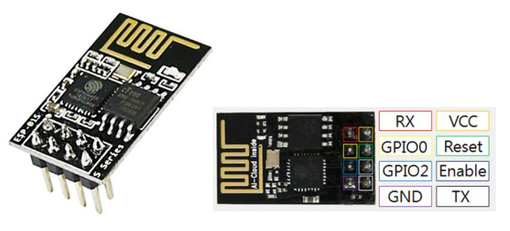
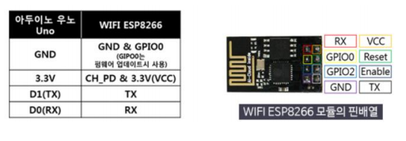
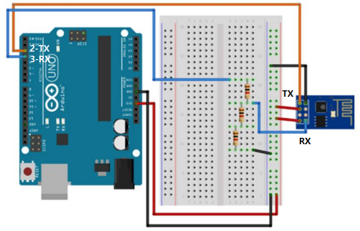

# WIFI ESP8266 AT 명령

  

## ESP8266







### SoftSerial

-   아두이노 Uno는 RX(0번)/RX(1번) 핀 1벌만 지원(PC 연결에 사용)
-   일반 디지털 핀을 소프트웨적으로 RX/TX 처리 이용 필요
    -   SoftSerial
-   2번 핀/3번 디지털 핀을 RX/TX로 연결
-   9600 속도에서 안정적으로 동작
    -   더 빨라지면 오류 발생
    -   ESP8266의 속도를 9600으로 설정 필요

  

### ESP8266는 3.3V로 동작

-   RX/TX 핀도 3.3V로 동작

-   아두이노의 디지털 출력은 5V

    -   전압 강하 필요
    -   1:2 비율로 전압 강하로 ESP8266의 RX로 연결

-   아두이노는 1.7V 이상을 HIGH로 미만을 LOW로 인식하므로 TX는 바로 연결

    

>   실제로는 전압 강하 없이 실행 가능

  

## 펌웨어 업그레이드

**wifi_at.ino**

```c++
#include <SoftwareSerial.h>
#define BT_RXD 2
#define BT_TXD 3

SoftwareSerial softSerial(BT_RXD, BT_TXD);
void setup()
{
    Serial.begin(9600);
    // 펌웨어로 설정된 디폴트 속도는 115200 bps
    softSerial.begin(115200); // 펌웨어 설정에 따라 조정
    softSerial.setTimeout(5000);
    delay(1000);
}
void loop()
{
    if (Serial.available()) {  // PC로부터 수신 데이터가 있으면
        softSerial.write(Serial.read());  // ESP로 전송
    }
    if (softSerial.available()) {  //ESP 모듈로부터 수신 데이터가 있으면
        Serial.write(softSerial.read());  // PC로 전송
    }
}
```

  

## AT 명령

### AT

-   정상 : OK 응답

  

### 보드레이트 재정의(펌웨어 디폴트 : 115200)

-   `AT+UART_DEF=9600,8,1,0,0`

  

## 펌웨어 업그레이드

**wifi_at.ino**

```c++
#include <SoftwareSerial.h>
#define BT_RXD 2
#define BT_TXD 3

SoftwareSerial softSerial(BT_RXD, BT_TXD);
void setup()
{
    Serial.begin(9600);
    // 펌웨어로 설정된 디폴트 속도는 115200 bps
    softSerial.begin(9600); // SoftwareSerial의 속도에 맞춤
    softSerial.setTimeout(5000);
    delay(1000);
}
void loop()
{
    if (Serial.available()) {
        softSerial.write(Serial.read());
    }
    if (softSerial.available()) {
        Serial.write(softSerial.read());
    }
}
```

  

## AT 명령

### `AT`

-   동작 여부 확인
-   정상 : OK 응답
-   비정상 : 무응답

### `AT+RST`

-   리셋

### `AT+GMR`

-   모듈 버전 확인

### `AT+CWMODE(Current Working Mode)`

-   `AT+CWMODE?` : 현재 모드 출력
-   **`AT+CWMODE=1`** (Stand Alone)
    `AT+CWMODE=2` (AP) : 공유기 모드
    `AT+CWMODE=3` (Stand Alone + AP)

### `AT+CWLAP`

-   AP 리스트 출력

### `AT+CWJAP`

-   AP 접속 명령
-   `AT+CWJAP="SSID","비밀번호"`
-   `AT+CWJAP="SevenRoom3","12345678"`
-   `AT+CWJAP="U+NetADD3","6000033359"`

### `AT+CIFSR`

-   접속 IP 확인
-   192.168.25.4

### `AT+CWQAP`

-   AP 접속 해제

### 보드레이트 재정의(펌웨어 디폴트 : 115200)

-   AT+UART_DEF=9600,8,1,0,0`

