# MQTT

   

## MQTT

### MQTT(Message Queue Telemetry Transport)

-   https://www.joinc.co.kr/w/man/12/MQTT/Tutorial

-   경량의 Publish/Subscribe(Pub/Sub) 메시징 프로토콜

-   M2M(machine-to-machine)와 IoT(Internet of things) 분야 적용

-   특징

    -   저전력
    -   신뢰할 수 없는 네트워크에서 운용 가능
    -   No TCP/IP 기반 운영 가능

    → 소형기기의 제어와 센서정보 수집에 유리

   

### 구성

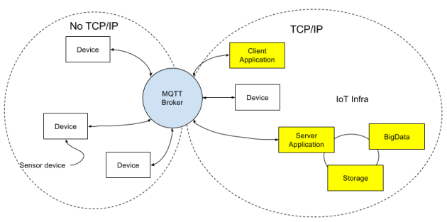

>   No TCP/IP : 발행자(pub)
>
>   TCP/IP : 구독자(sub)
>
>   발행자(Arduino) → MQTT Broker(server) ← 구독자

   

### 활용

-   센서(Sensor) 정보 수집
-   제어
    -   센서로 부터 받은 데이터를 토대로 기기 제어
    -   각 기기에 MQTT broker를 설치 또는 중앙 MQTT broker에 bind
-   Message Push Server
    -   모바일 애플리케이션을 위한 메시지 Push 서버
    -   페이스북의 경우 MQTT를 이용해서 메시지를 push 하고 있음

   

### MQTT 특징

-   **Publish/Subscribe**

    -   Publisher과 Subscriber은 모두 Broker에 대한 클라이언트로 작동
    -   Publisher는 토픽을 발행
    -   Subscriber은 토픽을 구독
    -   둘 다 Broker 서버에 연결

    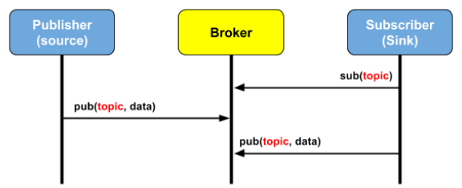

   

-   **토픽** (카테고리)

    -   Pub와 Sub는 토픽을 기준으로 작동
    -   토픽은 슬래시(/)를 이용해서 계층적으로 구성
    -   대량의 센서 기기들을 효율적으로 관리

    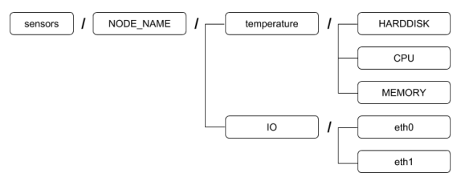

   

-   **토픽 와일드 카드 문자**

    -   \+ : 1레벨

        -   예) iot/home1/+/temperature

            -   → iot/home1/livingroom/temperature

            -   → iot/home1/bedroom/temperature

            -   → iot/home1/bathroom/temperature

    -   \# : 하위 모든 레벨

        -   예) iot/home1/#

   

-   **시스템 토픽**
    -   $토픽명
    -   브로커 내부용으로 사용

   

-   **메시지 버스**

    -   MQTT는 메시지 버스 시스템
    -   MQTT Broker가 메시지 버스를 만들고 여기에 메시지를 흘려보내면, 버스에 붙은 애플리케이션들이 메시지를 읽어가는 방식
    -   메시지 버스에는 다양한 주제의 메시지들이 흐를 수 있는데, 메시지를 구분하기 위해서 "Topic"을 이름으로 하는 메시지 채널을 만듦.
    -   애플리케이션들은 Message Bus에 연결하고 관심있는 토픽(Topic)을 등록 해서 메시지를 구독(SUB)하거나 발행(PUB)함.

    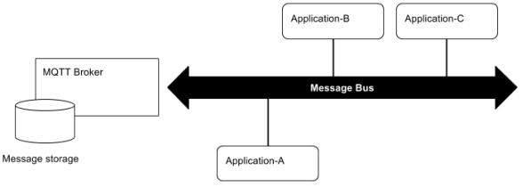

   

-   **QoS(Quality of Service)** (메세지 신뢰성)

    -   3단계의 QoS(Quality of service) 제공

        -   0 : 메시지는 한번만 전달하며, 전달여부를 확인하지 않는다. Fire and Forget 타입이다.

            >   테스트에서는 0 레벨로 운용함.

        -   1 : 메시지는 반드시 한번 이상 전달된다. 하지만 메시지의 핸드셰이킹 과정 을 엄밀하게 추적하지 않기 때문에, 중복전송될 수도 있다.

            >   분실 처리O, 중복 처리 X

        -   2 : 메시지는 한번만 전달된다. 메시지의 핸드셰이킹 과정을 추적한다. 높은 품질을 보장하지만 성능의 희생이 따른다.

            >   분실 처리O, 중복 처리 O

    -   서비스의 종류에 따라서 적당한 QoS 레벨을 선택

    -   No TCP/IP와 TCP/IP가 섞여있는 로컬 네트워크에서는 QoS 1, 2를 선택

    -   원격 네트워크에서는 0번

        -   네트워크의 신뢰성을 믿음

    -   클라이언트는 MQTT queue에 있는 메시지를 읽기 위해서 이전에 연결했던 MQTT에 연결

        -   QoS 레벨은 0으로 하고, 소프트웨어에서 QoS를 처리

    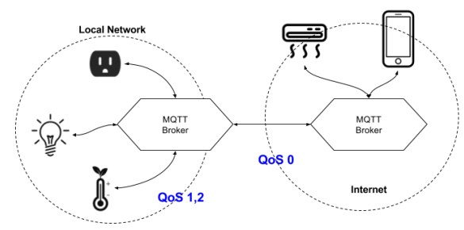

   

### MQTT 브로커 : Mosquitto

-   eclipse에서 제작 및 배포
-   BSD 라이센스 기반의 오픈소스 메시지 브로커

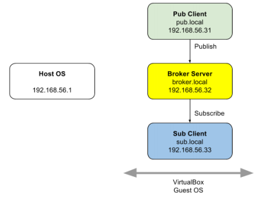

   

## Mosquitto

### Mosquitto 설치(윈도우즈)

-   Mosquitto

    -   https://mosquitto.org/download/

    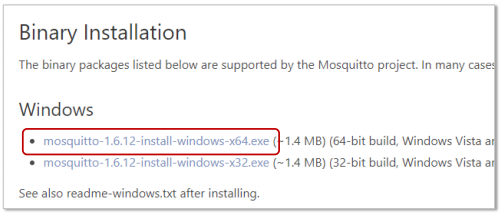

    -   설치
        -   서비스형으로 설치(디폴트)

    >   서비스 > Mosquitto Broker > 시작

   

### 방화벽 > 고급설정 > 인바운드 규칙 > 새 규칙

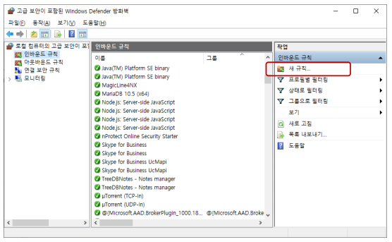

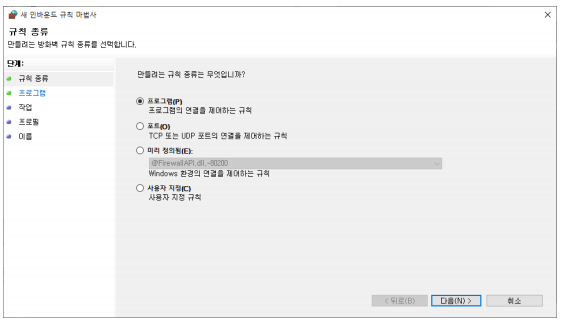

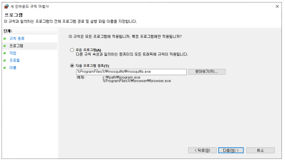

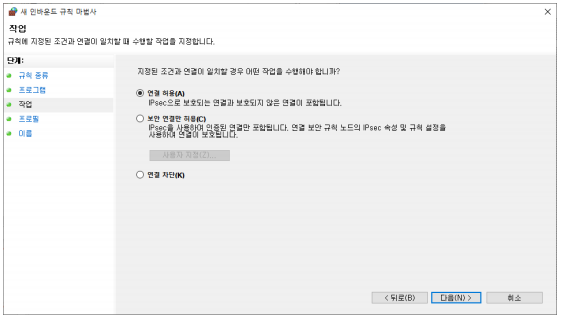

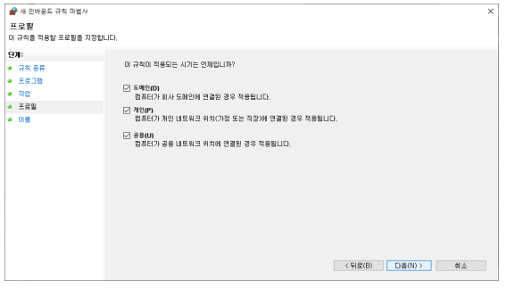

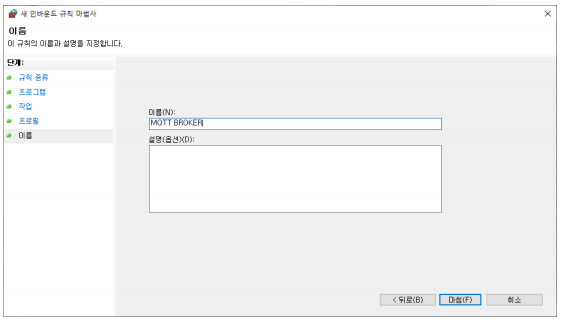

>   환경 변수 C:\Program Files\mosquitto 추가

   

### Mosquitto 운영 테스트

>   cmd 환경

-   구독자(Subscriber) 실행
    -   mosquitto_sub -h 브로커주소 -t 토픽명 (-v 옵션 주면 토픽까지 출력)
    -   `mosquitto_sub -h localhost -t iot/#`
-   발행자(Publisher) 실행
    -   mosquitto_pub -h 브로커주소 -t 토픽명 -m 메시지
    -   `mosquitto_pub -h localhost -t iot/home/greet -m "안녕하세요"`