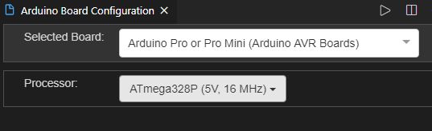

# Arduino MQTT PubSubClient 라이브러리

  

## Arduino MQTT

### 라이브러리 추가

-   PubSubClient
    -    https://pubsubclient.knolleary.net/
-   \#include <PubSubClient.h>

  

### 주요 메서드

-   PubSubClient(Client)

    -   생성자
    -   Client 객체를 매개변수로 지정

    ```c++
    WiFiEspClient espClient;
    PubSubClient client(espClient);
    ```

      

-   setServer(서버주소, 포트번호)

    -   서버 정보 설정

    ```c++
    client.setServer(MQTT_SERVER, 1883);
    ```

      

-   setCallback(callback)

    -   구독자인 경우 메시지 수신 처리 콜백 등록

    ```c++
    client.setCallback(callback);
    ```

      

### 주요 메서드

-   connect() / connect(ClientId)

    -   MQTT 서버 연결

    ```c++
    client.connect("ESPClient");
    ```

      

-   publish(토픽, 메시지)

    -   토픽 발행

    ```c++
    client.publish("home/livingroom/led", message);
    ```

      

-   subscribe(토픽)

    -   구독자로 등록
    -   주로 접속 성공 후 등록

    ```c++
    client.subscribe("home/livingroom/led");
    ```

      

### 구독자 콜백 함수

-   void callback(char* topic, byte* payload, unsigned int length)

    -   토픽 메시지 수신 시 호출

    -   topic : 수신된 토픽

    -   payload : 메시지 byte 배열

    -   length : 수신된 메시지 길이

          

    -   문자열 변환 처리

        ```c++
        char message[100];
        memcpy(message, payload, length); // 메모리 블록 복사(dest, src, length)
        message[length] = NULL;
        ```

  

**예제**

MQTT - 2초 간격으로 13번 LED 깜빡이기

```c++
#include <SoftwareSerial.h>
#include <WiFiEsp.h>
#include <PubSubClient.h>
#include <SimpleTimer.h>
#include <WifiUtil.h>

SoftwareSerial softSerial(2, 3);           // RX, TX

const char ssid[] = "cooluk";               // 네트워크 SSID
const char password[] = "xofla1106!";       // 비밀번호
const char mqtt_server[] = "192.168.0.6"; // 서버 주소

// MQTT용 WiFi 클라이언트 객체 초기화
WifiUtil wifi(2, 3);
WiFiEspClient espClient;
PubSubClient client(espClient);

void callback(char *topic, byte *payload, unsigned int length) {
    payload[length] = NULL;
    char *message = payload;

    if (strcmp("1", message) == 0) {
        digitalWrite(13, HIGH);
    } else {
        digitalWrite(13, LOW);
    }

    Serial.print(topic);
    Serial.print(" : ");
    Serial.println(message);
}

void mqtt_init() {
    client.setServer(mqtt_server, 1883);
    // subscriber인경우 메시지 수신시 호출할 콜백 함수 등록
    client.setCallback(callback);
}

// MQTT 서버에 접속될 때까지 재접속 시도
void reconnect() {

    while (!client.connected()) {
        Serial.print("Attempting MQTT connection...");
        
        if (client.connect("ESP8266Client")) {
            Serial.println("connected");
            // subscriber로 등록
            client.subscribe("home/livingroom/led");  // 구독 신청
        } else {
            Serial.print("failed, rc=");
            Serial.print(client.state());
            Serial.println(" try again in 5 seconds");
            delay(5000);
        }
    }
}

void publish() {
    int state = !digitalRead(13);
    char message[10];
    sprintf(message, "%d", state);

    // 토픽 발행
    client.publish("home/livingroom/led", message);
}

// 2초 간격으로 publish
SimpleTimer timer;

void setup() {
    Serial.begin(9600);
    wifi.init(ssid, password);
    mqtt_init();

    pinMode(13, OUTPUT);
    digitalWrite(13, LOW);
    timer.setInterval(2000, publish);
}

void loop() {
    if (!client.connected()) {  // MQTT가 연결 X
        reconnect();
    }

    client.loop();
    timer.run();
}
```

  

\>\>\> `mosquitto_sub -v -h localhost -t home/#`

  

  

## 아두이노 프로




  

>   Port : FTDI