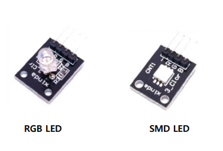
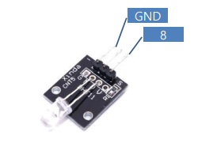
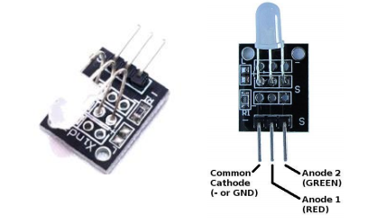
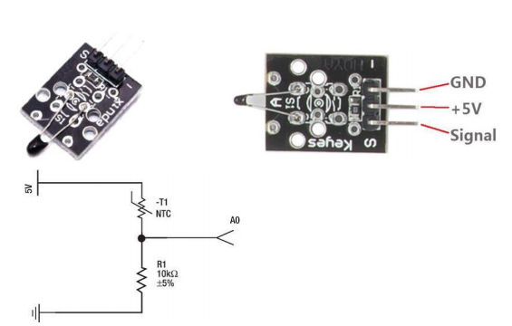
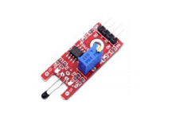

# RGB LED, SMD LED



```c++
int bluepin = 9;   // select the pin for the blue LED
int greenpin = 10; // select the pin for the green LED
int redpin = 11;   // select the pin for the red LED
int val;
void setup()
{
    pinMode(redpin, OUTPUT);
    pinMode(bluepin, OUTPUT);
    pinMode(greenpin, OUTPUT);
    Serial.begin(9600);
}

void loop()
{
    for (val = 255; val > 0; val--)
    {
        analogWrite(11, val);
        analogWrite(10, 255 - val);
        analogWrite(9, 128 - val);
        delay(1);
    }
    for (val = 0; val < 255; val++)
    {
        analogWrite(11, val);
        analogWrite(10, 255 - val);
        analogWrite(9, 128 - val);
        delay(1);
    }
}
```

  

# 7Color Flashing LED Module

-   7가지의 색을 자동으로 번갈아 가며 발광하는 LED



```c++
int led = 8;
void setup()
{
    pinMode(led, OUTPUT);
}
void loop()
{
    digitalWrite(led, HIGH); // set the LED on
    delay(2000);             // wait for a second
    digitalWrite(led, LOW);  // set the LED off
    delay(2000);             // wait for a second
}
```

  

# red and green LED module

-   3 mm red and green LED module (common cathode) 
-   5 mm red and green LED module (common cathode)



```c++
int redpin = 10;  // select the pin for the red LED
int bluepin = 11; // select the pin for the blueLED
int val;
void setup()
{
    pinMode(redpin, OUTPUT);
    pinMode(bluepin, OUTPUT);
}
void loop()
{
    for (val = 255; val > 0; val--)
    {
        analogWrite(redpin, val);
        analogWrite(bluepin, 255 - val);
        delay(15);
    }
    for (val = 0; val < 255; val++)
    {
        analogWrite(redpin, val);
        analogWrite(bluepin, 255 - val);
        delay(15);
    }
}
```

  

# 아날로그 온도 센서



```c++
#include <math.h>
double Thermister(int RawADC)
{
    double Temp;
    Temp = log(((10240000 / RawADC) - 10000));
    Temp = 1 / (0.001129148 + (0.000234125 + (0.0000000876741 * Temp * Temp)) * Temp);
    Temp = Temp - 273.15; // Convert Kelvin to Celcius
    return Temp;
}
void setup()
{
    Serial.begin(9600);
}
void loop()
{
    Serial.print(Thermister(analogRead(A0))); // display Fahrenheit
    Serial.println("c");
    delay(500);
}
```

  

# Digital Temperature



```c++
int Led = 13;      // define LED Interface
int buttonpin = 3; // define the digital temperature sensor interface
int val; // define numeric variables val
void setup()
{
    pinMode(Led, OUTPUT);
    pinMode(buttonpin, INPUT);
}
void loop()
{
    val = digitalRead(buttonpin);
    if (val == HIGH)
    {
        digitalWrite(Led, HIGH);
    }
    else
    {
        digitalWrite(Led, LOW);
    }
}
```

