>   검정색 센서는 +, - 라벨이 반대로 된 경우가 많다.


# 레이저 센서

### laser transmitter module

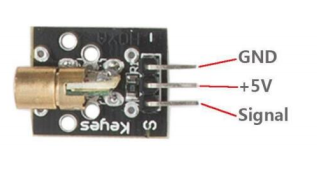

```c++
void setup()
{
    pinMode(13, OUTPUT);
}
void loop()
{
    digitalWrite(13, HIGH);
    delay(1000);
    digitalWrite(13, LOW);
    delay(1000);
}
```

  

# High-sensitive Voice Sensor

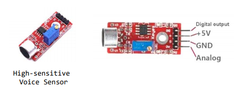

  

**DIGITAL_SENSOR/app.ino**

```c++
int Led = 13;      // define LED Interface
int buttonpin = 3; // define D0 Sensor Interface
int val;           // define numeric variables val
void setup()
{
    pinMode(Led, OUTPUT);      // define LED as output interface
    pinMode(buttonpin, INPUT); // output interface D0 is defined sensor
}
void loop()
{
    val = digitalRead(buttonpin);
    if (val == HIGH)
    {
        digitalWrite(Led, HIGH);
    }
    else
    {
        digitalWrite(Led, LOW);
    }
}
```

  

**ANALOG_SENSOR/app.ino**

```c++
int sensorPin = A5;  // select the input pin for the potentiometer
int ledPin = 13;     // select the pin for the LED
int sensorValue = 0; // variable to store the value coming from the sensor
void setup()
{
    pinMode(ledPin, OUTPUT);
    Serial.begin(9600);
}
void loop()
{
    sensorValue = analogRead(sensorPin);
    digitalWrite(ledPin, HIGH);
    delay(sensorValue);
    digitalWrite(ledPin, LOW);
    delay(sensorValue);
    Serial.println(sensorValue, DEC);
}
```

  

>   아래 디지털 센서는 모두 DIGITAL_SENSOR/app.ino 로 실행 가능ㄴ


# Tilt SWITCH MODULE

### Tilt switch module(Ball Switch)

-   내부에 볼 스위치를 이용하여 회로를 작동시키는 구조
-   기울기에 따라 ON/OFF
-   경사각을 구할 수는 없음

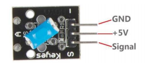

  

# 각도스위치센서 - mercury tilt switch module

###  mercury tilt switch module

-   작은 수은 구(수은)가 있음
-   기울였을 때 회로를 닫힘

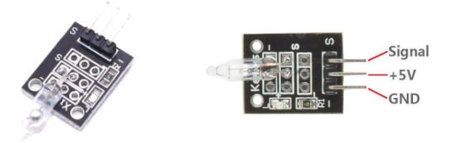

   

# REED MODULE

### REED 

-   자기장에 노출되었을 때 닫히는 센서

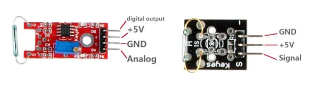

  

# 리니어 홀 자기센서

### Linear Hall magnetic module

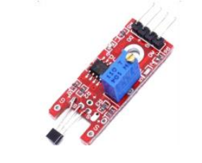


# vibration switch module

-   충격 및 진동을 감지하는 센서

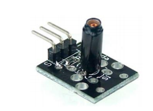

  

# touch module

### touch sensor

-    터치를 감지하는 센서

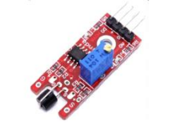

  

# knock sensor module

### knock sensor

-   충격 감지 센서

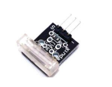

  

# 불꽃감지센서

### flame sensor module

-   화염을 감지하는 센서

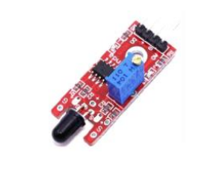

  

# 포토인터럽터 센서

### photo interrupter module

-   photo interrupter
    -   센서 틈 사이에 빛이 차단되었을 때 트리거 하는 모듈
    -   투광기와 검출기 사이의 광선을 사용하여 양쪽 사이의 경로가 불투명한 물 체에 의해 차단되는지 확인

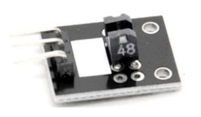

>   소개만

  

# IR트레킹 센서

### Tracking Module

-   검은색이 감지되면 닫히는 센서
-   라인트레이서에 사용

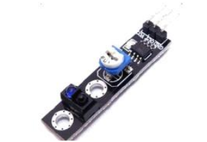

>   자동차 만들 때 사용, 감도 조절 가능

  

# 인체 모션 감지 센서

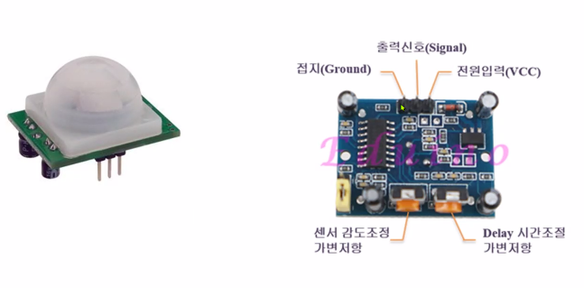

```c++
int ledPin = 13;
int inputpin = 3;
int pirState = LOW;
int val = 0;

void setup() {
    pinMode(ledPin, OUTPUT);
    pinMode(inputpin, INPUT);
    Serial.begin(9600);
}

void loop() {
    val = digitalRead(inputpin);
    if (val == HIGH) {
        digitalWrite(ledPin, HIGH);
        if(pirState == LOW) {  // 첫번째 감지에서만 처리
            Serial.println("Motion detected!");
            pirState = HIGH;
        }
    }
    else {
        digitalWrite(ledPin, LOW);
        if(pirState == HIGH) {  // 첫번째 감지에서만 처리
            Serial.println("Motion ended!");
            pirState = LOW;
        }
    }
}
```

>   가변저항 반시계 민감