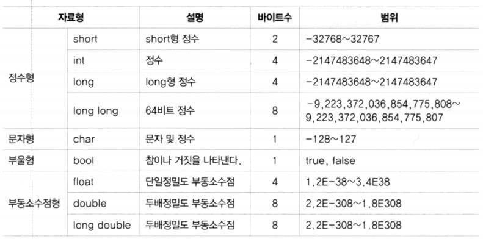
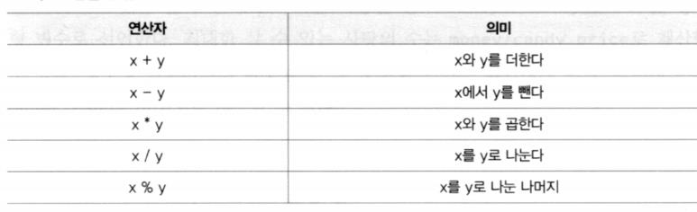
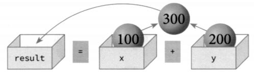

# 기초 사항


## 첫 프로그램

```c++
#include <iostream>
using namespace std;

int main( int argc , char const *argv[])
{
    cout << "Hello World" << endl << "C++ 반가워...";
    // std::cout << "Hello World" << std::endl;
    return 0;
}

// ctrl + alt + n : 코드 러너 실행
```

Hello World
C++ 반가워...

---

> 터미널에서 실행 : `설정` > `검색` > `code runner terminal` > `Run In Terminal` 체크


- **프로그램 구조**

  - main 함수
    - 프로그램의 진입점(entry point)

  - \#include
    - 외부 프로그램 소스를 포함시키는 매크로
  - iostream
    - 입출력 관련 기본 라이브러리 
    - std 네임스페이스를 정의
  - ::
    - 스코프 연산자 
    - 어디에 정의되어 있는지 지정할 때 사용
  - using namespace 
    - 네임스페이스 생략을 위해 지정 
    - std::cout --> cout

  

  ```c++
  #include <iostream>
  using namespace std;
  
  int main(int argc, char const *argv[])
  {
      cout << 10;
      cout << "개의 사과가 있습니다" << endl;
      
      cout << endl;
      
      cout << 10 <<  "개의 사과가 있습니다" << endl;
      return 0;
  }
  ```

  10개의 사과가 있습니다

  10개의 사과가 있습니다

  ---


## 변수와 자료형

- **변수**

  - 변수를 사용하기 위해서는 먼저 선언을 하고 사용해야 함
  - 해당 변수의 데이터 타입을 지정

    - 한 번 지정하면 다른 데이터 타입은 사용 불가
  - 데이터타_타입 변수명 [=초기값];

  ```c++
  int i ; 
  i = 100;
  // int i = 1000;
  // int i { 1000 }
  ```

  

  ```c++
  #include <iostream>
  #include <string>
  using namespace std;
  
  int main(int argc, char const *argv[])
  {
      int i;
      i = 1000;
      // int i = 1000;
      // int i { 1000 }
      cout << i << endl;
      string s{"hello"}; // string s = "hello"와 동일
      cout << s << endl;
      return 0;
  }
  ```

  1000
  hello

  ---

  

- **기본 자료형**
  


- **boolenan**
  - `true`/`false` 만 가질 수 있는 타입
    - `true` – `0`이 아닌 모든 값, 일반적으로 `1`로 표현
    - `false `- `0`

  ```c++
  #include <iostream>
  using namespace std;
  
  int main(int argc, char const *argv[])
  {
      bool b;
      b = true;
      cout << b;
      return 0;
  }
  ```
  
  1
  
  ---
  


- **char**
  - 글자 하나를 저장하는 데이터 타입
  -  작은 따움표로 묶어서 글자 표현

  ```c++
  #include <iostream>
  using namespace std;
  
  int main(int argc, char const *argv[])
  {
      char ch;
      ch = 'a';
      cout << ch;
   
      // 문법 에러 -- syntax error
      // ch = 'ab'; //error
      // ch = "a";  //error
      // ch = '';   //error
   
      return 0;
  }
  ```
  
  a
  
  ---
  

> c++은 '(작은따옴표)만 허용한다. 생성된 exe파일은 오류가 나오기 전 파일이다.


- **string**

  - 문자열을 저장하는 데이터 타입(**객체**)
  - \+ 연산자로 문자열 결합 가능
  - == 로 내용 비교 가능

  ```c++
  string s1 = "Good";
  string s2 = "Morning";
  string s3 = s1 + " " + s2 + "!";
  ```

  
  
  ```c++
  #include <iostream>
  #include <string>
  using namespace std;
  
  int main(int argc, char const *argv[])
  {
      string s1 = "Good";
      string s2 = "Morning";
      string s3 = s1 + " " + s2 + "!";
      cout << s3 << endl;
      string s4 = "Good";
      string s5 = "Bad";
      bool b = (s4 == s5);
      cout << b << endl;
      return 0;
  }
  ```
  
  Good Morning!
  0
  
  ---
  
  > string은 객체이므로 #include <string> 반드시 필요


- **const**

  - 기호 상수 정의
  - 한 번 초기화 되면 수정 불가
  - 관례상 대문자로 이름 지정

  ```c++
  #include <iostream>
  #include <string>
  using namespace std;
  
  int main(int argc, char const *argv[])
  {
      const double TAX_RATE = 0.25; // 기호 상수 선언
      int income = 1000;
      // TAX_RATE = 0.3; -- 에러
      income = income - TAX_RATE * income;
      cout << income << endl;
      return 0;
  }
  ```

  750

  ---


- **auto**

  - 컴파일러가 문맥을 보고 자동으로 데이터 타입을 결정

  ```c++
  #include <iostream>
  #include <string>
  using namespace std;
  
  auto add(int x, int y)
  {
      return x + y;
  }
  int main(int argc, char const *argv[])
  {
      auto d = 1.0; // 값을 보고 double 타입이 됨
      auto sum = add(5, 10);
      cout << d << " " << sum << endl;
      return 0;
  }
  ```

  1 15

  ---


## 출력과 입력

- **cout**

  - 콘솔에 대한 출력 객체
  - << 연산자를 통해 값을 출력
  - 연속 사용 가능

  ```c++
  #include <iostream>
  #include <string>
  using namespace std;
  
  int main(int argc, char const *argv[])
  {
      int i = 100;
      cout << "변수 i의 값은 ";
      cout << i;
      cout << "입니다.";
      cout << endl;
      cout << "변수 i의 값은 " << i << "입니다." << endl;
      return 0;
  }
  ```

  변수 i의 값은 100입니다.

  변수 i의 값은 100입니다.

  ---

  > 함수 안에 생성된 변수는 모두 `지역변수`이다.


- **cin**

  - 콘솔로 부터 값을 입력 받는 객체
  - 변수의 데이터 타입에 따라 자동 형 변환

  ```c++
  #include <iostream>
  #include <string>
  using namespace std;
  
  int main(int argc, char const *argv[])
  {
      int i;
      cin >> i;
  
      double f;
      cin >> f;
      
      cout << i << " " << f << endl;
      return 0;
  }
  ```

  `10`
  `20.3`
  **10 20.3**

  ---

  

  ```c++
  #include <iostream>
  #include <string>
  using namespace std;
  int main(int argc, char const *argv[])
  {
      string name;
      cout << "이름을 입력하세요: ";
      cin >> name;
      
      cout << name << "을 환영합니다." << endl;
      return 0;
  }
  
  ```

  ---

  이름을 입력하세요: `홍길동`
  **홍길동을 환영합니다.**

  ---


## 연산자

- **연산자**
  

  

  


```c++
#include <iostream>
#include <string>
using namespace std;

int main(int argc, char const *argv[])
{
    int x = 100;
    int y = 200;

    int result = x + y;
    cout << "x + y : " << result << endl;
    cout << "x - y : " << x - y << endl;
    cout << "x / y : " << x / y << endl;
    cout << "x % 3 : " << x % 3 << endl;
    cout << 1/2 << endl;  // 정수/정수 --> 정수(몫)
    cout << 1/2. << endl; // 정수/실수 --> 실수

    return 0;
}
```
---

  x + y : 300
  x - y : -100
  x / y : 0
  x % 3 : 1
  0
  0.5

---

  

- **연산자**

  - ++ : 현재 값에서 1 증가
  - -- : 현재 값에서 1 감소

  ```c++
  #include <iostream>
  #include <string>
  using namespace std;
  
  int main(int argc, char const *argv[])
  {
      int x = 100;
      x++; // x는 111
      cout << x << endl;
  
      x--;
      cout << x << endl;
  
      cout << ++x << endl;
      cout << x++ << endl;
      cout << x << endl;
      cout << --x << endl;
      cout << x-- << endl;
      cout << x << endl;
      return 0;
  }
  ```

  101
  100
  101
  101
  102
  101
  101
  100

  ---

  