# 제어 구조와 배열


## 제어 구조

- **제어 구조**
  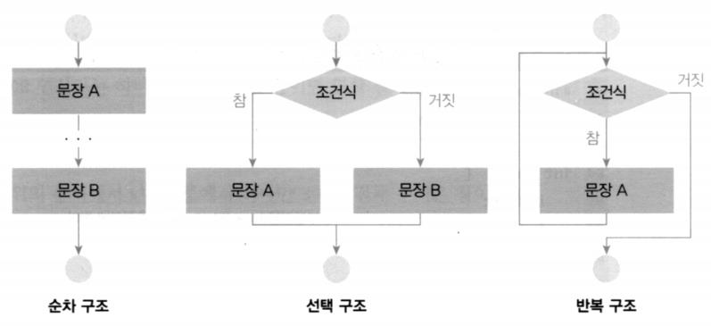


- **관계 연산자**

  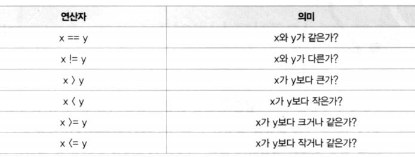

  


  ```c++
  #include <iostream>
  using namespace std;
  int main(int argc, char const *argv[])
  {
      bool b;
      b = (1 == 2);
      cout << std::boolalpha; // 부울린을 true, false로 출력
      cout << b << endl;
      return 0;
  }
  ```

  false

---

  > `cout << std::boolalpha;` 부분은 설정 : 출력에 나오지 않음

  

- **논리 연산자**

  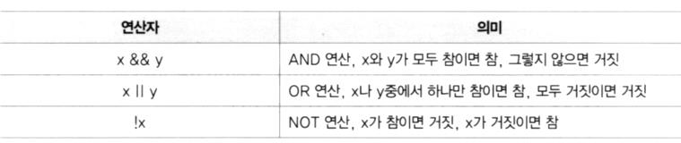

  


  ```c++
  #include <iostream>
  using namespace std;
  
  int main(int argc, char const *argv[])
  {
      bool b;
      int x = 3;
      int y = 3;
      cout << std::boolalpha; // 부울린을 true, false로 출력
      
      b = (x == 3) && (y == 3);
      cout << b << endl;
      
      y = 2;
      b = (x == 3) && (y == 3);
      cout << b << endl;
  
      b = (x == 3) || (y == 3);
      cout << b << endl;
  
      x = 2;
      b = (x == 3) || (y == 3);
      cout << b << endl;
  
      b = !(x == 3);
      cout << b << endl;
      
      return 0;
  }
  ```

  true
  false
  true
  false
  true

---

  

- **if ~ else 문**
  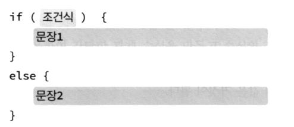

  

  - if 문

    ```c++
    #include <iostream>
    using namespace std;
    
    int main(int argc, char const *argv[]) {
        int x = 100;
    
        if(x == 100)
            cout << "x가 100입니다." << endl;
    
        if(x == 100) {
            cout << "x의 값을 출력합니다." << endl;
            cout << "x가 100입니다." << endl;
        }
    
        return 0;
    }
    ```

    x가 100입니다.
    x의 값을 출력합니다.
    x가 100입니다.

    ---

    

  - if ~ else 문(1)

    ```c++
    #include <iostream>
    using namespace std;
    
    int main(int argc, char const *argv[]) {
        int x = 120;
    
        if(x == 100)
            cout << "x가 100입니다." << endl;
        else
        {
            cout << "x가 100이 아닙니다" << endl;
        }
        
        return 0;
    }
    ```

    x가 100이 아닙니다

    ---

    

  - if ~ else 문(2)

    ```c++
    #include <iostream>
    using namespace std;
    
    int main(int argc, char const *argv[])
    {
        int x, y;
    
        cout << "x값을 입력하세요 ";
        cin >> x;
    
        cout << "y값을 입력하세요 ";
        cin >> y;
        
        if (x > y)
            cout << "x가 y보다 큽니다." << endl;
        else
            cout << "y가 x보다 크거나 같습니다." << endl;
        return 0;
    }
    ```

    x값을 입력하세요 `30`
    y값을 입력하세요 `40`
    y가 x보다 크거나 같습니다.

    ---


- **다중 if ~ else 문**

  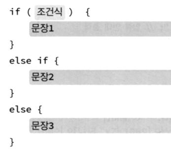

  ```c++
  #include <iostream>
  using namespace std;
  int main(int argc, char const *argv[])
  {
      int x, y;
  
      cout << "x값을 입력하세요";
      cin >> x;
  
      cout << "y값을 입력하세요";
      cin >> y;
  
      if (x > y)
          cout << "x가 y보다 큽니다." << endl;
      else if (x < y)
          cout << "x가 y보다 작습니다." << endl;
      else
          cout << "x와 y가 같습니다." << endl;
      
      return 0;
  }
  ```

  x값을 입력하세요 `30`
  y값을 입력하세요 `40`
  **y가 x보다 크거나 같습니다.**

  ---

  

- **switch 문**

  - switch 문(1) 

    ```c++
    #include <iostream>
    using namespace std;
    int main(int argc, char const *argv[])
    {
        int number;
        cout << "숫자를 입력하세요:";
        cin >> number;
    
        switch (number)
        {
        case 0:
            cout << "zero\n";
            break;
        case 1:
            cout << "one\n";
            break;
        case 2:
            cout << "two\n";
            break;
        default:
            cout << "many\n";
            break;
        }
        return 0;
    }
    ```

    숫자를 입력하세요:`3`
    many

    ---

    

  - switch 문(2) - break

    ```c++
    #include <iostream>
    using namespace std;
    int main(int argc, char const *argv[])
    {
        int number;
        cout << "숫자를 입력하세요:";
        cin >> number;
        switch (number)
        {
        case 0:
            cout << "zero\n";
        case 1:
            cout << "one\n";
        case 2:
            cout << "two\n";
        default:
            cout << "many\n";
            break;
        }
        return 0;
    }
    ```

    숫자를 입력하세요:`1`
    **one**
    **two**
    **many**

    ---

  

- **while 루프**

  - 조건이 참일 동안 반복
    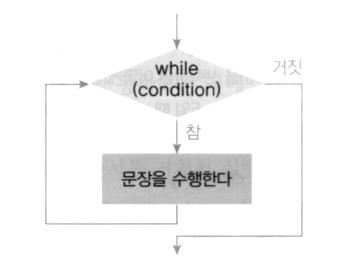
    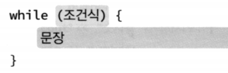


  ```c++
  #include <iostream>
  using namespace std;
  int main(int argc, char const *argv[])
  {
      int n = 10;
      while (n > 0)
      {
          cout << n << " ";
          n--;
      }
      cout << "fire!" << endl;
      return 0;
  }
  ```

  10 9 8 7 6 5 4 3 2 1 fire!

---

  > case안은 `정수` 타입만 가능하다.

  

  - 구구단

    ```c++
    #include <iostream>
    using namespace std;
    
    int main(int argc, char const *argv[])
    {
        int n;
        int i = 1;
    
        cout << "구구단 중에서 출력하고 싶은 단을 입력하세요: ";
        cin >> n;
    
        while (i <= 9)
        {
            cout << n << " * " << i
                 << " = " << n * i << endl;
            i++;
        }
    
        return 0;
    }
    ```

    구구단 중에서 출력하고 싶은 단을 입력하세요: `4`
    **4 * 1 = 4**
    **4 * 2 = 8**
    **4 * 3 = 12**
    **4 * 4 = 16**
    **4 * 5 = 20**
    **4 * 6 = 24**
    **4 * 7 = 28**
    **4 * 8 = 32**
    **4 * 9 = 36**

    ---

    

- **do ~ while 루프**

  - 조건이 참일 동안 반복

  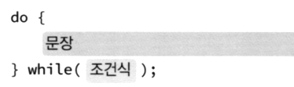

  ```c++
  #include <iostream>
  using namespace std;
  
  int main(int argc, char const *argv[])
  {
      string str;
  
      do
      {
          cout << "문자열을 입력하세요:";
          getline(cin, str);
  
          // cin >> str;  // 입력 문자열에 공백이 있는 경우 테스트 -> 예: 안녕 하세요.
  
          cout << "사용자의 입력: " << str << endl;
      } while (str != "종료");
  
      return 0;
  }
  ```

  문자열을 입력하세요:`안녕하세요.`
  사용자의 입력: **안녕하세요.**
  문자열을 입력하세요:`종료`
  사용자의 입력: **종료**

  ---

  > **cin >> str;**
  > 문자열을 입력하세요:안녕 하세요.
  > 사용자의 입력: 안녕
  > 문자열을 입력하세요:사용자의 입력: 하세요.
  > 문자열을 입력하세요:종료
  > 사용자의 입력: 종료

  

- **for 루프**

  - 조건이 참일 동안 반복

  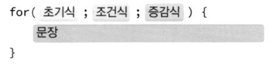

  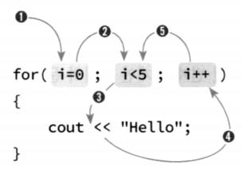

  

  - for 반복문(1)

    ```c++
    #include <iostream>
    using namespace std;
    int main()
    {
        int sum = 0;
        for (int i = 0; i <= 10; i++)
        {
            sum += i;
        }
        cout << "1부터 10까지 정수의 합 = " << sum << endl;
        return 0;
    }
    ```

    1부터 10까지 정수의 합 = 55

    ---

    

  - for 반복문(2)

    ```c++
    #include <iostream>
    using namespace std;
    int main()
    {
        long fact = 1;
        int n;
        cout << "정수를 입력하세요: ";
        cin >> n;
        for (int i = 1; i <= n; i++)
        {
            fact = fact * i;
        }
        cout << n << "! = " << fact << endl;
        return 0;
    }
    ```

    정수를 입력하세요: `5`
    **5! = 120**

    ---

    

  - break 문

    ```c++
    #include <iostream>
    using namespace std;
    int main()
    {
        for (int i = 1; i < 10; i++)
        {
            cout << i << " ";
            if (i == 4)
                break;
        }
        return 0;
    }
    ```

    1 2 3 4 

    ---

    

  - continue 문

    ```c++
    #include <iostream>
    using namespace std;
    int main()
    {
        for (int i = 1; i < 5; i++) {
            cout << "continue 문장 전에 있는 문장" << endl;
            continue;
            cout << "continue 문장 이후에 있는 문장" << endl;
        }
        return 0;
    }
    ```

    continue 문장 전에 있는 문장
    continue 문장 전에 있는 문장
    continue 문장 전에 있는 문장
    continue 문장 전에 있는 문장

    ---

    


## 배열

- **배열(array)**

  - **같은 종류의 데이터**들이 순차적으로 메모리에 저장되는 자료 구조
  - 각각의 데이터(요소)들은 인덱스(번호)를 사용하여 독립적으로 접근 가능
  - 대용량의 데이터를 동일한 이름으로 쉽게 저장하고 처리 가능

  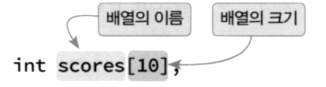

  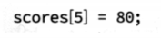

  ```c++
  #include <iostream>
  using namespace std;
  int main()
  {
      const int STUDENTS = 10;
  
      int scores[STUDENTS];
      int sum = 0;
      int i, average;
  
      for (i = 0; i < STUDENTS; i++) {
          cout << "학생들의 성적을 입력하시요: ";
          cin >> scores[i];
      }
  
      for (i = 0; i < STUDENTS; i++) {
          sum += scores[i];
      }
  
      average = sum / STUDENTS;
      cout << "성적 평균= " << average << endl;
      
      return 0;
  }
  ```

  학생들의 성적을 입력하시요: `10`
  학생들의 성적을 입력하시요: `20`
  학생들의 성적을 입력하시요: `30`
  학생들의 성적을 입력하시요: `40`
  학생들의 성적을 입력하시요: `50`
  학생들의 성적을 입력하시요: `60`
  학생들의 성적을 입력하시요: `70`
  학생들의 성적을 입력하시요: `80`
  학생들의 성적을 입력하시요: `90`
  학생들의 성적을 입력하시요: `100`
  **성적 평균= 55**

  ---


- **배열의 초기화**

  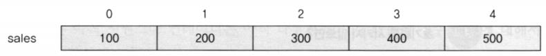

  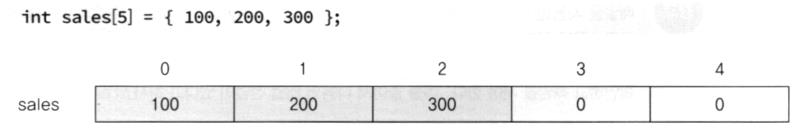

  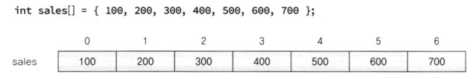

  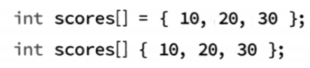

  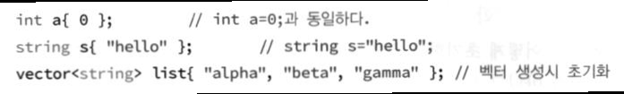

  


  ```c++
  #include <iostream>
  using namespace std;
  
  int main()
  {
      const int STUDENTS = 5;
  
      int scores[STUDENTS] = {
          100, 200, 300, 403, 555
      };
  
      int sum = 0;
      int i;
      double average;
  
      for (i = 0; i < STUDENTS; i++) {
          sum += scores[i];
      }
  
      //average = sum / STUDENTS; //정수형 반환
      average = sum / (double)STUDENTS;
      cout << "성적 평균= " << average << endl;
      
      return 0;
  }
  ```

  성적 평균= 311.6

---

  > elements 개수가 초기화 배열 개수보다 많은 경우는 syntax error
  > 적으면 0으로 초기화


- **범위 기반 for 문**

  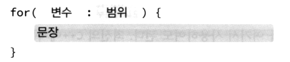

  ```c++
  #include <iostream>
  using namespace std;
  
  int main()
  {
      int list[] = {1, 2, 3, 4, 5, 6, 7, 8, 9, 10};
      int sum = 0;
      for (int i : list) {
          sum += i;
      }
  
      cout << sum << endl << endl;
  
      for (int& i : list) {
          cout << i << " ";
      }
  
      cout << endl;
      for (auto& i : list) {
          cout << i << " ";
      }
      return 0;
  }
  ```

  55

  

  1 2 3 4 5 6 7 8 9 10
  1 2 3 4 5 6 7 8 9 10

  ---
  
  > int sum=0; int total = sum; 
  >
  > **다른 공간** : 값의 복사
  >
  > int sum=0; int& total = sum;  
  >
  > **같은 공간(참조변수)** : 값의 복사 X (overhead를 줄여준다.)


- **다 차원 배열**

  - 2차원 배열
    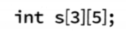

    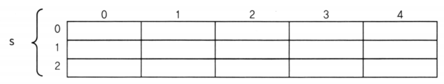

    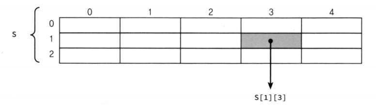

- **다 차원 배열의 초기화**

  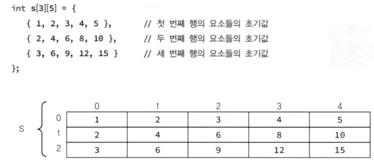

  ```c++
  #include <iostream>
  using namespace std;
  #define WIDTH 9
  #define HEIGHT 3
  
  int main()
  {
      int table[HEIGHT][WIDTH];
      int r, c;
  
      for (r = 0; r < HEIGHT; r++) {
          for (c = 0; c < WIDTH; c++) {
              table[r][c] = (r + 1) * (c + 1);
          }
      }
  
      for (r = 0; r < HEIGHT; r++) {
          for (c = 0; c < WIDTH; c++) {
              cout << table[r][c] << ", ";
          }
          cout << endl;
      }
      return 0;
  }
  ```

  1, 2, 3, 4, 5, 6, 7, 8, 9,
  2, 4, 6, 8, 10, 12, 14, 16, 18,
  3, 6, 9, 12, 15, 18, 21, 24, 27,

  ---

  


## **템플릿** 만드는 법

`Manage` > `User Snippets` > `c++ 검색` > `cpp.json`

```json
{
	// Place your snippets for cpp here. Each snippet is defined under a snippet name and has a prefix, body and 
	// description. The prefix is what is used to trigger the snippet and the body will be expanded and inserted. Possible variables are:
	// $1, $2 for tab stops, $0 for the final cursor position, and ${1:label}, ${2:another} for placeholders. Placeholders with the 
	// same ids are connected.
	// Example:
	"c++ main function": {
		"prefix": "c++_main",
		"body": [
			"#include <iostream>",
			"using namespace std;",
			"",
			"int main(int argc, char const *argv[]) {",
			"	$0",
			"	return 0;",
			"}"
		],
		"description": "c++ main function"
	}
}
```

> `$0`는 커서 위치