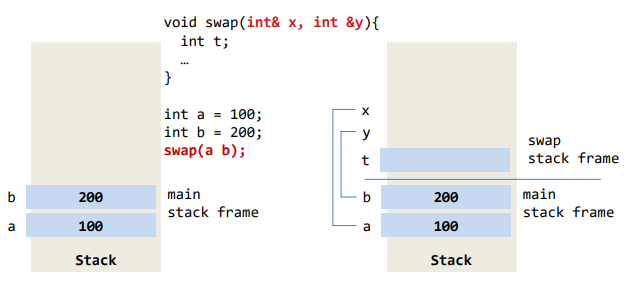
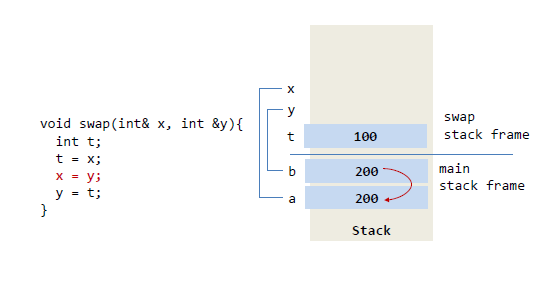

# 함수와 문자열


## 함수

- **함수의 구조**

  


- **함수의 호출**
  

  ```c++
  #include <iostream>
  using namespace std;
  
  int max(int x, int y);  // 함수 원형
  
  int main(int argc, char const *argv[]) {
      int n;
      n = max(2, 3);
      cout << "함수 호출 결과 : " << n << endl;
      return 0;
  }
  
  int max(int x, int y) {
      if(x>y)
          return x;
      else
          return y;
  }
  ```

  함수 호출 결과 : 3

  ---


- **함수 원형**
  
  


- **함수 인자 전달 방법**

  - **call by value**
    


    ```c++
    #include <iostream>
    using namespace std;
    void swap(int x, int y)
    {
        int t;
        t = x;
        x = y;
        y = t;
    }
    int main(int argc, char const *argv[])
    {
        int a = 100, b = 200;
        printf("a=%d, b=%d\n", a, b);
        swap(a, b);
        printf("a=%d, b=%d\n", a, b);
        return 0;
    }
    ```

    a=100, b=200
    a=100, b=200

    ---

  

  - **call by reference**
    

    - 참조 변수 - 기존 변수에 새로운 이름을 추가하는 것
      

    

    ```c++
    #include <iostream>
    using namespace std;
    void swap(int &x, int &y)
    {
        int t;
        t = x;
        x = y;
        y = t;
    }
    int main(int argc, char const *argv[])
    {
        int a = 100, b = 200;
        printf("a=%d, b=%d\n", a, b);
        swap(a, b);
        printf("a=%d, b=%d\n", a, b);
        return 0;
    }
    ```

    a=100, b=200
    a=200, b=100

    ---

    

    

    

    

    

    

    

  - **call by address(pointer)**

    - 추후


- **중복함수 (overload)**

  - 함수의 이름은 동일하지만 함수의 인자가 다르면 다른 함수로 인식
  - 리턴 타입은 상관없음

  
  
  

  ```c++
  #include <iostream>
  using namespace std;
  int square(int i)
  {
      cout << "square(int) 호출" << endl;
      return i * i;
  }
  double square(double i)
  {
      cout << "square(double) 호출" << endl;
      return i * i;
  }
  int main(int argc, char const *argv[])
  {
      cout << square(10) << endl;
      cout << square(2.0) << endl;
      return 0;
  }
  ```

  square(int) 호출
  100
  square(double) 호출
  4

  ---

  

  - **인수의 디폴트 값**

    - 함수 호출시 인수 값을 지정하지 않았을 때 가지는 값

    ```c++
    #include <iostream>
    using namespace std;
    void display(char c = '*', int n = 10)
    {
        for (int i = 0; i < n; i++)
        {
            cout << c;
        }
        cout << endl;
    }
    int main(int argc, char const *argv[])
    {
        display();
        display('#');
        display('#', 5);
        return 0;
    }
    ```

    \*\*\*\*\*\*\*\*\*\*

    ##########
    #####

    ---

    

  - **인수의 디폴트 값 지정시 주의 사항**

    - 뒤에서 부터 배정
    - 앞에서 부터 배정하는 경우 에러

    


# 문자열


