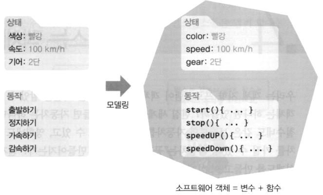
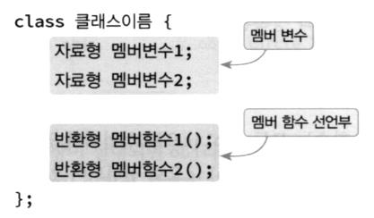
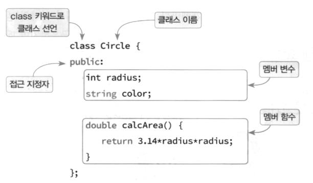
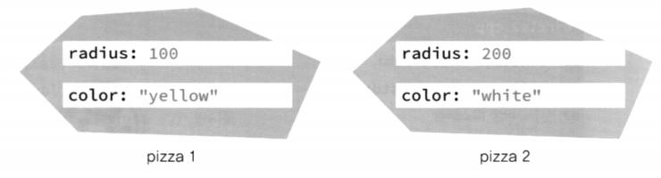
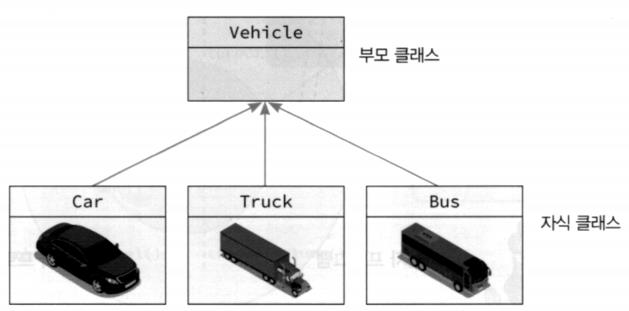
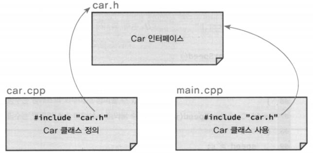
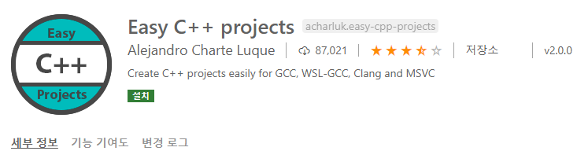
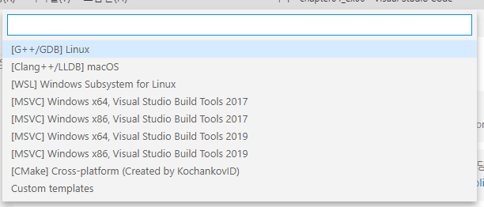
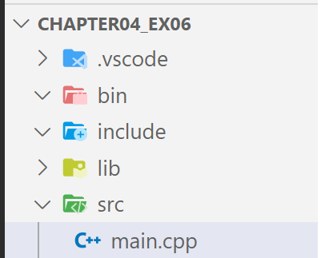
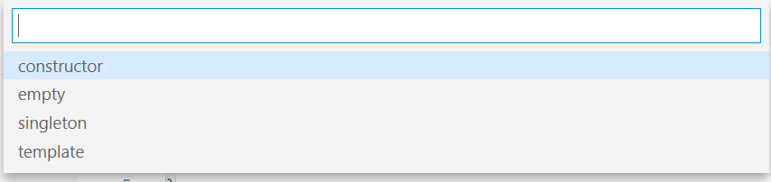

# 클래스와 객체

- **객체의 구성요소**

  - 멤버 변수
    - 객체의 상태를 저장하는 변수
  - 멤버 함수(메서드)
    - 객체 안에 정의된 함수
    - 멤버 변수 접근에 자유로움

  


- **클래스와 객체(인스턴스)**
  - 클래스
    - 객체의 형태를 정의하는 설계도
  - 객체(인스턴스)
    - 클래스의 형태를 취하는 실체


- **클래스 정의하기**
  
  


- **접근 지정자**
  - private
    - 클래스 안에서만 접근(사용)할 수 있음
  - protected
    - 클래스 안과 상속된 클래스에서 접근 가능
  - public
    - 어디서나 접근이 가능


- **객체 생성**

  - 클래스 타입으로 변수를 선언하면 해당 객체(인스턴스)가 생성됨

  


- **객체 멤버 접근**

  - . 연산자로 접근

  
  

  > 정적 할당 : 선언과 동시에 Stack에 만들어진다. (stack frame of main)
  > cf) Python에서는 상수랑 부울린만 정적 할당이었다.

  

**객체의 사용**

```c++
#include <iostream>
#include <string>
using namespace std;

class Circle
{
public:
    int radius;   // 반지름
    string color; // 색상
    double calcArea() {  // Python과 달리 self 매개 변수 없음.
        return 3.14 * radius * radius;  // 멤버 변수 접근시 바로 사용
    }
};

int main(int argc, char const *argv[])
{
    Circle obj; // 객체 생성
    obj.radius = 100;
    obj.color = "blue";
    // obj.area = 40;  // 에러 -- 동적으로 멤버 추가 불가
    cout << "원의 면적 " << obj.calcArea() << endl;
    return 0;
}
```

원의 면적 31400

---

> class 생성 끝에 ; 꼭 붙여주자


**여러 개의 객체 생성**

```c++
#include <iostream>
#include <string>
using namespace std;

class Circle
{
public:
    int radius;   // 반지름
    string color; // 색상
    double calcArea()
    {
        return 3.14 * radius * radius;
    }
};

int main(int argc, char const *argv[])
{
    Circle pizza1, pizza2; // 객체 생성

    pizza1.radius = 100;
    pizza1.color = "yellow";
    cout << "피자의 면적 " << pizza1.calcArea() << endl;
    
    pizza2.radius = 200;
    pizza2.color = "white";
    cout << "피자의 면적 " << pizza2.calcArea() << endl;
    
    return 0;
}
```

피자의 면적 31400
피자의 면적 125600



---


**Car 클래스**

```c++
#include <iostream>
#include <string>
using namespace std;

class Car{
public:
    int speed;    // 속도
    int gear;     // 기어
    string color; // 색상

    void speedUp() {
        speed += 10;
    }
    
    void speedDown(){
        speed -= 10;
    }
};

int main(int argc, char const *argv[])
{
    Car myCar;
    myCar.speed = 100;
    myCar.gear = 3;
    myCar.color = "red";

    myCar.speedUp();
    myCar.speedDown();
    
    return 0;
}
```


**멤버 함수 오버로드**

```c++
#include <iostream>
#include <string>
using namespace std;

class PrintData {
public:
    void print(int i) { cout << i << endl; }
    void print(double f) { cout << f << endl; }
    void print(string s = "No Data!") { cout << s << endl; }
};

int main(int argc, char const *argv[]) {
    PrintData prn;

    prn.print(1);
    prn.print(3.14);
    prn.print("C++ is cool.");
    prn.print();
    
    return 0;
}
```

1
3.14
C++ is cool.
No Data!

---


- **객체 지향의 특징**
  - 캡슐화
  - 정보 은닉
  - 상속과 다향성


- **상속**

  ```c++
  class 자식 클래스명: public 부모 클래스명 {
  	// 자식 클래스 멤버 정의
  }
  ```

  

  

  ```c++
  class Shape {
  protected:
      int x, y;
  
  public:
      void draw() {}
      void move() {}
  };
  
  class Reactangle : public Shape {
  protected:
      int width;
      int height;
  public:
      int calcArea()
      {
          return width * height;
      }
  };
  ```

  > 추후 상속 파트서 자세히


### 파일 분리

- **클래스 원형과 구현 정의 분리**

  - 헤더 파일에 클래스 원형
    - 멤버 변수 정의
    - 멤버 함수의 원형 정의
  - cpp 파일에 멤버 함수 정의
    - 헤더 파일을 먼저 include
    - 멤버 함수 구현

  

  > class 하나 당 file 하나 씩 운용


- **다중 파일을 위한 프로젝트 관리**

  - Easy C++ projects 확장 팩 설치

  


- **프로젝트 만들기**

  - 디렉토리 새로 오픈

    - chapter04_ex06 디렉토리

  - F1> create new c++ project

    


    

    

    


- **클래스 만들기**

  - F1> create new class

    

  - 클래스 유형 선택 : constructor

    

  - 클래스명 입력
    


- **Car 클래스 헤더 파일**

  - include/Car.hpp

  ```c++
  #include <string>
  using namespace std;
  
  // 클래스 원형
  class Car {
  // 디폴트 접근 제한자: private
      int speed;    // 속도
      int gear;     // 기어
      string color; // 색상
  
  public:
      int getSpeed();  // 함수 원형
      void setSpeed(int s);
  };
  ```

  

- **Car 클래스 정의 파일**

  - src/Car.cpp

  ```c++
  #include <iostream>  // 검색 순서: 사용자 lib -> 컴파일러 lib
  #include "Car.hpp"  // 검색 순서: cwd -> 사용자 lib -> 컴파일러 lib
  
  // 클래스 정의 파일
  void Car::setSpeed(int s) {  // :: scope 연산자
      speed = s;
  }
  
  int Car::getSpeed() {
      return speed;
  }
  ```

  
  

- **main 함수 파일**

  - src/main.cpp

  ```c++
  #include <iostream>
  #include <string>
  #include "Car.hpp"
  using namespace std;
  
  int main(int argc, char const *argv[]) {
      Car myCar;
  
      myCar.setSpeed(100);
  
      cout << "속도 : " << myCar.getSpeed() << endl;
      
      return 0;
  }
  ```

  속도 : 100

  ---

  

- **실행**

  - **TERMINAL > `>>make` > bin/main.exe 확인 > `bin/main` or `bin/main.exe`**

  > powershell은 /, \ 구분하지 않는다.
  >
  > \>\> cls : clear
  >
  > \>\> del 파일명 : 삭제


  Makefile 윈도우 명령어로 변경

  - clean -> cls, rm -> del, / -> \

  ```
  CXX		  := g++
  CXX_FLAGS := -Wall -Wextra -std=c++17 -ggdb
  
  BIN		:= bin
  SRC		:= src
  INCLUDE	:= include
  LIB		:= lib
  
  LIBRARIES	:=
  EXECUTABLE	:= main
  
  
  all: $(BIN)/$(EXECUTABLE)
  
  run: clean all
  	cls
  	./$(BIN)/$(EXECUTABLE)
  
  $(BIN)/$(EXECUTABLE): $(SRC)/*.cpp
  	$(CXX) $(CXX_FLAGS) -I$(INCLUDE) -L$(LIB) $^ -o $@ $(LIBRARIES)
  
  clean:
  	-del $(BIN)\*
  ```

  `make clean`  -> make.exe 파일 삭제
  `make run` -> 실행


- **위 PrintData Class 분리해보기**

  - include/PrintData.hpp

    ```c++
    #include<string>
    using namespace std;
    
    class PrintData {
    public:
        void print(int i);
        void print(double f);
        void print(string s = "No Data!");  // 디폴트 값 지정은 헤더 파일에서만 지정
    };
    ```

    

  - src/PrintData.cpp

    ```c++
    #include<iostream>
    #include<string>
    #include "PrintData.hpp"
    using namespace std;
    
    void PrintData::print(int i) {
        cout << i << endl;
    }
    
    void PrintData::print(double f) {
        cout << f << endl;
    }
    
    void PrintData::print(string s) {
        cout << s << endl;
    }
    ```

    

  - src/main.cpp

    ```c++
    #include <iostream>
    #include <string>
    #include "Car.hpp"
    #include "PrintData.hpp"
    using namespace std;
    
    int main(int argc, char const *argv[]) {
        Car myCar;
    
        myCar.setSpeed(100);
    
        cout << "속도 : " << myCar.getSpeed() << endl;
        
    
        PrintData pd;
        pd.print(10);
        pd.print(10.2);
        pd.print("Hello World!");
    
        return 0;
    }
    ```

    속도 : 100  
    10
    10.2        
    Hello World!

    ---

    > \>\> `make run`