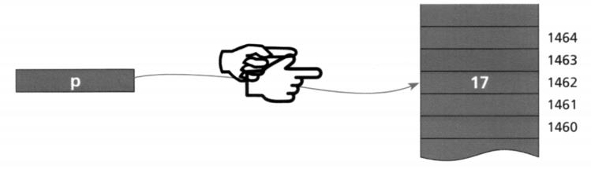
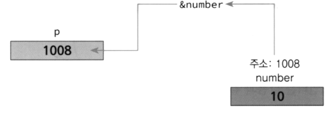
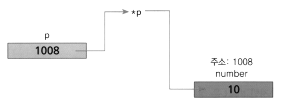
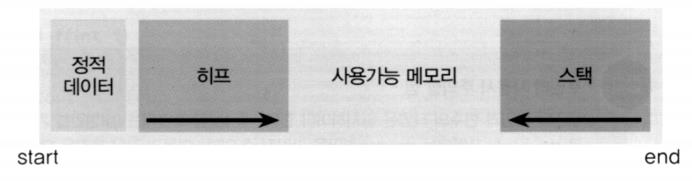
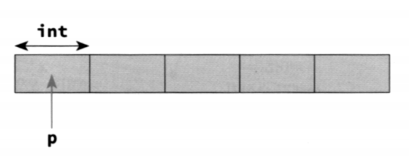
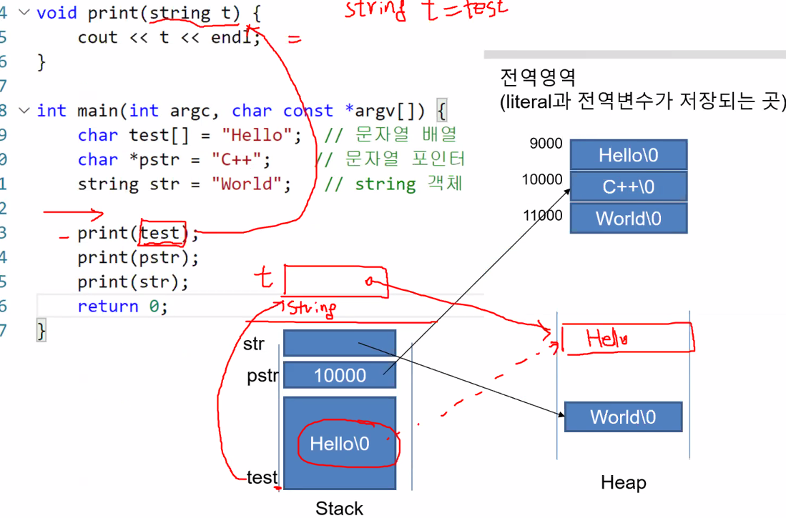
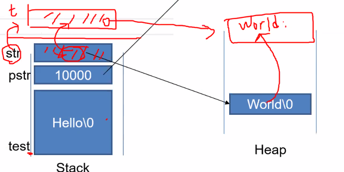
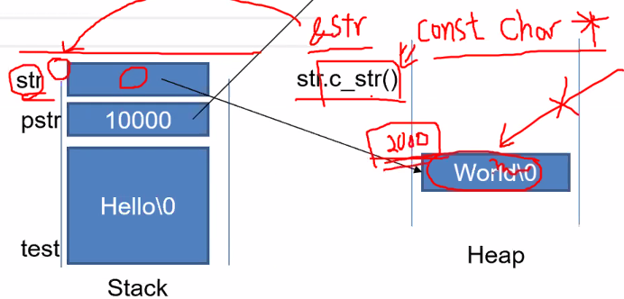

# 포인터와 동적 객체 생성


## 포인터

- **포인터(pointer)**

    - 메모리의 주소값을 저장하는 변수
    - 변수 선언시 타입 뒤에 *를 지정
    - int *p; // 정수를 가리키는 포인터 선언

    


- **주소 연산자 &**

    - 기존 변수의 주소 값을 획득하여 포인터 변수에 저장할 때 사용
    - int number = 10;
        int *p; // 정수를 가리키는 포인터 선언
        p = &number;

    
    
- **간접 참조 연산자 ***

    - 포인터 변수에는 주소가 저장되어있음
    - 그 주소에 저장되어 있는 데이터를 얻을 때 사용

    

    

      ```c++
    #include <iostream>
    using namespace std;
    int main() {
        int number = 0;
        double d = 20.2;
    
        int *p = &number;
        // p = &d;  // 에러
        double *pd = &d;
    
        cout << p << endl;
        cout << *p << endl;
    
        cout << sizeof(number) << "," << sizeof(d) << endl;
        cout << sizeof(p) << endl;  // int *
        cout << sizeof(pd) << endl;  // double *
    
        return 0;
    }
      ```

    **0x61fe0c**
    0
    4,8
    8
    8

    ---


- **NULL**

    - 포인터가 아무것도 가리키지 않는 것을 의미하는 특수한 데이터
        - 0으로 해석되므로 int이기도 하면서 포인터 이기도 함
    - 포인터 변수를 초기화할 때 사용
    - nullptr 사용 가능
        - 포인터로만 해석

    ```c++
    #include <iostream>
    using namespace std;
    
    void f(int i) {
        cout << "f(int)" << endl;
    }
    
    void f(char *p) {
        cout << "f(char *)" << endl;
    }
    
    int main() {
        int *pNumber = NULL;  // 권장
        int *pNumber2;  // 권장하지 않음, 임의의 초기값을 가짐
    
        if(pNumber != NULL) {  // 포인터 안정성 검사
            cout << *pNumber << endl;
    }
    
    if(pNumber2 != NULL) {  // 결과 장담 못함...
            cout << *pNumber2 << endl;
    }
    
    
        // f(NULL); -- int, char * 둘 다 가능하므로 에러
        f(nullptr);  // nullptr : 포인터 NULL의 의미하는 키워드
        return 0;
    }
    ```
    
    **17439201**
    f(char *)
    
    ---
    
    >   관례 : pointer 변수 --> **p**Number


## 동적 할당 메모리

-   **프로그램에서의 메모리**

    -   스택(Stack)

        -   지역 변수 할당 (정적할당)
        -   시스템에 의해 관리

    -   힙(Heap)

        -   동적 메모리 할당
        -   개발자에 의해 관리

        


-   **new, delete**

    -   new

        -   동적으로 힙에 메모리를 할당

    -   delete

        -   동적으로 힙에 할당된 메모리를 회수
        -   파괴자가 호출됨
        -   동적 메모리를 회수 하지않으면 가비지(garbage) 증가 -- 메모리 누수

    -   ```c++
        class T {};
        T *p = new T;
        T *p = new T[N];
        T *p = new T[N] { initializer1, ... , initializeerN}; 
        ```

    -   ```c++
        int *p;
        p = new int[5]; 
        
        int *p = new int[5] {0, 1, 2, 3, 4};
        ```

        

    -   ```c++
        int *p = new int;
        :
        delete p; // 단일 데이터 삭제
        
        
        int *p = new int[5] {0, 1, 2, 3, 4};
        delete [] p; // 배열 데이터 삭제
        ```

        

    new, delete

    ```c++
    #include <iostream>
    #include <time.h>
    using namespace std;
    
    int main() {
        int *ptr;
    
        srand(time(NULL));
        ptr = new int[10];
        // ptr은 할당된 동적 메모리의 시작 주소,
        // 따라서 ptr은 첫 번째 엘리먼트(ptr[0])에 대한 포인터
        // *ptr은 ptr[0]과 같음
        
        for (int i = 0; i < 10; i++) {
            ptr[i] = rand();
        }
    
        for (int i = 0; i < 10; i++) {
            cout << ptr[i] << " ";
        }
        cout << endl;
    delete []ptr;
        return 0;
}
    ```
    
    **10172 30097 1329 24679 4151 23900 15709 28541 10597 30398**
    
    
    ---
    
    
    
    가비지(garbage)
    
    ```c++
    #include <iostream>
    #include <time.h>
    using namespace std;
    
    int main() {
        int *ptr = new int;
        *ptr = 99;
        return 0;
    }
    ```


  

-   **스마트 포인터**

    -   포인터의 **동적 메모리 회수**를 **자동**으로 처리해줌

        -   포인터 변수가 제거될 때 **자동으로 delete 호출**

    -   `#include <memory>` 추가 후 사용

    -   unique_ptr

        -   포인터에 대해 오직 하나의 소유자만 허용

        `unique_ptr buf(new int[10]);`

    -   shared_ptr

        -   참조 횟수가 계산되는 스마트 포인터


    ```c++
    #include <iostream>
    #include <memory>
    using namespace std;
    int main()
    {
        unique_ptr<int[]> buf(new int[10]);
        for (int i = 0; i < 10; i++)
        {
            buf[i] = i;
        }
        
        for (int i = 0; i < 10; i++)
        {
            cout << buf[i] << " ";
        }
        cout << endl;
        return 0;
    }
    ```

    0 1 2 3 4 5 6 7 8 9

    ---


  

## 객체의 동적 생성

-   **객체의 동적 생성**

    -   객체에 대해서도 동일한 원칙 적용

    -   멤버 접근에 대한 표현이 다름

        -   포인터_변수->멤버

    -   Dog *pDog = new Dog;

        pDog->age = 10;
          :
        delete pDog;

      

    ```c++
    #include <iostream>
    #include <memory>
    #include <string>
    using namespace std;
    
    class Dog
    {
    public:
        int age;
        string name;
        Dog()
        {
            cout << "Dog constructor call" << endl;
            age = 1;
            name = "puppy";
        }
        ~Dog()
        {
            cout << "Dog deconstructor call" << endl;
        }
    };
    
    int main(int argc, char const *argv[]) {
        unique_ptr<Dog> buf(new Dog); // startporinter사용, 소멸자 자동으로 호출
    //    Dog *pDog = new Dog; // Dog constructor call
    //    delete pDog; // Dog deconstructor call
       return 0;
    }
    ```

    Dog constructor call
    Dog deconstructor call

    ---

  

-   **포인터로 객체 멤버 접근하기**
    `(*pDog).getAge();`  // 실제 인스턴스가 되서 .을 붙일 수 있음
    `pDog->getAge();`  // 포인터로 멤버 접근할 때 -> 사용
    // 둘 다 같은 표현

    
      


    포인터로 객체 멤버 접근하기


    ```c++
    #include <iostream>
    #include <string>
    using namespace std;
    
    class Dog{
    public:
        int age;
        string name;
    
        Dog(){
            age = 1;
            name = "puppy";
        }    
        ~Dog(){ }
    
        int getAge() { return age;}
        void setAge(int a) { age = a; } 
    };
    
    int main(int argc, char const *argv[]) {
       Dog *pDog = new Dog;
    
       cout << "puppy's age : " << pDog->getAge() << endl;
        // 화살표를 이용하여 객체 멤버 접근
    
       pDog->setAge(3);
       cout << "puppy's age : " << pDog->getAge() << endl;
    
       delete pDog;
       return 0;
    }
    ```

    puppy's age : 1
    puppy's age : 3

    ---

      

    멤버도 동적 생성하기

    ```c++
    #include <iostream>
    #include <string>
    using namespace std;
    
    class Dog{
    private:
        int *pAge; // 멤버변수
        int *pWeight;
    public:
        Dog(){
            pAge = new int{1};
            pWeight = new int{10};
        }
        ~Dog(){
           // 만약 pAge와 pWeight delete를 하지 않게되면 Dog가 가리키는 객체만
           // 사라지게 되어 pAge와 pWeight 의 저장공간은 남게되어 garbage가 생김
            delete pAge;
            delete pWeight; 
        }
        int getAge(){ return *pAge; }
        void setAge(int a) { *pAge = a; }
        int getWeight(){ return *pWeight; }
        void setWeight(int w) { *pWeight = w; }
    };
    
    int main(int argc, char const *argv[]) {
       Dog *pDog = new Dog;
       cout << sizeof(pDog) << endl; // pDog포인터 변수의 크기, 8출력
       cout << sizeof(*pDog) << endl; // pDog포인트하는 인스턴스의 크기, 16출력
    
       cout << "puppy's age : " << pDog->getAge() << endl;
    
       pDog->setAge(3);
       cout << "puppy's age : " << pDog->getAge() << endl;
    
       delete pDog;   
       return 0;
    }
    ```

    8
    16
    puppy's age : 1
    puppy's age : 3

    ---

    >   포인터 변수의 크기는 상관없이 **8바이트**
    >   Dog인스턴스의크기는  *pAge, *pWeight 두개의 포인터 변수를 갖고 있어 16바이트

      

  

-   **this 포인터**

    >   c++에서 변수 접근 방법 : 지역변수 - > 멤버변수 -> 전역변수 -> 에러

    -   모든 객체가 가지는 멤버 변수
    -   자신(인스턴스)에 대한 포인터 변수
    -   멤버 변수와 매개 변수의 이름이 같은 경우 멤버 변수를 지칭하기 위해 사용

    >   this는 포인터이기 때문에 .이 아니라 화살표(->)를 사용해야 함

    ```c++
    #include <iostream>
    #include <string>
    using namespace std;
    
    class Rectangle{
    private:
        int length;
        int width;
    public:
        // Rectangle(int length=30, int width=40){
        //     this->length = length;
        //     this->width = width;
        // }    
    
        // 멤버 초기화 리스트로 초기화하기
        Rectangle(int length=30, int width=40) : length(length), width(width){
        } // this를 쓰지 않아도 규칙이 있어 변수를 받아옴
          //length(length) : 괄호 밖 -> 멤버변수, 괄호 안 -> 규칙상 지역변수
        ~Rectangle() {}
        void setLength(int length){
            this->length = length;
        }
        int getLength(){
            return this->length;
        }
        void setWidth(int width){
            this->width = width;
        }
        int getWidth(){
            return this->width;
        }
    };
    
    int main(int argc, char const *argv[]) {
       Rectangle rect;
    
       cout << "rectangle's width : " << rect.getWidth() << endl;
       cout << "rectangle's length : " << rect.getLength() << endl;
    
       rect.setLength(50);
       rect.setWidth(60);
    
       cout << "rectangle's width : " << rect.getWidth() << endl;
       cout << "rectangle's length : " << rect.getLength() << endl;
       return 0;
    }
    ```

    rectangle's width : 40
    rectangle's length : 30
    rectangle's width : 60
    rectangle's length : 50

    ---

  

-   **const 포인터**

    -   `const int *p1;` // 상수에 대한 포인터, 값이 상수임, 값을 바꿀 수 없음
    -   `int * const p2;` // 포인터가 상수임. 다른 주소로 바꿀 수 없음
    -   `const int * const p3;` // 포인터와 값 모두 상수 

    ```c++
    #include <iostream>
    using namespace std;
    
    int main(int argc, char const *argv[]) {
        // 프로그램에서 사용된 literal데이터 (Hello, c++등)는 전역영역에 저장, 상수이다.
       char test[] = "Hello"; // 문자열 배열(6바이트->마지막 \0 포함, Hello를 복사해와서), 지역변수, stack에 할당, literal데이터를 가져와 복사를 한다.
       char *pstr = "C++"; // 문자열 포인터(8바이트), 지역변수, stack에 할당, 주소값 대입 후 c++이 있는 전역영역을 가리킴
       string str = "World"; // string 객체(32바이트, 실제 데이터와 상관없이 string은 32바이트이다), stack에 할당, string은 불변객체가 아님, insert, remove를 통해 늘릴 수도있고 줄일 수도있다. 내부적으로 동적 데이터를 운영
    
        // *pstr = 'P'; // 에러남
       cout << test << endl;
       cout << pstr << endl;
       cout << str << endl;
    
       return 0;
    }
    ```

    Hello
    C++
    World

    ---


### 정리



- print(test);

    - strint t = test
    - t에 test를 대입 받아 Hello를 복사 한 후 Heap에 메모리를 할당한다. 함수가 끝나면 소멸자로 인해 메모리가 사라진다.

- print(pstr);

    - string t = pstr

    - t에 pstr을 대입 받아 c++을 복사 한 후 Heap에 메모리를 할당 된다. 함수가 끝나면 소멸자로 인해 메모리가 사라진다.

- print(str);

    - string t = str;

    - pstr과 같이 t의 영역공간에 str을 받아 가리키고있는 world를 복사한다. 함수가 끝나면 소멸자로 인해 메모리가 사라진다.

        

```c++
void print(char t[]); 
void print(const char *t); // *t = 'A'; <- 이런식 사용안됨
// 두개의 표현은 상수만 받아올 수 있다, 즉 string은 받아올 수 없다.
print(str.c_str); //.c_str을 사용하면 string의 값이 들어있는 주소값을 받아올 수 있어 사용 가능하다.
// const char * 리턴, 읽을 순 있지만 수정은 불가능하다
```



