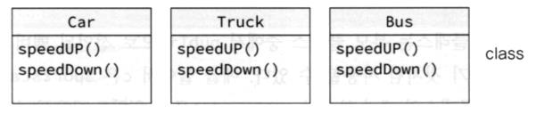
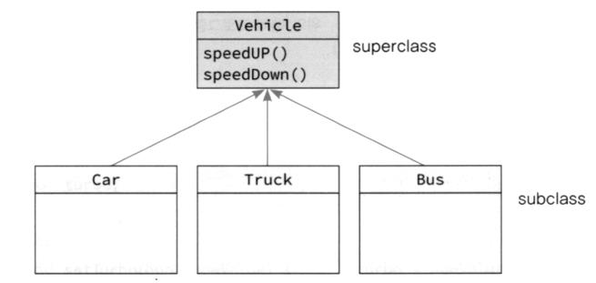
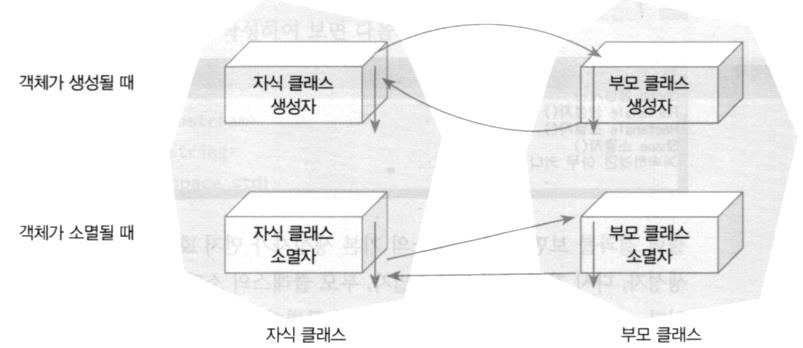
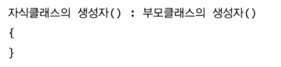

# 상속

  

## 상속

-   **상속의 필요성**

    -   코드 중복

    

    


  

-   **상속 계층 구조도**

    
    


  

-   **상속에서의 생성자, 소멸자**
    

    >   Python은 생성자 1개, C++은 여러개 Why? 오버로드 기능!


  

-   **부모 클래스의 생성자를 지정하는 방법**
    

    ```c++
    #include <iostream>
    #include <string>
    using namespace std;
    
    class Shape {
        int x, y;
    public:
        Shape() {
            cout << "Shape() 생성자" << endl;
        }
    
        Shape(int xloc, int yloc) : x(xloc), y(yloc) {
            cout << "Shape(xloc, yloc) 생성자" << endl;
        }
    
        ~Shape() {
            cout << "~Shape() 소멸자" << endl;
        }
    };
    
    class Rectangle : public Shape {
        int width, height;
    
    public:
        Rectangle() {
            cout << "Rectangle() 생성자" << endl;
        }
    
        Rectangle(int x, int y, int w, int h) : Shape(x, y), width(w), height(h) {
            cout << "Rectangle(x, y, w, h) 생성자" << endl;
        }
    
        ~Rectangle() {
            cout << "~Rectangle() 소멸자" << endl;
        }
    };
    
    int main(int argc, char const *argv[])
    {
        Rectangle r1;
        cout << endl;
        Rectangle r2(0, 0, 100, 100);
        cout << endl;
        
        return 0;
    }
    ```

    Shape() 생성자
    Rectangle() 생성자

      

    Shape(xloc, yloc) 생성자
    Rectangle(x, y, w, h) 생성자

      

    ~Rectangle() 소멸자
    ~Shape() 소멸자
    ~Rectangle() 소멸자
    ~Shape() 소멸자

    ---

    