## 2020.09.09 TIL

### 포인터와 동적 객체 생성

##### new, delete

``` c++
#include <iostream>
#include <time.h>
using namespace std;

int main(int argc, char const *argv[]) {
   int *ptr;

   srand(time(NULL));
   ptr = new int[10];
    // ptr은 할당된 동적 메모리의 시작 주소,
    // 따라서 ptr은 첫 번째 엘리먼트(ptr[0])에 대한 포인터
    // *ptr은 ptr[0]과 같음
   for(int i=0; i<10; i++){
       ptr[i] = rand();
   }

   for(int i=0; i<10; i++){
       cout << ptr[i] << " ";
   }
   cout << endl;
   delete []ptr;
   return 0;
}
```

##### 스마트 포인터

- 포인터의 동적 **메모리 회수**를 **자동으로 처리**해줌

  - 포인터 변수가 제거될 때 **자동으로 delete 호출**

- ```c++
  #include <memory> // 추가 후 사용
  ```

- unipue_ptr

  - 포인터에 대해 오직 하나의 소유자만 허용

- ```c++
  unipue_ptr<int[]> buf(new int[10]);
  ```

- shared_ptr

  - 참조 횟수가 계산되는 스마트 포인터

```c++
#include <iostream>
#include <memory>
using namespace std;

int main(int argc, char const *argv[]) {
   unique_ptr<int[]> buf(new int[10]);
   // unique_ptr<int[]> buf = new int[10]; // error

   for(int i=0; i<10; i++){
       buf[i] = i; // *(buf + i) = i; 와 동일
   }
   for(int i=0; i<10; i++){
       cout << buf[i] << " ";
   }
   cout << endl;
   return 0;
}
```

##### 객체의 동적 생성

- 객체에 대해서도 동일한 원칙 적용

- 멤버 접근에 대한 표현이 다름

  - 포인터_변수 -> 멤버

- Dog *pDog = new Dog;

  **pDog ->age = 10;**

  :

  delete pDog;

```c++
#include <iostream>
#include <memory>
#include <string>
using namespace std;

class Dog{
public:
    int age;
    string name;

    Dog(){
        cout <<"Dog constructor call" << endl;
        age = 1;
        name = "puppy";
    }    
    ~Dog(){
        cout << "Dog deconstructor call" << endl;
    }
};

int main(int argc, char const *argv[]) {
    unique_ptr<Dog> buf(new Dog); // startporinter사용, 소멸자 자동으로 호출
//    Dog *pDog = new Dog; // Dog constructor call
//    delete pDog; // Dog deconstructor call
   return 0;
}
```

##### 포인터로 객체 멤버 접근하기

- ```c++
  (*pDog).getAge(); // 실제 인스턴스가 되서 .을 붙일 수 있음
  pDog->getAge(); // 포인터로 멤버 접근할 때 -> 사용
  // 둘 다 같은 표현
  ```

```c++
#include <iostream>
#include <string>
using namespace std;

class Dog{
public:
    int age;
    string name;

    Dog(){
        age = 1;
        name = "puppy";
    }    
    ~Dog(){ }

    int getAge() { return age;}
    void setAge(int a) { age = a; } 
};

int main(int argc, char const *argv[]) {
   Dog *pDog = new Dog;

   cout << "puppy's age : " << pDog->getAge() << endl;
    // 화살표를 이용하여 객체 멤버 접근

   pDog->setAge(3);
   cout << "puppy's age : " << pDog->getAge() << endl;

   delete pDog;
   return 0;
}
```

```c++
#include <iostream>
#include <string>
using namespace std;

class Dog{
private:
    int *pAge; // 멤버변수
    int *pWeight;
public:
    Dog(){
        pAge = new int{1};
        pWeight = new int{10};
    }
    ~Dog(){
       // 만약 pAge와 pWeight delete를 하지 않게되면 Dog가 가리키는 객체만
       // 사라지게 되어 pAge와 pWeight 의 저장공간은 남게되어 garbage가 생김
        delete pAge;
        delete pWeight; 
    }
    int getAge(){ return *pAge; }
    void setAge(int a) { *pAge = a; }
    int getWeight(){ return *pWeight; }
    void setWeight(int w) { *pWeight = w; }
};

int main(int argc, char const *argv[]) {
   Dog *pDog = new Dog;
   cout << sizeof(pDog) << endl; // pDog포인터 변수의 크기, 8출력
   cout << sizeof(*pDog) << endl; // pDog포인트하는 인스턴스의 크기, 16출력

   cout << "puppy's age : " << pDog->getAge() << endl;

   pDog->setAge(3);
   cout << "puppy's age : " << pDog->getAge() << endl;

   delete pDog;   
   return 0;
}
```

- 포인터 변수의 크기는 상관없이 **8바이트**

- Dog인스턴스의크기는  *pAge, *pWeight 두개의 포인터 변수를 갖고 있어 16바이트

##### this 포인터

- c++에서 변수 접근 방법 : 지역변수 - > 멤버변수 -> 전역변수 -> 에러

- 모든 객체가 가지는 멤버 변수
- 자신(인스턴스)에 대한 포인터 변수
- **멤버 변수와 매개 변수의 이름이 같은 경우 멤버 변수를 지칭하기 위해 사용**

- **this는 포인터이기 때문에 .이 아니라 화살표(->)를 사용해야 함**

```c++
#include <iostream>
#include <string>
using namespace std;

class Rectangle{
private:
    int length;
    int width;
public:
    // Rectangle(int length=30, int width=40){
    //     this->length = length;
    //     this->width = width;
    // }    

    // 멤버 초기화 리스트로 초기화하기
    Rectangle(int length=30, int width=40) : length(length), width(width){
    } // this를 쓰지 않아도 규칙이 있어 변수를 받아옴
      //length(length) : 괄호 밖 -> 멤버변수, 괄호 안 -> 규칙상 지역변수
    ~Rectangle() {}
    void setLength(int length){
        this->length = length;
    }
    int getLength(){
        return this->length;
    }
    void setWidth(int width){
        this->width = width;
    }
    int getWidth(){
        return this->width;
    }
};

int main(int argc, char const *argv[]) {
   Rectangle rect;

   cout << "rectangle's width : " << rect.getWidth() << endl;
   cout << "rectangle's length : " << rect.getLength() << endl;

   rect.setLength(50);
   rect.setWidth(60);

   cout << "rectangle's width : " << rect.getWidth() << endl;
   cout << "rectangle's length : " << rect.getLength() << endl;
   return 0;
}
```

##### const 포인터

```c++
const int *p1; // 상수에 대한 포인터, 값이 상수임, 값을 바꿀 수 없음
int * const p2; // 포인터가 상수임. 다른 주소로 바꿀 수 없음
const int * const p3; // 포인터와 값 모두 상수 
```

```c++
#include <iostream>
using namespace std;

int main(int argc, char const *argv[]) {
    // 프로그램에서 사용된 literal데이터 (Hello, c++등)는 전역영역에 저장, 상수이다.
   char test[] = "Hello"; // 문자열 배열(6바이트->마지막 \0 포함, Hello를 복사해와서), 지역변수, stack에 할당, literal데이터를 가져와 복사를 한다.
   char *pstr = "C++"; // 문자열 포인터(8바이트), 지역변수, stack에 할당, 주소값 대입 후 c++이 있는 전역영역을 가리킴
   string str = "World"; // string 객체(32바이트, 실제 데이터와 상관없이 string은 32바이트이다), stack에 할당, string은 불변객체가 아님, insert, remove를 통해 늘릴 수도있고 줄일 수도있다. 내부적으로 동적 데이터를 운영

    // *pstr = 'P'; // 에러남
   cout << test << endl;
   cout << pstr << endl;
   cout << str << endl;

   return 0;
}
```

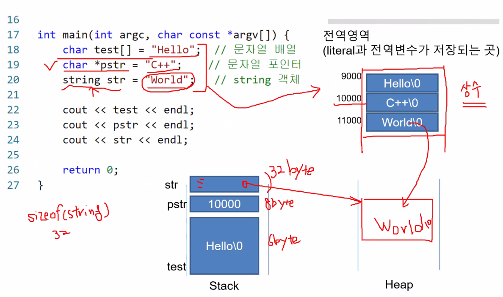

- char test[] = "Hello"; 
  - 문자열 배열(6바이트->마지막 \0 포함, Hello를 복사해와서), 지역변수, stack에 할당, literal데이터를 가져와 복사를 한다.
- char *pstr = "C++"; 
  - 문자열 포인터(8바이트), 지역변수, stack에 할당, 주소값 대입 후 c++이 있는 전역영역을 가리킴
  - 현재 상수 데이터를 받아와 warning: ISO C++ forbids converting a string constant to 'char*' [-Wwrite-strings] 메시지를 출력, 읽기에는 상관이 없지만 쓰기에 오류가 난다.
  - ***pstr = 'T'** 를 주는 순간 **상수영역에 있는 쓰기 operation을 하기 때문에** 프로그램이 죽는다.
  - 그러기 때문에 **const char *pstr = "C++"**로 수정함으로써 오류를 미리 방지 한다.
- string str = "World";
  - string 객체(32바이트, 실제 데이터와 상관없이 string은 32바이트이다), stack에 할당, string은 불변객체가 아님, insert, remove를 통해 늘릴 수도있고 줄일 수도 있다. 내부적으로 동적 데이터를 운영

```c++
#include <iostream>
using namespace std;

void print(string t){
    cout << t << endl;
}

int main(int argc, char const *argv[]) {
    
   char test[] = "Hello";
   char *pstr = "C++";
   string str = "World";

   // *pstr = 'P'; // 에러남
   print(test);
   print(pstr);
   print(str);
   return 0;
}
```

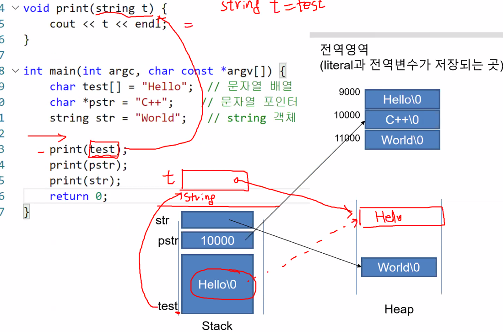

- print(test);

  - strint t = test
  - t에 test를 대입 받아 Hello를 복사 한 후 Heap에 메모리를 할당한다. 함수가 끝나면 소멸자로 인해 메모리가 사라진다.

- print(pstr);

  - string t = pstr

  - t에 pstr을 대입 받아 c++을 복사 한 후 Heap에 메모리를 할당 된다. 함수가 끝나면 소멸자로 인해 메모리가 사라진다.

- print(str);

  - string t = str;

  - pstr과 같이 t의 영역공간에 str을 받아 가리키고있는 world를 복사한다. 함수가 끝나면 소멸자로 인해 메모리가 사라진다.

    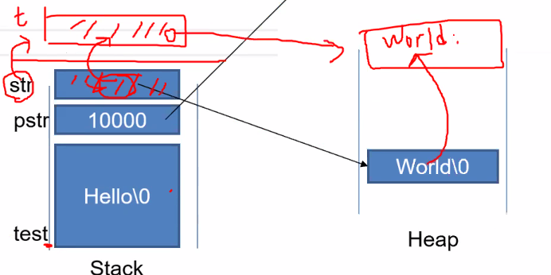

```c++
void print(char t[]); 
void print(const char *t); // *t = 'A'; <- 이런식 사용안됨
// 두개의 표현은 상수만 받아올 수 있다, 즉 string은 받아올 수 없다.
print(str.c_str); //.c_str을 사용하면 string의 값이 들어있는 주소값을 받아올 수 있어 사용 가능하다.
// const char * 리턴, 읽을 순 있지만 수정은 불가능하다
```

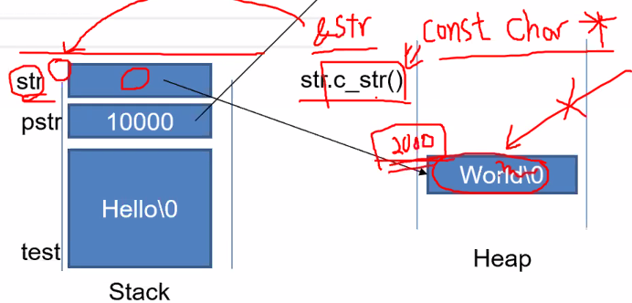

### 복사생성자와 정적멤버

##### 객체를 함수로 전달하기

- 함수 호출 시 객체를 매개변수로 전달하면 객체의 복사가 일어남

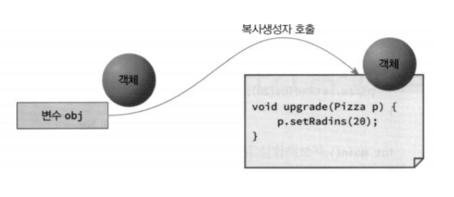

##### 함수가 객체를 반환

- 객체를 함수의 매개변수로 전달할 때와 같이 객체의 복사가 일어남

- ```c++
  Pizza pizza = createPizza(); // 이런 함수를 팩토리 함수라고 한다.
  ```

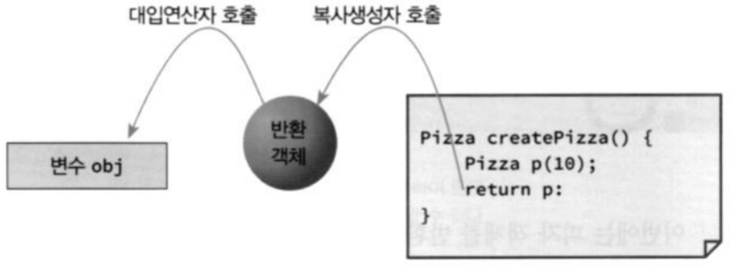

##### 복사 생성자가 사용되는 시점

- 함수의 매개변수로 객체를 전달할 때
- 객체를 대입할 때

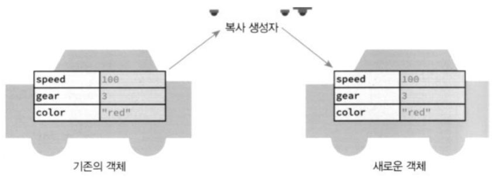

##### 복사 생성자

```c++
MyClass(const MyClass & other){ // 복사생성자의 매개변수타입은 지정되어있다.
    // 객체 초기화               // 반드시 참조변수(&)로 받아야 한다
}
```

- MyClass(**MyClass other**)로 하면 무한 루프 발생하므로 주의!
- 복사 생성자를 정의하지 않으면 자동으로 추가
  - 멤버 변수에  대한 **얕은 복사** 진행 

- 깊은 복사가 필요한 경우 복사 생성자 정의 필요

##### 복사 생성자

- 얕은 복사와 깊은 복사

  - 얕은 복사 - **참조되는 주소값을 복사**하여 주소값에 있는 값을 참조

  - 깊은 복사 - **참조되는 값까지 복사**하여 그 값을 참조

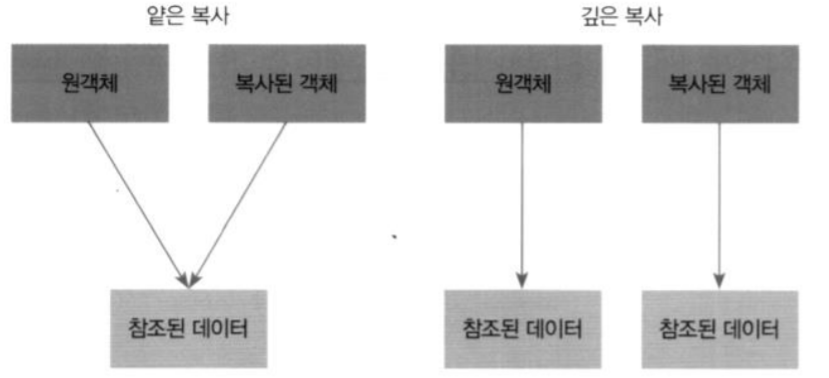

##### 복사 생성자 - 얕은 복사의 문제점

``` c++
#include <iostream>
#include <string>
using namespace std;

class MyArray{
public:
    int size;
    int *data;
    MyArray(int size){
        this->size = size;
        data = new int[size];
    }
    ~MyArray(){
        if(data != NULL){
            delete []data;
        }
    }
};

int main(int argc, char const *argv[]) {
   MyArray buffer(10);
   buffer.data[0] = 1;
   {
        MyArray clone = buffer; // 복사 생성자 호출
   } // clone 삭제
   buffer.data[0] = 2;
   cout << buffer.data[0] << endl;
   return 0;
}
```


- MyArray clone = buffer; // 복사 생성자 호출

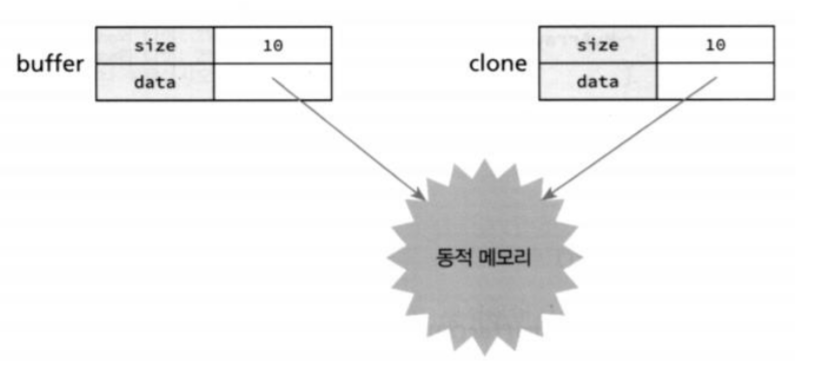

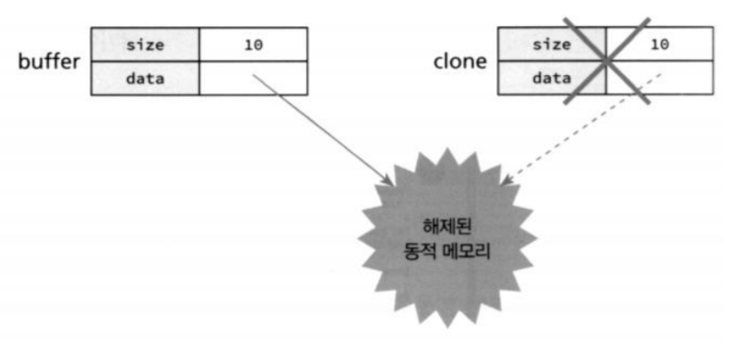

##### 복사생성자 - 깊은복사

```c++
class MyArray{
public:
    int size;
    int *data;
    MyArray(const MyArray& other){
        size = other.size;
        data = new int[other.size];
        for(int i=0; i<size; i++){
            data[i] = other.data[i]; // 복사 생성자 호출
        }
    }
    ~MyArray(){
        if(data != NULL){
            delete []data;
        }
    }
};
```

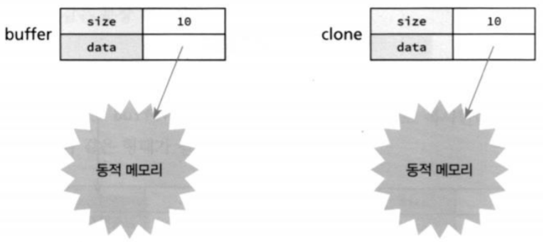

### 상속

##### 상속의 필요성

- 코드 중복

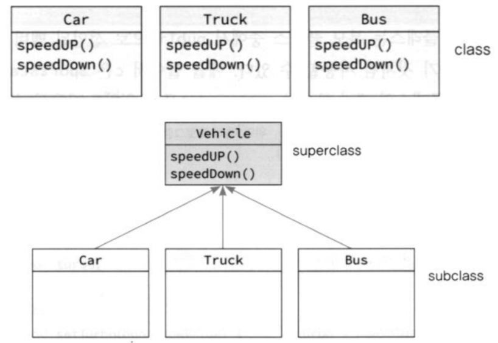

- **추상화** - 개별 인스턴스가 가지는 공통점들을 찾아내서 하나의 일반화시키는 과정 

##### 상속 계층 구조도

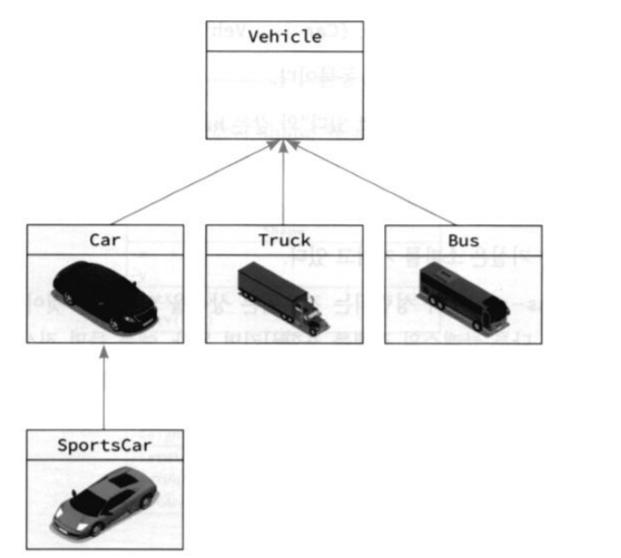

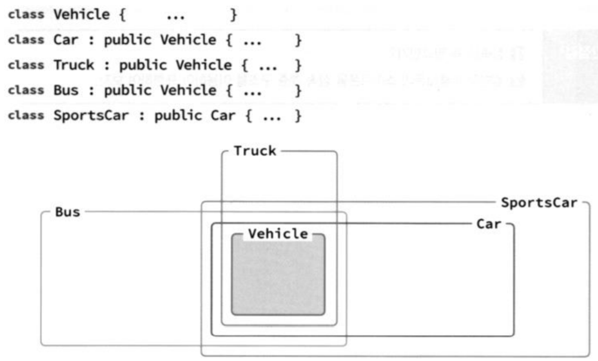

- 클래스 뒤에 ' **:** ' 붙으면 상속을 받는다 라는 뜻
- class Car : public Vehicle (자식(Car)에게 부모(Vehicle)클래스를 상속받겠다)  

##### 상속자에서의 생성자, 소멸자

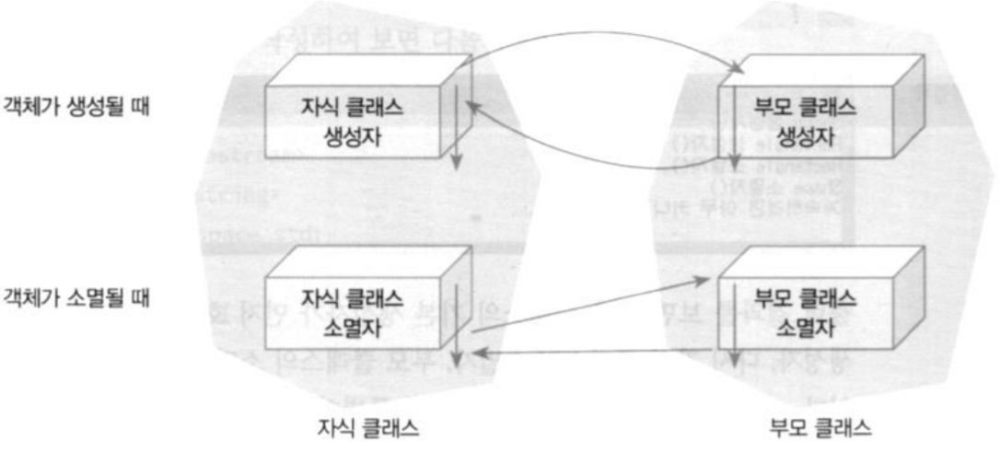

- 개발자가 소멸자를 안만들면 디폴트 소멸자를 생성해준다.

##### 부모 클래스의 생성자를 지정하는 방법

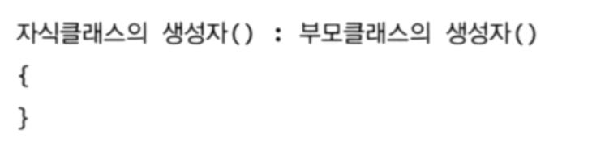

- 모든 클래스의 최상위 클래스는 Object 클래스